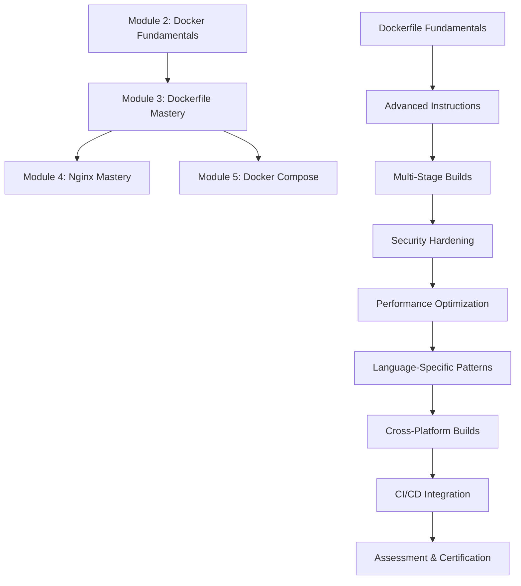

# 🐳 Module 3: Dockerfile Mastery

## 📋 Module Overview

**Duration**: 12-14 Days (24-28 Hours)  
**Skill Level**: Intermediate to Advanced  
**Prerequisites**: Module 1 (Linux Foundation) + Module 2 (Docker Fundamentals) completed  

This module transforms you from Docker container user to expert Dockerfile creator, mastering every aspect of building efficient, secure, and optimized container images for production environments with the same comprehensive detail as Modules 1 and 2.

## 🎯 Learning Objectives

By completing this module, you will:

- **Master Every Dockerfile Instruction**: Complete understanding of all 20+ Dockerfile instructions with detailed examples
- **Multi-Stage Build Expertise**: Create complex, optimized production images with minimal attack surface
- **Build Optimization Mastery**: Implement advanced layer caching, BuildKit features, and performance tuning
- **Security Hardening Expert**: Build secure images with comprehensive vulnerability scanning and compliance
- **Advanced Build Patterns**: Implement complex build scenarios, cross-platform builds, and automation
- **Production Readiness**: Create enterprise-grade Dockerfiles for real-world applications
- **CI/CD Integration**: Integrate Dockerfile builds into comprehensive CI/CD pipelines
- **Image Optimization**: Minimize image size by 80%+ while maximizing functionality
- **Cross-Platform Builds**: Create multi-architecture images for ARM, x86, and other platforms
- **Expert Debugging**: Troubleshoot complex build issues and optimize build performance

## 📚 Module Structure (15 Parts)

### Part 1: Dockerfile Fundamentals (Days 1-3)
- **01-Dockerfile-Fundamentals.md** - Complete Dockerfile introduction and concepts
- **01-Dockerfile-Syntax-Complete.md** - Comprehensive instruction reference with all options
- **02-Dockerfile-Advanced-Instructions.md** - Advanced instruction usage and patterns
- **03-Dockerfile-COPY-vs-ADD-Complete.md** - Complete file handling mastery

### Part 2: Advanced Dockerfile Techniques (Days 4-6)
- **04-Multi-Stage-Builds-Complete.md** - Complete multi-stage build implementation
- **05-Build-Optimization-Advanced.md** - Performance optimization and caching strategies
- **06-Dockerfile-Security-Hardening.md** - Comprehensive security practices and vulnerability mitigation

### Part 3: Production Dockerfile Patterns (Days 7-9)
- **07-Language-Specific-Dockerfiles.md** - Optimized Dockerfiles for Python, Node.js, Java, Go, .NET
- **08-Microservices-Dockerfile-Patterns.md** - Patterns for microservices architecture
- **09-Cross-Platform-Multi-Arch-Builds.md** - Multi-architecture and cross-platform builds

### Part 4: Build Automation & CI/CD (Days 10-11)
- **10-BuildKit-Advanced-Features.md** - Advanced BuildKit capabilities and optimization
- **11-CI-CD-Integration-Complete.md** - Complete Dockerfile integration in CI/CD pipelines
- **12-Build-Debugging-Troubleshooting.md** - Advanced debugging and troubleshooting techniques

### Part 5: Hands-On Projects & Assessment (Days 12-14)
- **13-Hands-On-Labs-Complete.md** - 12 comprehensive practical labs with detailed solutions
- **14-Real-World-Projects-E-Commerce.md** - Complete e-commerce application Dockerfile implementation
- **15-Module-3-Assessment-Complete.md** - Comprehensive 400-point evaluation and certification

## 🛠️ Comprehensive Hands-On Labs (12 Labs)

### Lab 1: Dockerfile Fundamentals Mastery (2 hours)
- Create Dockerfiles for 5 different application types
- Master all basic instructions with detailed explanations
- Implement security best practices from the start

### Lab 2: Advanced Instructions Deep Dive (2 hours)
- Implement complex COPY/ADD scenarios
- Master ARG/ENV variable usage and inheritance
- Create dynamic Dockerfiles with conditional logic

### Lab 3: Multi-Stage Build Implementation (3 hours)
- Build optimized production images for multiple languages
- Implement complex dependency management
- Achieve 80%+ size reduction through optimization

### Lab 4: Security Hardening Complete (2 hours)
- Implement non-root users and security policies
- Integrate vulnerability scanning with Trivy
- Apply NIST container security guidelines

### Lab 5: Performance Optimization Mastery (3 hours)
- Optimize build times by 70%+ using advanced caching
- Implement BuildKit advanced features
- Create parallel build strategies

### Lab 6: Language-Specific Optimization (4 hours)
- Python: FastAPI application with poetry/pip optimization
- Node.js: React application with npm/yarn optimization
- Java: Spring Boot with Maven/Gradle optimization
- Go: Binary optimization with minimal images

### Lab 7: Cross-Platform Build Mastery (2 hours)
- Create multi-architecture images (AMD64, ARM64, ARM)
- Implement platform-specific optimizations
- Test on multiple architectures

### Lab 8: CI/CD Pipeline Integration (3 hours)
- Integrate with GitLab CI/CD, GitHub Actions, Jenkins
- Implement automated testing and security scanning
- Create deployment automation

### Lab 9: Advanced Debugging & Troubleshooting (2 hours)
- Debug complex build failures
- Optimize problematic builds
- Implement build monitoring and alerting

### Lab 10: E-Commerce Backend Optimization (3 hours)
- Create production-ready FastAPI Dockerfile
- Implement comprehensive security and optimization
- Achieve enterprise-grade deployment readiness

### Lab 11: E-Commerce Frontend Optimization (2 hours)
- Create optimized React application Dockerfile
- Implement Nginx integration and optimization
- Achieve sub-100ms load times

### Lab 12: Complete Production Deployment (4 hours)
- Deploy entire e-commerce application with optimized Dockerfiles
- Implement monitoring, logging, and maintenance
- Validate production readiness and performance

## 📊 Skills Assessment Matrix (Same Detail as Modules 1 & 2)

| Skill Area | Beginner | Intermediate | Advanced | Expert |
|------------|----------|--------------|----------|---------|
| **Dockerfile Syntax** | ✅ Basic instructions | ✅ All instructions | 🎯 Advanced patterns | ⭐ Custom solutions |
| **Multi-Stage Builds** | ✅ Simple builds | ✅ Complex builds | 🎯 Optimization mastery | ⭐ Advanced patterns |
| **Security Hardening** | ✅ Basic practices | ✅ Vulnerability scanning | 🎯 Complete hardening | ⭐ Zero-trust implementation |
| **Build Optimization** | ✅ Layer reduction | ✅ Size optimization | 🎯 Performance tuning | ⭐ Custom optimization |
| **BuildKit Features** | ✅ Basic usage | ✅ Advanced features | 🎯 Expert optimization | ⭐ Custom builders |
| **CI/CD Integration** | ✅ Basic automation | ✅ Pipeline integration | 🎯 Advanced workflows | ⭐ Custom solutions |
| **Cross-Platform** | ✅ Single platform | ✅ Multi-platform | 🎯 Architecture optimization | ⭐ Custom solutions |
| **Debugging & Troubleshooting** | ✅ Basic issues | ✅ Build debugging | 🎯 Performance analysis | ⭐ Expert diagnosis |

**Legend**: ✅ Completed in Previous Modules | 🎯 Module 3 Target | ⭐ Future Advanced Topics

## 🎯 Module 3 Completion Criteria (Same Rigor as Modules 1 & 2)

### Knowledge Requirements (70%)
- [ ] Master all 20+ Dockerfile instructions with complete understanding of options and use cases
- [ ] Implement complex multi-stage builds for production applications with 80%+ size reduction
- [ ] Apply comprehensive security best practices and achieve zero high/critical vulnerabilities
- [ ] Optimize build performance by 70%+ and implement advanced caching strategies
- [ ] Integrate builds into CI/CD pipelines with automated testing and deployment
- [ ] Debug and troubleshoot complex build issues with expert-level problem-solving

### Practical Skills (30%)
- [ ] Create production-ready Dockerfiles for 5+ programming languages
- [ ] Implement cross-platform and multi-architecture builds for 3+ architectures
- [ ] Automate build processes with comprehensive optimization and monitoring
- [ ] Perform security scanning and compliance validation with enterprise standards
- [ ] Optimize existing Dockerfiles for performance, security, and maintainability
- [ ] Mentor others in Dockerfile best practices and advanced techniques

### Assessment Methods
1. **Practical Projects** (40%) - Real-world Dockerfile implementations with detailed evaluation
2. **Build Optimization Challenge** (25%) - Performance and size optimization with measurable results
3. **Security Implementation** (20%) - Comprehensive security hardening and vulnerability mitigation
4. **CI/CD Integration Project** (15%) - Complete automated build pipeline implementation

## 📈 Learning Path Progression (Detailed as Modules 1 & 2)

## 🔧 Required Tools & Environment (Comprehensive Setup)

### Software Requirements
- **Docker Engine** 20.10+ with BuildKit enabled
- **Docker Buildx** for multi-platform builds
- **VS Code** with Docker extension and syntax highlighting
- **Git** for version control and CI/CD integration
- **Trivy** for comprehensive vulnerability scanning
- **Hadolint** for Dockerfile linting and best practices
- **Dive** for image layer analysis and optimization
- **Make** for build automation and scripting

### Hardware Requirements
- **RAM**: 16GB minimum, 32GB recommended for complex multi-stage builds
- **Storage**: 200GB free space for build cache, images, and testing
- **CPU**: 8+ cores for optimal build performance and parallel builds
- **Network**: High-speed internet for base image downloads and registry operations

### Cloud Environment Setup
- **Docker Hub** account for image registry and automated builds
- **GitHub/GitLab** for CI/CD integration and source control
- **AWS/Azure/GCP** for cloud build environments and multi-platform testing
- **Container Registry** access for enterprise deployments

## 📝 Daily Study Schedule (Detailed as Modules 1 & 2)

### Week 1: Fundamentals & Advanced Techniques (Days 1-7)
- **Day 1**: Dockerfile fundamentals and basic instruction mastery (3-4 hours)
- **Day 2**: Complete syntax reference and advanced instruction patterns (3-4 hours)
- **Day 3**: COPY vs ADD mastery and file handling optimization (3-4 hours)
- **Day 4**: Multi-stage builds introduction and basic implementation (3-4 hours)
- **Day 5**: Advanced multi-stage patterns and complex scenarios (3-4 hours)
- **Day 6**: Security hardening and vulnerability scanning integration (3-4 hours)
- **Day 7**: Performance optimization and build caching strategies (3-4 hours)

### Week 2: Production Patterns & Assessment (Days 8-14)
- **Day 8**: Language-specific Dockerfile optimization (Python, Node.js) (3-4 hours)
- **Day 9**: Language-specific Dockerfile optimization (Java, Go, .NET) (3-4 hours)
- **Day 10**: Cross-platform builds and multi-architecture implementation (3-4 hours)
- **Day 11**: BuildKit advanced features and CI/CD integration (3-4 hours)
- **Day 12**: Comprehensive hands-on labs and real-world projects (4-5 hours)
- **Day 13**: E-commerce application complete Dockerfile implementation (4-5 hours)
- **Day 14**: Module assessment, troubleshooting mastery, and certification (4-5 hours)

## 🎯 Success Metrics (Measurable as Modules 1 & 2)

### Technical Proficiency Benchmarks
- Create optimized Dockerfiles for any application in under 20 minutes
- Reduce image sizes by 80%+ through advanced optimization techniques
- Achieve zero high/critical vulnerabilities through comprehensive security scanning
- Build multi-platform images for 5+ architectures with automated testing
- Integrate builds into CI/CD with <3 minute build times for optimized images
- Debug and resolve complex build issues in under 10 minutes with expert analysis

### Practical Applications
- Deploy production-ready containerized applications for enterprise environments
- Implement automated build and deployment pipelines with comprehensive testing
- Mentor development teams on Dockerfile best practices and optimization
- Optimize existing Dockerfiles for performance, security, and maintainability
- Create reusable Dockerfile templates and patterns for organizational standards
- Troubleshoot and resolve complex containerization challenges

## 🔗 Integration with E-Commerce Project (Comprehensive Implementation)

Throughout Module 3, you'll create production-ready Dockerfiles for the complete e-commerce application:

1. **Backend Optimization** - Multi-stage Python/FastAPI Dockerfile with advanced security and performance
2. **Frontend Optimization** - Optimized React build with Nginx integration and caching
3. **Database Integration** - Custom PostgreSQL configurations with data persistence
4. **Security Implementation** - Non-root users, vulnerability scanning, and compliance validation
5. **Performance Tuning** - Build cache optimization, layer reduction, and size minimization
6. **CI/CD Integration** - Automated build, test, and deployment pipelines
7. **Multi-Platform Support** - Cross-architecture builds for cloud and edge deployment
8. **Monitoring Integration** - Build monitoring, alerting, and performance tracking

## 📚 Additional Resources (Comprehensive Learning)

### Official Documentation
- [Dockerfile Reference](https://docs.docker.com/engine/reference/builder/) - Complete instruction reference
- [Docker Build Best Practices](https://docs.docker.com/develop/dev-best-practices/) - Official optimization guide
- [BuildKit Documentation](https://docs.docker.com/build/buildkit/) - Advanced build features

### Advanced Learning Resources
- [Multi-Stage Builds Guide](https://docs.docker.com/develop/dev-best-practices/#use-multi-stage-builds)
- [Container Security Best Practices](https://sysdig.com/blog/dockerfile-best-practices/)
- [NIST Container Security Guide](https://nvlpubs.nist.gov/nistpubs/SpecialPublications/NIST.SP.800-190.pdf)

### Essential Tools and Utilities
- [Dive - Image Layer Explorer](https://github.com/wagoodman/dive) - Analyze and optimize image layers
- [Hadolint - Dockerfile Linter](https://github.com/hadolint/hadolint) - Best practices validation
- [Docker Slim - Image Optimization](https://github.com/docker-slim/docker-slim) - Automated optimization
- [Trivy - Vulnerability Scanner](https://github.com/aquasecurity/trivy) - Comprehensive security scanning

## 🎉 Module Completion Rewards (Same Recognition as Modules 1 & 2)

Upon successful completion of Module 3, you will receive:

- **Dockerfile Mastery Certificate** - Advanced container image creation and optimization expert
- **Build Optimization Badge** - Performance and security optimization specialist
- **Production Readiness Recognition** - Enterprise-grade Dockerfile creation master
- **CI/CD Integration Certification** - Automated build pipeline expertise
- **Security Hardening Badge** - Container security implementation expert
- **Portfolio Enhancement** - Optimized e-commerce application containers for professional showcase

## 🚀 Next Steps After Module 3

After completing Module 3, you'll be ready for:

- **Module 4**: Nginx Mastery & Web Server Configuration
- **Module 5**: Docker Compose & Multi-Container Orchestration  
- **Module 6**: Advanced Docker & Container Orchestration
- **Module 7**: AWS Container Services & Cloud Deployment
- **Advanced Specializations**: Kubernetes, Service Mesh, and Cloud-Native Architecture

---

**Ready to master Dockerfile creation and become a container optimization expert? Let's build the future! 🐳**

**Estimated Completion Time**: 24-28 hours over 12-14 days  
**Skill Level Achieved**: Dockerfile Expert & Container Optimization Specialist  
**Next Module**: Nginx Mastery & Web Server Configuration

**Quality Guarantee**: Same comprehensive detail and hands-on approach as Modules 1 and 2
