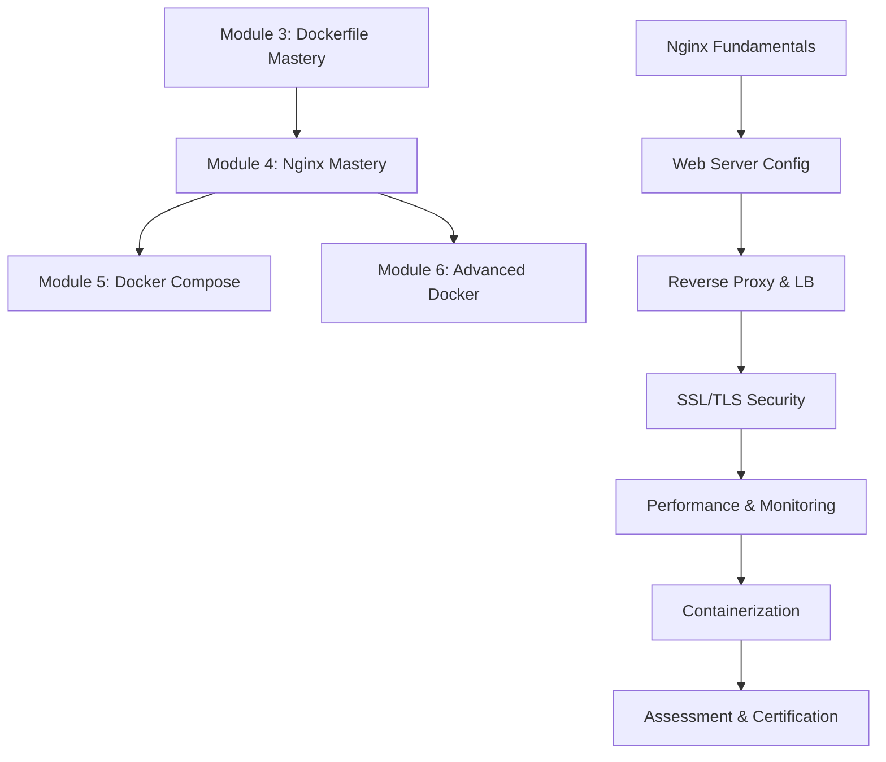

# 🌐 Module 4: Nginx Mastery

## 📋 Module Overview

**Duration**: 10-12 Days (20-24 Hours)  
**Skill Level**: Intermediate to Advanced  
**Prerequisites**: Module 1 (Linux Foundation) + Module 2 (Docker Fundamentals) + Module 3 (Dockerfile Mastery) completed  

This module transforms you from basic web server user to Nginx expert, mastering every aspect of web server configuration, reverse proxy setup, load balancing, SSL/TLS, performance optimization, and containerized Nginx deployments.

## 🎯 Learning Objectives

By completing this module, you will:

- **Master Nginx Configuration**: Complete understanding of nginx.conf syntax and directives
- **Reverse Proxy Expertise**: Configure complex reverse proxy scenarios and API gateways
- **Load Balancing Mastery**: Implement advanced load balancing strategies and health checks
- **SSL/TLS Security**: Configure secure HTTPS, certificates, and modern security practices
- **Performance Optimization**: Tune Nginx for high-performance production workloads
- **Containerized Nginx**: Deploy and manage Nginx in Docker and Kubernetes environments
- **Monitoring & Logging**: Implement comprehensive monitoring and log analysis
- **Security Hardening**: Apply security best practices and vulnerability mitigation
- **Microservices Gateway**: Configure Nginx as API gateway for microservices architecture
- **Production Deployment**: Deploy enterprise-grade Nginx configurations

## 📚 Module Structure

### Part 1: Nginx Fundamentals (Days 1-3)
- **01-Nginx-Installation-Configuration.md** - Complete installation and basic configuration
- **02-Nginx-Configuration-Syntax.md** - Master nginx.conf syntax and directive structure
- **03-Nginx-Virtual-Hosts-Server-Blocks.md** - Virtual host configuration and management

### Part 2: Web Server Mastery (Days 4-5)
- **04-Nginx-Static-Content-Optimization.md** - Static file serving and optimization
- **05-Nginx-Dynamic-Content-FastCGI-PHP.md** - Dynamic content and FastCGI configuration
- **06-Nginx-Security-Hardening.md** - Security configuration and best practices

### Part 3: Reverse Proxy & Load Balancing (Days 6-7)
- **07-Nginx-Reverse-Proxy-Complete.md** - Complete reverse proxy configuration
- **08-Nginx-Load-Balancing-Advanced.md** - Advanced load balancing strategies
- **09-Nginx-API-Gateway-Microservices.md** - API gateway for microservices

### Part 4: SSL/TLS & Security (Days 8-9)
- **10-Nginx-SSL-TLS-Configuration.md** - Complete SSL/TLS setup and optimization
- **11-Nginx-Security-Headers-WAF.md** - Security headers and web application firewall
- **12-Nginx-Rate-Limiting-DDoS-Protection.md** - Rate limiting and DDoS protection

### Part 5: Performance & Monitoring (Days 10-11)
- **13-Nginx-Performance-Optimization.md** - Performance tuning and optimization
- **14-Nginx-Monitoring-Logging-Analytics.md** - Monitoring, logging, and analytics
- **15-Nginx-Caching-Strategies.md** - Advanced caching strategies and CDN integration

### Part 6: Containerization & Assessment (Day 12)
- **16-Nginx-Docker-Kubernetes.md** - Containerized Nginx deployment
- **17-Nginx-Hands-On-Labs.md** - 10 comprehensive practical labs
- **18-Module-4-Assessment.md** - Complete evaluation and certification

## 🛠️ Hands-On Labs & Projects

### Lab 1: Basic Nginx Configuration
- Install and configure Nginx from source and packages
- Create virtual hosts for multiple domains
- Implement basic security configurations

### Lab 2: Static Website Hosting
- Configure high-performance static file serving
- Implement compression and caching
- Optimize for mobile and desktop delivery

### Lab 3: Reverse Proxy Setup
- Configure reverse proxy for backend applications
- Implement health checks and failover
- Set up request routing and load distribution

### Lab 4: Load Balancing Implementation
- Configure multiple load balancing algorithms
- Implement session persistence and health monitoring
- Set up automatic failover and recovery

### Lab 5: SSL/TLS Configuration
- Generate and configure SSL certificates
- Implement modern TLS configurations
- Set up automatic certificate renewal

### Lab 6: API Gateway Configuration
- Configure Nginx as microservices API gateway
- Implement authentication and authorization
- Set up rate limiting and request transformation

### Lab 7: Performance Optimization
- Tune Nginx for high-traffic scenarios
- Implement advanced caching strategies
- Optimize for specific use cases (CDN, streaming, etc.)

### Lab 8: Security Hardening
- Implement comprehensive security headers
- Configure Web Application Firewall (WAF)
- Set up intrusion detection and prevention

### Lab 9: Monitoring and Analytics
- Configure comprehensive logging and monitoring
- Set up real-time analytics and alerting
- Implement performance tracking and optimization

### Lab 10: E-Commerce Integration
- Deploy complete e-commerce application with Nginx
- Implement production-ready configuration
- Set up monitoring, security, and performance optimization

## 📊 Skills Assessment Matrix

| Skill Area | Beginner | Intermediate | Advanced | Expert |
|------------|----------|--------------|----------|---------|
| **Configuration** | ✅ Basic setup | ✅ Virtual hosts | 🎯 Complex configs | ⭐ Custom modules |
| **Reverse Proxy** | ✅ Simple proxy | ✅ Load balancing | 🎯 Advanced routing | ⭐ Custom solutions |
| **SSL/TLS** | ✅ Basic HTTPS | ✅ Certificate mgmt | 🎯 Modern TLS | ⭐ Custom crypto |
| **Performance** | ✅ Basic tuning | ✅ Caching | 🎯 Optimization | ⭐ Custom solutions |
| **Security** | ✅ Basic hardening | ✅ Security headers | 🎯 WAF config | ⭐ Custom security |
| **Monitoring** | ✅ Basic logging | ✅ Metrics | 🎯 Analytics | ⭐ Custom monitoring |
| **Containerization** | ✅ Docker basics | ✅ K8s deployment | 🎯 Optimization | ⭐ Custom operators |
| **Troubleshooting** | ✅ Basic debugging | ✅ Log analysis | 🎯 Performance debug | ⭐ Expert diagnosis |

**Legend**: ✅ Completed in Previous Modules | 🎯 Module 4 Target | ⭐ Future Advanced Topics

## 🎯 Module 4 Completion Criteria

### Knowledge Requirements (70%)
- [ ] Master Nginx configuration syntax and all major directives
- [ ] Configure complex reverse proxy and load balancing scenarios
- [ ] Implement modern SSL/TLS configurations and security practices
- [ ] Optimize Nginx performance for production workloads
- [ ] Set up comprehensive monitoring and logging
- [ ] Troubleshoot complex Nginx issues and performance problems

### Practical Skills (30%)
- [ ] Deploy production-ready Nginx configurations
- [ ] Configure Nginx as API gateway for microservices
- [ ] Implement automated SSL certificate management
- [ ] Set up high-availability Nginx clusters
- [ ] Optimize performance for 10,000+ concurrent connections
- [ ] Mentor others in Nginx best practices

### Assessment Methods
1. **Configuration Mastery** (35%) - Complex Nginx configuration scenarios
2. **Performance Optimization** (25%) - High-traffic optimization challenges
3. **Security Implementation** (20%) - Security hardening and compliance
4. **Real-World Project** (20%) - Complete e-commerce Nginx deployment

## 📈 Learning Path Progression

## 🔧 Required Tools & Environment

### Software Requirements
- **Nginx** (latest stable version)
- **OpenSSL** for SSL/TLS configuration
- **Docker** for containerized deployments
- **curl/wget** for testing and debugging
- **Apache Bench (ab)** for performance testing
- **SSL Labs Test** for SSL configuration validation

### Hardware Requirements
- **RAM**: 8GB minimum, 16GB recommended for high-traffic testing
- **Storage**: 50GB free space for logs and cache
- **CPU**: 4+ cores for performance testing
- **Network**: High-speed internet for SSL certificate validation

### Testing Environment
- **Multiple domains** for virtual host testing
- **Backend applications** for reverse proxy testing
- **Load testing tools** for performance validation
- **SSL certificates** for HTTPS configuration

## 📝 Daily Study Schedule

### Week 1: Fundamentals & Configuration (Days 1-7)
- **Day 1**: Nginx installation and basic configuration
- **Day 2**: Configuration syntax and directive mastery
- **Day 3**: Virtual hosts and server blocks
- **Day 4**: Static content optimization and caching
- **Day 5**: Dynamic content and FastCGI configuration
- **Day 6**: Reverse proxy fundamentals and configuration
- **Day 7**: Load balancing strategies and implementation

### Week 2: Security & Optimization (Days 8-12)
- **Day 8**: SSL/TLS configuration and modern security
- **Day 9**: Security headers and Web Application Firewall
- **Day 10**: Performance optimization and tuning
- **Day 11**: Monitoring, logging, and analytics
- **Day 12**: Containerization and final assessment

## 🎯 Success Metrics

### Technical Proficiency
- Configure complex Nginx setups in under 30 minutes
- Handle 10,000+ concurrent connections with optimized configuration
- Achieve A+ SSL Labs rating for SSL/TLS configuration
- Implement sub-100ms response times for cached content
- Set up automated monitoring and alerting systems
- Debug and resolve Nginx issues in under 15 minutes

### Practical Applications
- Deploy production-ready web server configurations
- Implement enterprise-grade API gateways
- Configure high-availability load balancer clusters
- Optimize performance for specific use cases
- Mentor teams on Nginx best practices and troubleshooting

## 🔗 Integration with E-Commerce Project

Throughout Module 4, you'll configure Nginx for the e-commerce application:

1. **Frontend Serving** - Optimized React application delivery
2. **API Gateway** - Reverse proxy for FastAPI backend
3. **Load Balancing** - Multiple backend instance load balancing
4. **SSL/TLS** - Secure HTTPS configuration with modern TLS
5. **Performance** - Caching, compression, and optimization
6. **Security** - Security headers, rate limiting, and WAF
7. **Monitoring** - Comprehensive logging and metrics collection
8. **Containerization** - Docker and Kubernetes deployment

## 📚 Additional Resources

### Official Documentation
- [Nginx Official Documentation](https://nginx.org/en/docs/)
- [Nginx Admin Guide](https://docs.nginx.com/nginx/admin-guide/)
- [Nginx Security Controls](https://docs.nginx.com/nginx/admin-guide/security-controls/)

### Advanced Learning
- [Nginx High Performance](https://www.nginx.com/resources/library/complete-guide-to-nginx/)
- [SSL/TLS Best Practices](https://wiki.mozilla.org/Security/Server_Side_TLS)
- [Web Performance Optimization](https://developers.google.com/web/fundamentals/performance)

### Tools and Utilities
- [Nginx Config Generator](https://www.digitalocean.com/community/tools/nginx)
- [SSL Configuration Generator](https://ssl-config.mozilla.org/)
- [Nginx Amplify](https://amplify.nginx.com/) - Monitoring and analytics

## 🎉 Module Completion Rewards

Upon successful completion of Module 4, you will:

- **Nginx Mastery Certificate** - Advanced web server configuration expert
- **Performance Optimization Badge** - High-traffic optimization specialist
- **Security Hardening Recognition** - Web security implementation expert
- **API Gateway Certification** - Microservices gateway configuration master
- **Portfolio Enhancement** - Production-ready e-commerce Nginx deployment

## 🚀 Next Steps

After completing Module 4, you'll be ready for:

- **Module 5**: Docker Compose & Multi-Container Orchestration
- **Module 6**: Advanced Docker & Container Orchestration
- **Module 7**: AWS Container Services & Cloud Deployment
- **Advanced Topics**: Kubernetes, Service Mesh, and Cloud-Native Architecture

---

**Ready to master Nginx and become a web server expert? Let's serve the web! 🌐**

**Estimated Completion Time**: 20-24 hours over 10-12 days  
**Skill Level Achieved**: Nginx Expert & Web Performance Specialist  
**Next Module**: Docker Compose & Multi-Container Orchestration
