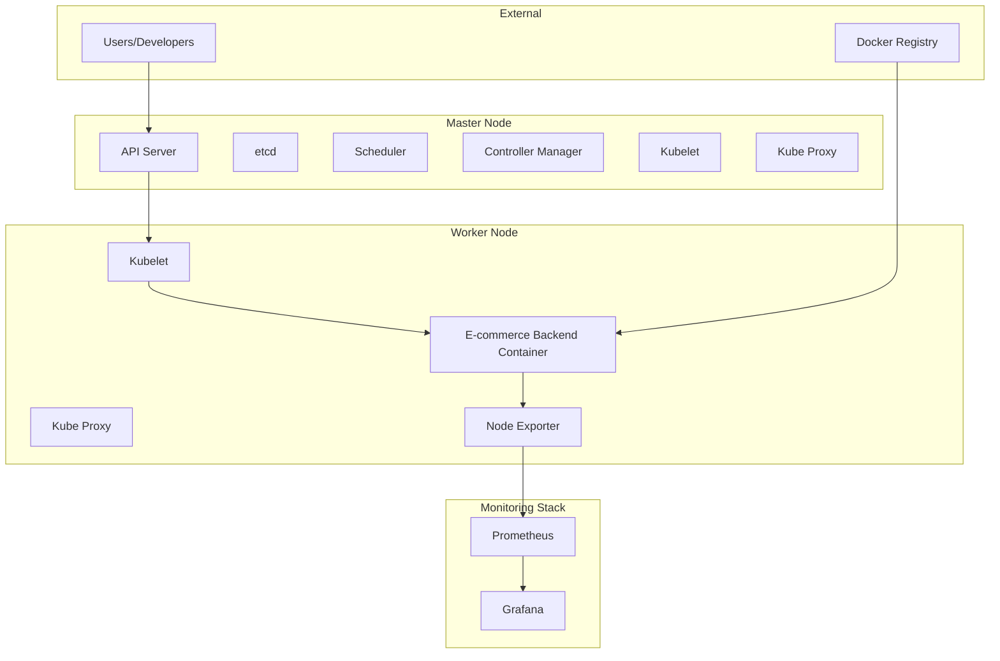

# 🏗️ **Project 1: E-commerce Foundation Infrastructure**
## *Building the Foundation for Scalable E-commerce Operations*

**Project Placement**: After Module 5 (Initial Monitoring Setup)  
**Prerequisites**: Modules 0-5 completion  
**Duration**: 2-3 days  
**Complexity Level**: Foundation  

---

## 🎯 **Client Requirement: E-commerce Infrastructure Foundation**

### **Business Context**

**TechCorp Solutions**, a rapidly growing e-commerce company, has been experiencing significant challenges with their current infrastructure setup. As their customer base has grown from 1,000 to 50,000 active users over the past year, their existing single-server deployment is struggling to handle the increased load, leading to frequent downtime and poor user experience.

The company's current pain points include:

- **Scalability Issues**: The monolithic deployment cannot handle traffic spikes during peak shopping seasons, resulting in 15-20% revenue loss during Black Friday and holiday periods
- **Monitoring Blind Spots**: Lack of proper monitoring has led to reactive troubleshooting, with an average of 4 hours mean time to resolution (MTTR) for critical issues
- **Infrastructure Fragility**: Single points of failure in their current setup have caused 3 major outages in the past 6 months, each lasting 2-4 hours
- **Development Bottlenecks**: The development team cannot efficiently test new features due to shared infrastructure, leading to 30% longer development cycles
- **Cost Inefficiency**: Over-provisioned resources during low-traffic periods and under-provisioned during peak times, resulting in 40% higher infrastructure costs than necessary

**Strategic Objectives**:
- Establish a robust, scalable foundation for their e-commerce platform
- Implement comprehensive monitoring to enable proactive issue detection
- Create a containerized environment that supports rapid development and deployment
- Build a 2-node cluster that can handle 3x current traffic load
- Establish monitoring dashboards that provide real-time visibility into system health

The company expects this foundation to support their growth to 200,000 users over the next 18 months while maintaining 99.9% uptime and reducing infrastructure costs by 25%.

---

## 🎯 **Project Objectives**

### **Primary Objectives**
1. **Containerize E-commerce Backend**: Convert the existing Python FastAPI backend into production-ready Docker containers
2. **Establish 2-Node Cluster**: Deploy a minimal Kubernetes cluster with master and worker nodes
3. **Implement Basic Monitoring**: Set up Prometheus and Grafana for system and application monitoring
4. **Validate Infrastructure**: Ensure the setup can handle basic load and provides monitoring visibility

### **Learning Outcomes**
- Master containerization of complex applications
- Understand Kubernetes cluster architecture and components
- Implement monitoring solutions for containerized applications
- Gain hands-on experience with infrastructure automation

---

## 🏗️ **Architecture Diagram**



---

## 🚀 **Implementation Guide**

### **Phase 1: Environment Preparation**

#### **Step 1.1: System Requirements Validation**

```bash
# Check system resources
free -h
df -h
lscpu

# Verify Docker installation
docker --version
docker-compose --version

# Check Kubernetes prerequisites
cat /proc/sys/net/bridge/bridge-nf-call-iptables
cat /proc/sys/net/ipv4/ip_forward
```

**Explanation**: These commands validate that the system meets the minimum requirements for Kubernetes deployment. The bridge-nf-call-iptables and ip_forward settings are crucial for Kubernetes networking to function properly.

#### **Step 1.2: Install Kubernetes Components**

```bash
# Update system packages
sudo apt-get update && sudo apt-get upgrade -y

# Install required packages
sudo apt-get install -y apt-transport-https ca-certificates curl gnupg lsb-release

# Add Kubernetes repository
curl -fsSL https://packages.cloud.google.com/apt/doc/apt-key.gpg | sudo gpg --dearmor -o /usr/share/keyrings/kubernetes-archive-keyring.gpg
echo "deb [signed-by=/usr/share/keyrings/kubernetes-archive-keyring.gpg] https://apt.kubernetes.io/ kubernetes-xenial main" | sudo tee /etc/apt/sources.list.d/kubernetes.list

# Install Kubernetes components
sudo apt-get update
sudo apt-get install -y kubelet kubeadm kubectl
sudo apt-mark hold kubelet kubeadm kubectl

# Install container runtime (containerd)
sudo apt-get install -y containerd
sudo mkdir -p /etc/containerd
sudo containerd config default | sudo tee /etc/containerd/config.toml
sudo systemctl restart containerd
sudo systemctl enable containerd
```

**Explanation**: This installs the core Kubernetes components. Kubeadm is used for cluster initialization, kubectl for cluster management, and kubelet for running containers. Containerd is chosen as the container runtime for better performance and security.

### **Phase 2: E-commerce Backend Containerization**

#### **Step 2.1: Analyze Existing Backend**

```bash
# Navigate to backend directory
cd /path/to/e-commerce/backend

# Examine the application structure
ls -la
cat requirements.txt
cat main.py | head -20
```

**Explanation**: Understanding the existing application structure is crucial for proper containerization. This helps identify dependencies, entry points, and configuration requirements.

#### **Step 2.2: Create Production-Ready Dockerfile**

```dockerfile
# Multi-stage build for optimized image
FROM python:3.11-slim as builder

# Set working directory
WORKDIR /app

# Install system dependencies
RUN apt-get update && apt-get install -y \
    gcc \
    g++ \
    && rm -rf /var/lib/apt/lists/*

# Copy requirements and install Python dependencies
COPY requirements.txt .
RUN pip install --no-cache-dir --user -r requirements.txt

# Production stage
FROM python:3.11-slim

# Create non-root user for security
RUN groupadd -r appuser && useradd -r -g appuser appuser

# Set working directory
WORKDIR /app

# Copy Python dependencies from builder stage
COPY --from=builder /root/.local /home/appuser/.local

# Copy application code
COPY --chown=appuser:appuser . .

# Create necessary directories
RUN mkdir -p /app/uploads/products && \
    chown -R appuser:appuser /app

# Switch to non-root user
USER appuser

# Add local bin to PATH
ENV PATH=/home/appuser/.local/bin:$PATH

# Expose port
EXPOSE 8000

# Health check
HEALTHCHECK --interval=30s --timeout=3s --start-period=5s --retries=3 \
    CMD curl -f http://localhost:8000/health || exit 1

# Start application
CMD ["python", "main.py"]
```

**Explanation**: This multi-stage Dockerfile optimizes the image size by separating build dependencies from runtime requirements. The non-root user enhances security, and the health check ensures container health monitoring.

#### **Step 2.3: Build and Test Container**

```bash
# Build the Docker image
docker build -t ecommerce-backend:v1.0.0 .

# Test the container locally
docker run -d --name ecommerce-test -p 8000:8000 ecommerce-backend:v1.0.0

# Verify container is running
docker ps
docker logs ecommerce-test

# Test API endpoints
curl http://localhost:8000/health
curl http://localhost:8000/docs

# Clean up test container
docker stop ecommerce-test
docker rm ecommerce-test
```

**Explanation**: Local testing ensures the containerized application works correctly before deployment to Kubernetes. The health check endpoint is crucial for Kubernetes liveness and readiness probes.

### **Phase 3: Kubernetes Cluster Setup**

#### **Step 3.1: Initialize Master Node**

```bash
# Initialize the cluster
sudo kubeadm init --pod-network-cidr=10.244.0.0/16 --apiserver-advertise-address=192.168.1.100

# Configure kubectl for non-root user
mkdir -p $HOME/.kube
sudo cp -i /etc/kubernetes/admin.conf $HOME/.kube/config
sudo chown $(id -u):$(id -g) $HOME/.kube/config

# Verify cluster status
kubectl get nodes
kubectl get pods -n kube-system
```

**Explanation**: The pod-network-cidr is set for Flannel CNI compatibility. The advertise-address should be the master node's IP. The kubectl configuration allows non-root users to manage the cluster.

#### **Step 3.2: Install CNI Plugin (Flannel)**

```bash
# Install Flannel CNI
kubectl apply -f https://raw.githubusercontent.com/flannel-io/flannel/master/Documentation/kube-flannel.yml

# Wait for CNI to be ready
kubectl wait --for=condition=Ready nodes --all --timeout=300s

# Verify network connectivity
kubectl get pods -n kube-system
```

**Explanation**: Flannel provides pod-to-pod networking in the cluster. It's lightweight and easy to configure, making it ideal for learning environments.

#### **Step 3.3: Join Worker Node**

```bash
# On worker node, run the join command from master node output
sudo kubeadm join 192.168.1.100:6443 --token <token> --discovery-token-ca-cert-hash <hash>

# Verify worker node joined
kubectl get nodes
```

**Explanation**: The join command connects the worker node to the cluster. The token and hash ensure secure communication between nodes.

### **Phase 4: E-commerce Backend Deployment**

#### **Step 4.1: Create Namespace**

```yaml
# ecommerce-namespace.yaml
apiVersion: v1
kind: Namespace
metadata:
  name: ecommerce
  labels:
    name: ecommerce
    environment: development
---
apiVersion: v1
kind: ResourceQuota
metadata:
  name: ecommerce-quota
  namespace: ecommerce
spec:
  hard:
    requests.cpu: "2"
    requests.memory: 4Gi
    limits.cpu: "4"
    limits.memory: 8Gi
    persistentvolumeclaims: "4"
```

**Explanation**: Namespaces provide logical separation. ResourceQuota prevents resource exhaustion by limiting CPU, memory, and PVC usage in the namespace.

#### **Step 4.2: Deploy E-commerce Backend**

```yaml
# ecommerce-backend-deployment.yaml
apiVersion: apps/v1
kind: Deployment
metadata:
  name: ecommerce-backend
  namespace: ecommerce
  labels:
    app: ecommerce-backend
    version: v1.0.0
spec:
  replicas: 2
  selector:
    matchLabels:
      app: ecommerce-backend
  template:
    metadata:
      labels:
        app: ecommerce-backend
        version: v1.0.0
    spec:
      containers:
      - name: ecommerce-backend
        image: ecommerce-backend:v1.0.0
        ports:
        - containerPort: 8000
          name: http
        env:
        - name: ENVIRONMENT
          value: "development"
        - name: LOG_LEVEL
          value: "INFO"
        resources:
          requests:
            memory: "256Mi"
            cpu: "250m"
          limits:
            memory: "512Mi"
            cpu: "500m"
        livenessProbe:
          httpGet:
            path: /health
            port: 8000
          initialDelaySeconds: 30
          periodSeconds: 10
        readinessProbe:
          httpGet:
            path: /health
            port: 8000
          initialDelaySeconds: 5
          periodSeconds: 5
        volumeMounts:
        - name: uploads
          mountPath: /app/uploads
      volumes:
      - name: uploads
        emptyDir: {}
```

**Explanation**: This deployment creates 2 replicas of the e-commerce backend. Resource limits prevent resource exhaustion, and probes ensure container health. The emptyDir volume provides temporary storage for uploads.

#### **Step 4.3: Create Service**

```yaml
# ecommerce-backend-service.yaml
apiVersion: v1
kind: Service
metadata:
  name: ecommerce-backend-service
  namespace: ecommerce
  labels:
    app: ecommerce-backend
spec:
  selector:
    app: ecommerce-backend
  ports:
  - port: 80
    targetPort: 8000
    protocol: TCP
    name: http
  type: ClusterIP
```

**Explanation**: The service provides stable network access to the backend pods. ClusterIP type keeps the service internal to the cluster.

### **Phase 5: Monitoring Setup**

#### **Step 5.1: Deploy Prometheus**

```yaml
# prometheus-configmap.yaml
apiVersion: v1
kind: ConfigMap
metadata:
  name: prometheus-config
  namespace: ecommerce
data:
  prometheus.yml: |
    global:
      scrape_interval: 15s
      evaluation_interval: 15s
    
    scrape_configs:
    - job_name: 'kubernetes-nodes'
      kubernetes_sd_configs:
      - role: node
      relabel_configs:
      - source_labels: [__address__]
        regex: '(.*):10250'
        target_label: __address__
        replacement: '${1}:9100'
    
    - job_name: 'ecommerce-backend'
      kubernetes_sd_configs:
      - role: endpoints
        namespaces:
          names:
          - ecommerce
      relabel_configs:
      - source_labels: [__meta_kubernetes_service_name]
        action: keep
        regex: ecommerce-backend-service
```

**Explanation**: This Prometheus configuration scrapes metrics from Kubernetes nodes and the e-commerce backend service. The relabeling ensures proper target discovery.

#### **Step 5.2: Deploy Grafana**

```yaml
# grafana-deployment.yaml
apiVersion: apps/v1
kind: Deployment
metadata:
  name: grafana
  namespace: ecommerce
spec:
  replicas: 1
  selector:
    matchLabels:
      app: grafana
  template:
    metadata:
      labels:
        app: grafana
    spec:
      containers:
      - name: grafana
        image: grafana/grafana:latest
        ports:
        - containerPort: 3000
        env:
        - name: GF_SECURITY_ADMIN_PASSWORD
          value: "admin123"
        resources:
          requests:
            memory: "256Mi"
            cpu: "250m"
          limits:
            memory: "512Mi"
            cpu: "500m"
        volumeMounts:
        - name: grafana-storage
          mountPath: /var/lib/grafana
      volumes:
      - name: grafana-storage
        emptyDir: {}
```

**Explanation**: Grafana provides visualization for Prometheus metrics. The admin password is set via environment variable for initial access.

---

## 🧪 **Chaos Engineering Experiments**

### **Experiment 1: Pod Failure Simulation**

**Objective**: Test application resilience when individual pods fail

```bash
# Simulate pod failure
kubectl delete pod -l app=ecommerce-backend -n ecommerce

# Monitor pod recreation
kubectl get pods -n ecommerce -w

# Verify service continuity
curl http://ecommerce-backend-service.ecommerce.svc.cluster.local/health
```

**Expected Behavior**: 
- Pods should be recreated within 30 seconds
- Service should continue serving requests
- No data loss should occur

**Recovery Steps**:
- Check pod logs: `kubectl logs -l app=ecommerce-backend -n ecommerce`
- Verify resource availability: `kubectl top pods -n ecommerce`
- Test application functionality: `curl http://service-ip/health`

### **Experiment 2: Node Failure Simulation**

**Objective**: Test cluster resilience when a worker node becomes unavailable

```bash
# Drain worker node
kubectl drain worker-node-1 --ignore-daemonsets --delete-emptydir-data

# Monitor pod rescheduling
kubectl get pods -n ecommerce -o wide

# Verify service availability
kubectl get svc -n ecommerce
```

**Expected Behavior**:
- Pods should be rescheduled to available nodes
- Service should continue serving requests
- Monitoring should detect the node failure

**Recovery Steps**:
- Uncordon the node: `kubectl uncordon worker-node-1`
- Verify node status: `kubectl get nodes`
- Check pod distribution: `kubectl get pods -n ecommerce -o wide`

### **Experiment 3: Resource Exhaustion Test**

**Objective**: Test behavior under resource constraints

```bash
# Create resource stress test
kubectl run stress-test --image=busybox --rm -it --restart=Never --limits="cpu=100m,memory=128Mi" -- sh -c "while true; do :; done"

# Monitor resource usage
kubectl top pods -n ecommerce
kubectl top nodes

# Check for pod evictions
kubectl get events -n ecommerce --sort-by='.lastTimestamp'
```

**Expected Behavior**:
- Resource limits should be enforced
- Pods should not exceed their resource limits
- System should remain stable

**Recovery Steps**:
- Delete stress test: `kubectl delete pod stress-test`
- Monitor resource recovery: `kubectl top pods -n ecommerce`
- Verify application functionality

---

## ✅ **Validation Steps**

### **Infrastructure Validation**

```bash
# 1. Verify cluster health
kubectl get nodes
kubectl get pods -n kube-system

# 2. Check e-commerce deployment
kubectl get deployments -n ecommerce
kubectl get pods -n ecommerce
kubectl get svc -n ecommerce

# 3. Test application connectivity
kubectl port-forward svc/ecommerce-backend-service 8080:80 -n ecommerce
curl http://localhost:8080/health
curl http://localhost:8080/docs
```

### **Monitoring Validation**

```bash
# 1. Check Prometheus targets
kubectl port-forward svc/prometheus-service 9090:9090 -n ecommerce
# Open http://localhost:9090/targets

# 2. Verify Grafana access
kubectl port-forward svc/grafana-service 3000:3000 -n ecommerce
# Open http://localhost:3000 (admin/admin123)

# 3. Check metrics collection
kubectl exec -it prometheus-pod -n ecommerce -- promtool query instant 'up'
```

### **Performance Validation**

```bash
# 1. Load test the application
kubectl run load-test --image=busybox --rm -it --restart=Never -- sh -c "
for i in \$(seq 1 100); do
  wget -qO- http://ecommerce-backend-service.ecommerce.svc.cluster.local/health
done
"

# 2. Monitor resource usage during load
kubectl top pods -n ecommerce
kubectl top nodes

# 3. Check application logs
kubectl logs -l app=ecommerce-backend -n ecommerce --tail=50
```

---

## 🔧 **Troubleshooting Guide**

### **Issue 1: Pods Stuck in Pending State**

**Symptoms**:
```
NAME                    READY   STATUS    RESTARTS   AGE
ecommerce-backend-xxx   0/1     Pending   0          5m
```

**Diagnosis**:
```bash
kubectl describe pod ecommerce-backend-xxx -n ecommerce
kubectl get events -n ecommerce --sort-by='.lastTimestamp'
```

**Common Causes**:
- Insufficient resources
- Image pull failures
- Node selector issues

**Solutions**:
```bash
# Check resource availability
kubectl describe nodes
kubectl top nodes

# Verify image availability
docker images | grep ecommerce-backend

# Check node selector
kubectl get nodes --show-labels
```

### **Issue 2: Service Not Accessible**

**Symptoms**:
- Cannot access application via service IP
- Connection timeouts

**Diagnosis**:
```bash
kubectl get svc -n ecommerce
kubectl get endpoints -n ecommerce
kubectl describe svc ecommerce-backend-service -n ecommerce
```

**Common Causes**:
- Service selector mismatch
- Pod port configuration issues
- Network policy restrictions

**Solutions**:
```bash
# Verify service selector
kubectl get pods -l app=ecommerce-backend -n ecommerce
kubectl get svc ecommerce-backend-service -n ecommerce -o yaml

# Test pod connectivity
kubectl exec -it ecommerce-backend-xxx -n ecommerce -- curl localhost:8000/health
```

### **Issue 3: Monitoring Not Working**

**Symptoms**:
- No metrics in Prometheus
- Grafana dashboards empty

**Diagnosis**:
```bash
kubectl get pods -n ecommerce | grep -E "(prometheus|grafana)"
kubectl logs prometheus-xxx -n ecommerce
kubectl logs grafana-xxx -n ecommerce
```

**Common Causes**:
- Prometheus configuration errors
- Service discovery issues
- Network connectivity problems

**Solutions**:
```bash
# Check Prometheus configuration
kubectl get configmap prometheus-config -n ecommerce -o yaml

# Verify service discovery
kubectl get endpoints -n ecommerce
kubectl get svc -n ecommerce

# Test metrics endpoint
kubectl exec -it prometheus-xxx -n ecommerce -- curl localhost:9090/api/v1/targets
```

### **Issue 4: High Resource Usage**

**Symptoms**:
- Pods exceeding resource limits
- Node resource exhaustion

**Diagnosis**:
```bash
kubectl top pods -n ecommerce
kubectl top nodes
kubectl describe pod ecommerce-backend-xxx -n ecommerce
```

**Common Causes**:
- Inefficient application code
- Insufficient resource limits
- Memory leaks

**Solutions**:
```bash
# Adjust resource limits
kubectl patch deployment ecommerce-backend -n ecommerce -p '{"spec":{"template":{"spec":{"containers":[{"name":"ecommerce-backend","resources":{"limits":{"memory":"1Gi","cpu":"1000m"}}}]}}}}'

# Monitor resource usage
kubectl top pods -n ecommerce --containers
```

### **Issue 5: Container Image Pull Failures**

**Symptoms**:
```
Failed to pull image "ecommerce-backend:v1.0.0"
```

**Diagnosis**:
```bash
kubectl describe pod ecommerce-backend-xxx -n ecommerce
docker images | grep ecommerce-backend
```

**Common Causes**:
- Image not available on worker nodes
- Registry authentication issues
- Image tag problems

**Solutions**:
```bash
# Load image on worker nodes
docker save ecommerce-backend:v1.0.0 | ssh worker-node 'docker load'

# Or use image pull secrets
kubectl create secret docker-registry regcred --docker-server=<registry> --docker-username=<username> --docker-password=<password> -n ecommerce
```

---

## 📊 **Assessment Rubric**

### **Knowledge Assessment (25 points)**

| Criteria | Excellent (5) | Good (4) | Satisfactory (3) | Needs Improvement (2) | Poor (1) |
|----------|---------------|----------|------------------|----------------------|----------|
| **Container Concepts** | Demonstrates deep understanding of Docker, multi-stage builds, security best practices | Good understanding of Docker basics and some advanced concepts | Basic understanding of Docker and containerization | Limited understanding of container concepts | No understanding of container concepts |
| **Kubernetes Architecture** | Explains master/worker components, networking, and cluster communication | Understands basic cluster components and their roles | Knows main Kubernetes components | Limited knowledge of Kubernetes architecture | No understanding of Kubernetes concepts |
| **Monitoring Concepts** | Explains Prometheus metrics, Grafana dashboards, and observability | Good understanding of monitoring basics | Basic knowledge of monitoring tools | Limited understanding of monitoring | No understanding of monitoring concepts |
| **Troubleshooting** | Can diagnose and resolve complex issues independently | Can troubleshoot common issues with guidance | Basic troubleshooting skills | Limited troubleshooting ability | Cannot troubleshoot issues |

### **Practical Assessment (35 points)**

| Criteria | Excellent (7) | Good (6) | Satisfactory (5) | Needs Improvement (3) | Poor (1) |
|----------|---------------|----------|------------------|----------------------|----------|
| **Containerization** | Successfully containerizes application with security best practices | Good containerization with minor issues | Basic containerization working | Containerization with significant issues | Failed containerization |
| **Cluster Setup** | Perfect cluster setup with all components working | Good cluster setup with minor issues | Basic cluster working | Cluster setup with problems | Failed cluster setup |
| **Application Deployment** | Perfect deployment with proper configuration | Good deployment with minor issues | Basic deployment working | Deployment with problems | Failed deployment |
| **Monitoring Setup** | Complete monitoring with custom dashboards | Good monitoring setup | Basic monitoring working | Monitoring with issues | Failed monitoring setup |
| **Documentation** | Excellent documentation with clear explanations | Good documentation | Basic documentation | Poor documentation | No documentation |

### **Performance Assessment (25 points)**

| Criteria | Excellent (5) | Good (4) | Satisfactory (3) | Needs Improvement (2) | Poor (1) |
|----------|---------------|----------|------------------|----------------------|----------|
| **Resource Efficiency** | Optimal resource usage with proper limits | Good resource management | Basic resource usage | Inefficient resource usage | Poor resource management |
| **Application Performance** | Fast response times, handles load well | Good performance | Acceptable performance | Performance issues | Poor performance |
| **Monitoring Effectiveness** | Comprehensive monitoring with useful metrics | Good monitoring coverage | Basic monitoring | Limited monitoring | No effective monitoring |
| **Scalability** | System can handle increased load | Good scalability | Basic scalability | Limited scalability | Poor scalability |
| **Reliability** | High availability with proper health checks | Good reliability | Basic reliability | Reliability issues | Poor reliability |

### **Security Assessment (15 points)**

| Criteria | Excellent (5) | Good (4) | Satisfactory (3) | Needs Improvement (2) | Poor (1) |
|----------|---------------|----------|------------------|----------------------|----------|
| **Container Security** | Non-root user, minimal base image, security scanning | Good security practices | Basic security measures | Limited security | Poor security |
| **Kubernetes Security** | Proper RBAC, network policies, secrets management | Good security configuration | Basic security setup | Limited security | Poor security |
| **Network Security** | Proper network segmentation, secure communication | Good network security | Basic network security | Limited network security | Poor network security |

### **Scoring Guide**

- **90-100 points**: Excellent - Ready for production
- **80-89 points**: Good - Minor improvements needed
- **70-79 points**: Satisfactory - Some improvements required
- **60-69 points**: Needs Improvement - Significant work needed
- **Below 60 points**: Poor - Requires complete revision

### **Pass/Fail Criteria**

- **Pass**: 70+ points overall with no category below 60%
- **Fail**: Below 70 points or any category below 60%

---

## 🎯 **Next Steps**

Upon successful completion of this project, you will be ready to proceed to:

1. **Module 6**: Kubernetes Architecture and Components
2. **Module 7**: ConfigMaps and Secrets
3. **Module 8**: Pods - The Basic Building Block
4. **Module 9**: Labels and Selectors
5. **Module 10**: Deployments - Managing Replicas
6. **Project 2**: Core Workloads Deployment (Module 10.1)

This foundation project provides the essential infrastructure knowledge and hands-on experience needed for advanced Kubernetes concepts and deployments.

---

## 📚 **Additional Resources**

- [Kubernetes Documentation](https://kubernetes.io/docs/)
- [Docker Best Practices](https://docs.docker.com/develop/dev-best-practices/)
- [Prometheus Documentation](https://prometheus.io/docs/)
- [Grafana Documentation](https://grafana.com/docs/)
- [Container Security Guide](https://kubernetes.io/docs/concepts/security/)

---

**Project Completion Time**: 2-3 days  
**Difficulty Level**: Foundation  
**Prerequisites**: Modules 0-5 completion  
**Next Project**: Project 2 - Core Workloads Deployment
