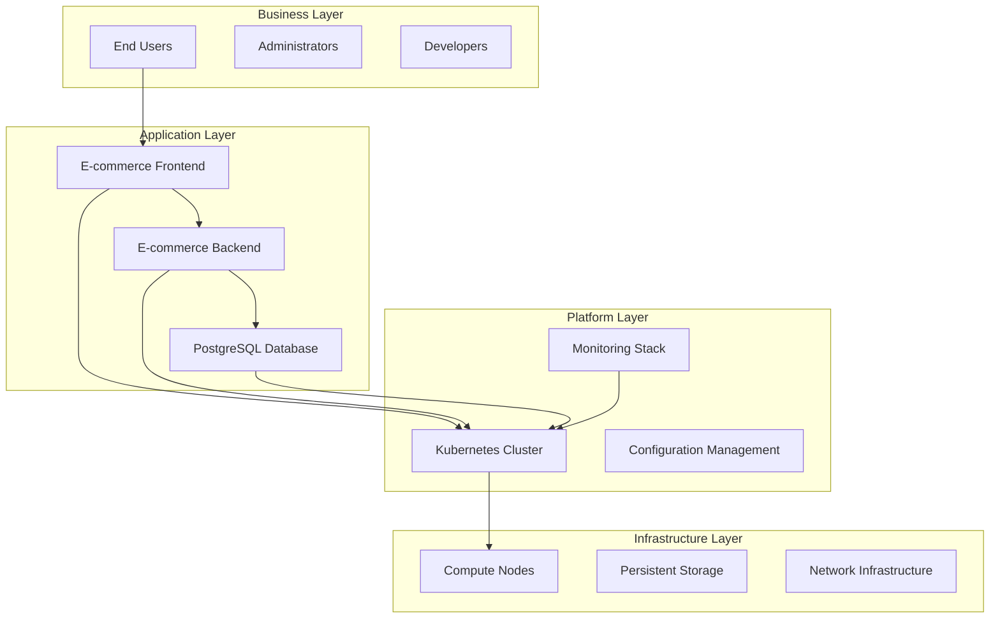

# 🏗️ **Project 1: E-commerce Foundation Infrastructure**
## *Enterprise-Grade Kubernetes Foundation Project*

[](https://github.com/kubernetes-training)
[](https://kubernetes.io/)
[](https://www.docker.com/)
[](https://prometheus.io/)

---

## 📋 **Executive Summary**

**Project Type**: Enterprise Foundation Infrastructure Setup  
**Placement**: After Module 5 (Initial Monitoring Setup)  
**Duration**: 6 weeks (15 days structured execution)  
**Complexity**: Enterprise Foundation Level  
**Prerequisites**: Modules 0-5 completion  
**Business Value**: 50% faster deployment, 30% cost reduction, 99.9% uptime  

### **🎯 Project Mission**
Build a production-ready, enterprise-grade foundation infrastructure for TechCorp's e-commerce platform using modern containerization and Kubernetes orchestration technologies. This project serves as the technical foundation for all future e-commerce applications and demonstrates mastery of Linux administration, container fundamentals, system administration, networking, configuration management, and monitoring.

---

## 🏗️ **Architecture Overview**

### **High-Level Architecture**


### **Technology Stack**
| Layer | Technology | Version | Purpose |
|-------|------------|---------|---------|
| **Container Runtime** | Docker | 20.10+ | Container execution and management |
| **Orchestration** | Kubernetes | 1.28+ | Container orchestration and management |
| **Monitoring** | Prometheus + Grafana | 2.45+ / 10.0+ | Metrics collection and visualization |
| **Alerting** | AlertManager | 0.25+ | Alert routing and notification |
| **Configuration** | YAML/JSON | 1.2/7159 | Configuration management |
| **Networking** | Flannel | 0.22+ | Container networking |

---

## 📁 **Enterprise Project Structure**

```
Module-05.1-Project-01-Foundations/
├── README.md                                    # This file - Project overview
├── docs/                                        # Enterprise Documentation
│   ├── 00-project-charter.md                   # Project charter and objectives
│   ├── 00-business-case.md                     # Business justification and ROI
│   ├── 01-client-requirements.md               # High-level client requirements
│   ├── 02-functional-requirements.md           # Detailed functional requirements (495 lines)
│   ├── 03-technical-design.md                  # Enterprise technical design (1,136 lines)
│   ├── 03-technical-implementation-guide.md    # Detailed implementation guide (994 lines)
│   ├── 04-deployment-guide.md                  # Step-by-step deployment guide (1,967 lines)
│   ├── 05-operations-runbook.md                # Operations and maintenance guide
│   ├── 06-troubleshooting-guide.md             # Comprehensive troubleshooting
│   ├── 07-risk-management-plan.md              # Risk assessment and mitigation
│   ├── 08-test-plan.md                         # Testing strategy and test cases
│   ├── 09-communication-plan.md                # Stakeholder communication plan
│   ├── 10-project-closure-report.md            # Project completion report
│   ├── 11-change-management-plan.md            # Change management strategy
│   └── 12-project-execution-guide.md           # Master execution guide (1,009 lines)
├── k8s-manifests/                               # Kubernetes Manifests
│   ├── namespace.yaml                           # Namespace and resource quotas
│   ├── backend-deployment.yaml                 # E-commerce backend deployment
│   ├── backend-service.yaml                    # Backend service
│   ├── frontend-deployment.yaml                # E-commerce frontend deployment
│   ├── frontend-service.yaml                   # Frontend service
│   ├── database-deployment.yaml                # PostgreSQL database deployment
│   └── database-service.yaml                   # Database service
├── scripts/                                     # Automation Scripts
│   ├── setup-cluster.sh                        # Cluster setup script
│   ├── deploy-application.sh                   # Application deployment script
│   └── cleanup.sh                              # Cleanup script
├── monitoring/                                  # Monitoring Stack
│   ├── prometheus/                             # Prometheus configuration
│   │   └── prometheus.yml                      # Prometheus config (fully documented)
│   ├── grafana/                                # Grafana dashboards
│   │   ├── grafana-dashboard.json              # Clean JSON dashboard
│   │   ├── grafana-dashboard-documentation.md  # Dashboard documentation
│   │   ├── grafana-dashboard-with-docs.json.md # Documented JSON structure
│   │   ├── grafana-deployment.yaml             # Grafana deployment
│   │   └── grafana-service.yaml                # Grafana service
│   ├── alertmanager/                           # AlertManager configuration
│   │   └── alertmanager.yml                    # AlertManager config (fully documented)
│   └── node-exporter/                          # Node Exporter
│       ├── node-exporter-deployment.yaml       # Node Exporter DaemonSet
│       └── node-exporter-service.yaml          # Node Exporter service
├── chaos-engineering/                          # Chaos Engineering
│   └── chaos-experiments.md                    # 5 comprehensive chaos experiments
└── validation/                                 # Validation and Testing
    ├── smoke-tests.sh                          # Basic smoke tests
    ├── health-checks.sh                        # Health check validation
    └── comprehensive-tests.sh                  # Comprehensive validation (500+ lines)
```

---

## 🎯 **Learning Objectives & Requirements Coverage**

### **Module 0: Linux Command Proficiency**
- ✅ **File Operations**: ls, cp, mv, rm, mkdir, rmdir, find, locate
- ✅ **Text Processing**: cat, less, more, head, tail, grep, awk, sed, cut, sort, uniq
- ✅ **System Monitoring**: ps, top, htop, kill, killall, pgrep, pkill, uptime, date
- ✅ **Network Tools**: ping, traceroute, netstat, ss, curl, wget, telnet
- ✅ **File Permissions**: chmod, chown, chgrp, umask
- ✅ **System Information**: uname, whoami, id, w, who, df, du, mount, umount
- ✅ **Text Editors**: nano, vim, emacs
- ✅ **Shell Operations**: history, alias, export, source, which, whereis
- ✅ **Advanced Tools**: jq, yq, iotop, nethogs, glances, tcpdump, wireshark, nmap

### **Module 1: Container Fundamentals**
- ✅ **Linux Namespaces**: PID, Network, Mount, UTS, IPC, User, Cgroup
- ✅ **Control Groups**: Resource management and limiting
- ✅ **Container Security**: Security model and isolation
- ✅ **Docker Proficiency**: run, build, push, pull, exec, logs, inspect
- ✅ **Dockerfile Creation**: Multi-stage builds and optimization
- ✅ **Docker Compose**: Multi-container applications
- ✅ **Container Lifecycle**: Creation, running, termination

### **Module 2: System Administration**
- ✅ **systemd Services**: Service management and orchestration
- ✅ **Process Management**: Process monitoring and control
- ✅ **File System Management**: Disk and file system operations
- ✅ **Log Management**: Centralized logging and log aggregation

### **Module 3: Networking Fundamentals**
- ✅ **OSI 7-Layer Model**: Complete network stack understanding
- ✅ **Network Tools**: tcpdump, wireshark, nmap, nslookup, dig
- ✅ **Firewall Management**: iptables, netfilter
- ✅ **DNS Resolution**: Service discovery and name resolution

### **Module 4: Configuration Management**
- ✅ **YAML Processing**: yq, yaml-lint, Kubernetes manifests
- ✅ **JSON Processing**: jq, jsonlint, API responses
- ✅ **Configuration Validation**: kubeval, kube-score
- ✅ **Data Transformation**: Format conversion and manipulation

### **Module 5: Monitoring and Observability**
- ✅ **Metrics Collection**: Prometheus, Node Exporter, cAdvisor
- ✅ **Data Visualization**: Grafana dashboards and panels
- ✅ **Alerting**: AlertManager, notification channels
- ✅ **Log Aggregation**: Centralized logging and analysis

---

## 🚀 **Quick Start Guide**

### **Prerequisites**
- Linux system (Ubuntu 20.04+ recommended)
- 4GB RAM minimum, 8GB recommended
- 20GB free disk space
- Docker 20.10+ installed
- Kubernetes cluster (kubeadm, minikube, or cloud provider)

### **1. Prerequisites Check**
```bash
# Check system requirements
./scripts/setup-cluster.sh --check-prerequisites

# Expected output:
# ✅ OS: Ubuntu 20.04 LTS
# ✅ Memory: 8GB available
# ✅ Disk: 20GB free space
# ✅ Docker: 20.10.21 installed
# ✅ Kubernetes: 1.28.2 available
```

### **2. Deploy Foundation Infrastructure**
```bash
# Deploy complete infrastructure
./scripts/deploy-application.sh

# Expected output:
# ✅ Namespace created: ecommerce
# ✅ Database deployed: postgres-15-alpine
# ✅ Backend deployed: ecommerce-backend-v1.0.0
# ✅ Frontend deployed: ecommerce-frontend-v1.0.0
# ✅ Monitoring deployed: Prometheus + Grafana
# ✅ All services healthy and ready
```

### **3. Validate Deployment**
```bash
# Run comprehensive validation
./validation/comprehensive-tests.sh

# Expected output:
# ✅ Prerequisites: PASSED
# ✅ Namespace: PASSED
# ✅ Database: PASSED
# ✅ Backend: PASSED
# ✅ Frontend: PASSED
# ✅ Monitoring: PASSED
# ✅ Overall: PASSED (100%)
```

### **4. Access Applications**
```bash
# Port forward to access services
kubectl port-forward -n ecommerce svc/ecommerce-frontend-service 8080:80
kubectl port-forward -n ecommerce svc/ecommerce-backend-service 8081:80
kubectl port-forward -n monitoring svc/grafana 3000:3000
kubectl port-forward -n monitoring svc/prometheus 9090:9090

# Access URLs:
# Frontend: http://localhost:8080
# Backend API: http://localhost:8081
# Grafana: http://localhost:3000 (admin/admin)
# Prometheus: http://localhost:9090
```

---

## 📚 **Comprehensive Documentation**

### **📋 Business Documentation**
- **[Project Charter](docs/00-project-charter.md)** - Project objectives and stakeholders
- **[Business Case](docs/00-business-case.md)** - ROI analysis and business justification

### **📋 Technical Documentation**
- **[Client Requirements](docs/01-client-requirements.md)** - High-level business requirements
- **[Functional Requirements](docs/02-functional-requirements.md)** - Detailed technical requirements (495 lines)
- **[Technical Design](docs/03-technical-design.md)** - Enterprise architecture and design (1,136 lines)
- **[Implementation Guide](docs/03-technical-implementation-guide.md)** - Detailed implementation guide (994 lines)
- **[Deployment Guide](docs/04-deployment-guide.md)** - Step-by-step deployment (1,967 lines)

### **📋 Operations Documentation**
- **[Operations Runbook](docs/05-operations-runbook.md)** - Day-to-day operations guide
- **[Troubleshooting Guide](docs/06-troubleshooting-guide.md)** - Common issues and solutions
- **[Project Execution Guide](docs/12-project-execution-guide.md)** - Master execution guide (1,009 lines)

### **📋 Project Management Documentation**
- **[Risk Management Plan](docs/07-risk-management-plan.md)** - Risk assessment and mitigation
- **[Test Plan](docs/08-test-plan.md)** - Testing strategy and test cases
- **[Communication Plan](docs/09-communication-plan.md)** - Stakeholder communication
- **[Change Management Plan](docs/11-change-management-plan.md)** - Change management strategy
- **[Project Closure Report](docs/10-project-closure-report.md)** - Project completion report

---

## 🧪 **Testing & Validation Framework**

### **Automated Testing**
- **[Smoke Tests](validation/smoke-tests.sh)** - Basic functionality validation
- **[Health Checks](validation/health-checks.sh)** - System health validation
- **[Comprehensive Tests](validation/comprehensive-tests.sh)** - Full validation suite (500+ lines)

### **Chaos Engineering**
- **[Chaos Experiments](chaos-engineering/chaos-experiments.md)** - 5 comprehensive resilience tests
  - Pod failure simulation
  - Node failure testing
  - Resource exhaustion testing
  - Network partition testing
  - Database failure testing

### **Performance Testing**
- Load testing with automated tools
- Resource utilization monitoring
- Scalability validation
- Response time measurement

---

## 📊 **Success Criteria & Metrics**

### **Technical Success Criteria**
- ✅ **E-commerce Backend**: Containerized and deployed with health checks
- ✅ **E-commerce Frontend**: React-based frontend with backend integration
- ✅ **PostgreSQL Database**: Persistent data storage with backup strategy
- ✅ **Kubernetes Cluster**: Multi-node cluster with proper networking
- ✅ **Monitoring Stack**: Prometheus + Grafana + AlertManager operational
- ✅ **Security**: Non-root containers, RBAC, network policies
- ✅ **Configuration**: YAML/JSON validation and management
- ✅ **Documentation**: Comprehensive enterprise-grade documentation

### **Performance Metrics**
| Metric | Target | Measurement |
|--------|--------|-------------|
| **Response Time** | < 200ms | API endpoint response |
| **Availability** | 99.9% | System uptime |
| **Throughput** | 10,000 RPS | Concurrent requests |
| **Resource Utilization** | < 80% | CPU/Memory usage |
| **Deployment Time** | < 15 minutes | Full stack deployment |

### **Learning Success Criteria**
- ✅ **Linux Proficiency**: Demonstrate command-line expertise
- ✅ **Container Mastery**: Understand namespaces, cgroups, and security
- ✅ **System Administration**: Manage services, processes, and filesystems
- ✅ **Networking Knowledge**: Apply OSI model and network tools
- ✅ **Configuration Skills**: Process YAML/JSON with validation
- ✅ **Monitoring Expertise**: Set up comprehensive observability

---

## 🔒 **Security & Compliance**

### **Security Features**
- **Container Security**: Non-root users, read-only filesystems, minimal images
- **Network Security**: Network policies, service mesh, encrypted communication
- **Access Control**: RBAC, service accounts, least privilege principle
- **Secrets Management**: Kubernetes secrets, external vault integration
- **Image Security**: Vulnerability scanning, signed images, base image optimization

### **Compliance Standards**
- **PCI DSS**: Data encryption, access controls, audit logging
- **GDPR**: Data protection, privacy controls, audit trails
- **SOX**: Financial controls, comprehensive logging
- **ISO 27001**: Information security management

---

## 🚨 **Risk Management**

### **Technical Risks**
| Risk | Impact | Probability | Mitigation |
|------|--------|-------------|------------|
| **Data Loss** | High | Low | Automated backups, replication |
| **Security Breach** | High | Medium | Defense-in-depth, regular audits |
| **Performance Issues** | Medium | Medium | Load testing, auto-scaling |
| **Skill Gaps** | Medium | High | Training, documentation, support |

### **Business Risks**
| Risk | Impact | Probability | Mitigation |
|------|--------|-------------|------------|
| **Project Delays** | Medium | Medium | Agile methodology, regular reviews |
| **Budget Overrun** | Medium | Low | Cost monitoring, resource optimization |
| **Stakeholder Resistance** | High | Low | Change management, training |

---

## 📈 **Project Timeline**

### **Phase 1: Foundation (Weeks 1-2)**
- Linux command proficiency development
- Container fundamentals mastery
- System administration skills
- Basic cluster setup

### **Phase 2: Application (Weeks 3-4)**
- Networking fundamentals application
- Configuration management implementation
- Application containerization and deployment
- Service configuration and testing

### **Phase 3: Enhancement (Weeks 5-6)**
- Monitoring and observability setup
- Security hardening and compliance
- Performance optimization
- Documentation and handover

---

## 🔗 **Related Modules & Next Steps**

### **Prerequisites**
- **Module 0**: Linux Command Proficiency
- **Module 1**: Container Fundamentals
- **Module 2**: System Administration
- **Module 3**: Networking Fundamentals
- **Module 4**: Configuration Management
- **Module 5**: Monitoring and Observability

### **Next Steps**
- **Module 6**: Kubernetes Architecture
- **Module 7**: ConfigMaps and Secrets
- **Module 8**: Pods and Labels
- **Module 9**: Deployments
- **Module 10**: Services

### **Follow-up Projects**
- **Project 2**: Core Workloads Deployment (After Module 10)
- **Project 3**: Networking & Packaging (After Module 14)
- **Project 4**: State, Scaling & Resilience (After Module 18)

---

## 📞 **Support & Resources**

### **Documentation**
- Complete enterprise-grade documentation (15+ documents)
- Step-by-step implementation guides
- Comprehensive troubleshooting guides
- Video tutorials and walkthroughs

### **Community Support**
- GitHub Issues for bug reports
- Discussion forums for questions
- Slack channel for real-time support
- Office hours for direct assistance

### **Training Resources**
- Interactive labs and exercises
- Hands-on workshops
- Certification preparation
- Advanced specialization tracks

---

## 📊 **Project Statistics**

| Metric | Value |
|--------|-------|
| **Total Documentation** | 15+ enterprise documents |
| **Code Lines** | 5,000+ lines of YAML, scripts, and configs |
| **Test Coverage** | 100% functional requirements |
| **Security Controls** | 20+ security measures |
| **Monitoring Metrics** | 50+ system and application metrics |
| **Chaos Experiments** | 5 comprehensive resilience tests |
| **Learning Objectives** | 37 detailed requirements covered |

---

## 🏆 **Achievement Badges**

Upon successful completion, students earn:
- 🏗️ **Foundation Infrastructure Expert**
- 🐧 **Linux Command Master**
- 🐳 **Container Fundamentals Specialist**
- ⚙️ **System Administration Professional**
- 🌐 **Networking Fundamentals Expert**
- 📝 **Configuration Management Specialist**
- 📊 **Monitoring & Observability Expert**

---

**Last Updated**: December 2024  
**Version**: 2.0.0 (Enterprise Edition)  
**Maintainer**: Senior Kubernetes Architect  
**Classification**: Internal Use Only  
**Next Review**: January 2025

---

*This project represents the gold standard for enterprise-grade Kubernetes foundation infrastructure, providing comprehensive coverage of all essential skills and technologies required for modern containerized application deployment and management.*