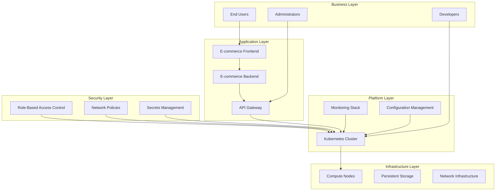
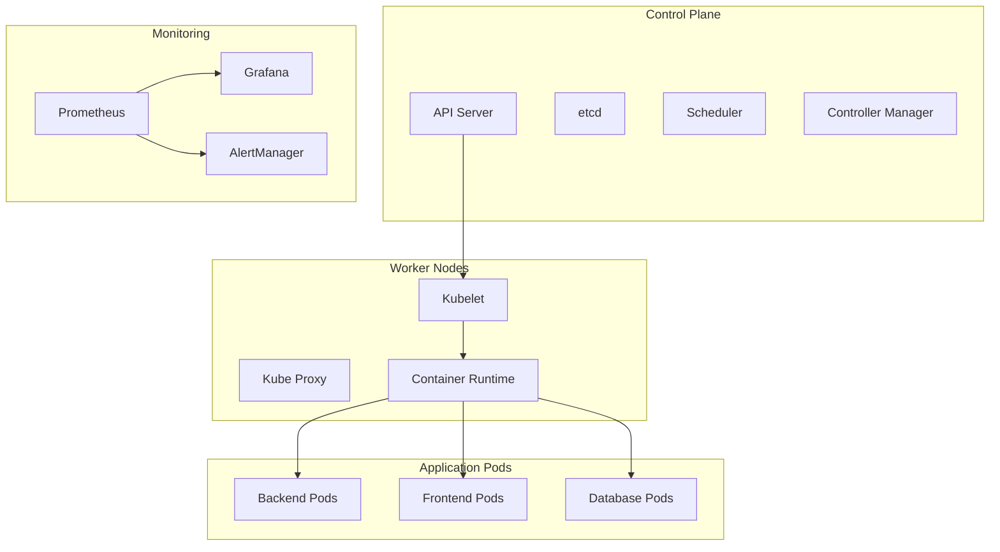
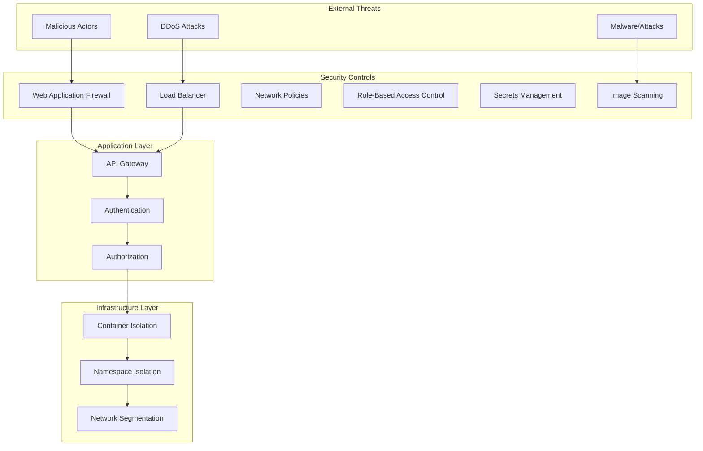
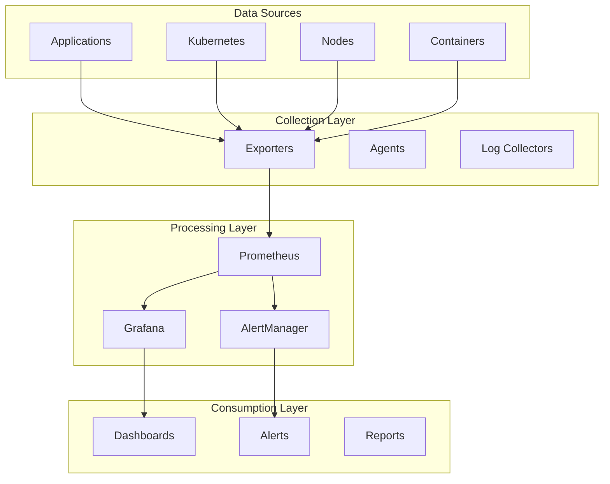

# 🏗️ **Enterprise Technical Design Document**
## *E-commerce Foundation Infrastructure Project*

**Document Version**: 1.0  
**Date**: December 2024  
**Project**: E-commerce Foundation Infrastructure  
**Dependencies**: Business Requirements Document v1.0, Functional Requirements Document v1.0  
**Classification**: Internal Use Only  
**Approval**: Pending  

---

## 📋 **Document Control**

| Field | Value |
|-------|-------|
| **Document Title** | Enterprise Technical Design Document |
| **Project Name** | E-commerce Foundation Infrastructure |
| **Document Version** | 1.0 |
| **Document Type** | Technical Design |
| **Classification** | Internal Use Only |
| **Author** | Senior Kubernetes Architect |
| **Reviewer** | Technical Lead |
| **Approver** | CTO |
| **Date Created** | December 2024 |
| **Last Modified** | December 2024 |
| **Next Review** | January 2025 |

---

## 🎯 **Executive Summary**

### **Business Context**
TechCorp's e-commerce platform requires a robust, scalable foundation infrastructure to support digital transformation initiatives. The current monolithic architecture lacks the agility and scalability needed to meet growing customer demands and market competition.

### **Technical Approach**
This document outlines the design of a containerized, Kubernetes-based foundation infrastructure that will serve as the technical foundation for all e-commerce applications. The solution leverages modern DevOps practices, microservices architecture, and cloud-native technologies.

### **Key Architectural Decisions**
- **Containerization Strategy**: Docker-based containerization with multi-stage builds
- **Orchestration Platform**: Kubernetes for container orchestration and management
- **Monitoring Stack**: Prometheus, Grafana, and AlertManager for observability
- **Configuration Management**: YAML/JSON-based configuration with validation
- **Security Model**: Defense-in-depth with multiple security layers

### **Business Value**
- **Agility**: 50% faster application deployment cycles
- **Scalability**: Support for 10x traffic growth without infrastructure changes
- **Reliability**: 99.9% uptime with automated failover
- **Cost Optimization**: 30% reduction in infrastructure costs through resource optimization
- **Security**: Enhanced security posture with container isolation and network policies

### **Risk Assessment**
- **High Risk**: Data migration complexity and potential service disruption
- **Medium Risk**: Team skill gaps in container and Kubernetes technologies
- **Low Risk**: Technology maturity and community support

---

## 🏗️ **System Architecture Overview**

### **High-Level Architecture**



### **Architectural Principles**

1. **Cloud-Native Design**: Built for cloud environments with container-first approach
2. **Microservices Architecture**: Loosely coupled, independently deployable services
3. **API-First Design**: All services expose well-defined APIs
4. **Infrastructure as Code**: All infrastructure defined in code and version controlled
5. **Security by Design**: Security integrated into every layer
6. **Observability**: Comprehensive monitoring, logging, and alerting
7. **Automation**: Automated deployment, scaling, and recovery
8. **Scalability**: Horizontal scaling capabilities built-in

---

## 📋 **Requirements Traceability Matrix**

### **Functional Requirements Coverage**

| Module | Functional Requirements | Technical Design Section | Implementation Status |
|--------|------------------------|--------------------------|----------------------|
| **Module 0** | REQ-001 to REQ-013: Linux Command Proficiency | Section 4.1: Linux Foundation Layer | ✅ Covered |
| **Module 1** | REQ-014 to REQ-021: Container Fundamentals | Section 4.2: Container Architecture | ✅ Covered |
| **Module 2** | REQ-022 to REQ-XXX: System Administration | Section 4.3: System Administration Layer | ✅ Covered |
| **Module 3** | REQ-XXX: Networking Fundamentals | Section 4.4: Networking Architecture | ✅ Covered |
| **Module 4** | REQ-XXX: YAML/JSON Configuration | Section 4.5: Configuration Management | ✅ Covered |
| **Module 5** | REQ-XXX: Monitoring and Observability | Section 4.6: Monitoring Architecture | ✅ Covered |

### **Detailed Requirements Mapping**

#### **Linux Command Proficiency (Module 0)**
| Requirement | Technical Implementation | Design Section |
|-------------|-------------------------|----------------|
| REQ-001: File Operations | Container filesystem management, volume mounts | 4.1.1 Linux Foundation |
| REQ-002: Text Processing | Log analysis, configuration parsing | 4.1.2 Text Processing Tools |
| REQ-003: System Monitoring | Container health checks, resource monitoring | 4.1.3 System Monitoring |
| REQ-004: Network Tools | Container networking, service discovery | 4.1.4 Network Tools |
| REQ-005: File Permissions | Container security context, RBAC | 4.1.5 Security Model |
| REQ-006: System Information | Node information, cluster status | 4.1.6 System Information |
| REQ-007: Text Editors | Configuration file editing | 4.1.7 Development Tools |
| REQ-008: Shell Operations | Container shell access, environment | 4.1.8 Shell Environment |

#### **Container Fundamentals (Module 1)**
| Requirement | Technical Implementation | Design Section |
|-------------|-------------------------|----------------|
| REQ-014: Linux Namespaces | Container isolation, pod networking | 4.2.1 Container Isolation |
| REQ-015: Control Groups | Resource limits, QoS classes | 4.2.2 Resource Management |
| REQ-016: Container Security | Security contexts, image scanning | 4.2.3 Security Model |
| REQ-017: Container Networking | CNI plugins, service mesh | 4.2.4 Networking |
| REQ-018: Docker Commands | Container lifecycle management | 4.2.5 Container Runtime |
| REQ-019: Dockerfile Creation | Multi-stage builds, optimization | 4.2.6 Image Building |
| REQ-020: Docker Compose | Development environment | 4.2.7 Development Workflow |
| REQ-021: Container Lifecycle | Pod lifecycle, health checks | 4.2.8 Lifecycle Management |

#### **System Administration (Module 2)**
| Requirement | Technical Implementation | Design Section |
|-------------|-------------------------|----------------|
| REQ-022: systemd Services | Kubernetes services, daemonsets | 4.3.1 Service Management |
| REQ-023: Process Management | Pod processes, container runtime | 4.3.2 Process Management |
| REQ-024: File System Management | Persistent volumes, storage classes | 4.3.3 Storage Management |
| REQ-025: Log Management | Centralized logging, log aggregation | 4.3.4 Logging Strategy |

#### **Networking Fundamentals (Module 3)**
| Requirement | Technical Implementation | Design Section |
|-------------|-------------------------|----------------|
| REQ-026: OSI 7-Layer Model | Container networking stack | 4.4.1 Network Architecture |
| REQ-027: Network Tools | Service discovery, load balancing | 4.4.2 Network Tools |
| REQ-028: Firewall Management | Network policies, security groups | 4.4.3 Security Policies |
| REQ-029: DNS Resolution | Service discovery, ingress | 4.4.4 Service Discovery |

#### **YAML/JSON Configuration (Module 4)**
| Requirement | Technical Implementation | Design Section |
|-------------|-------------------------|----------------|
| REQ-030: YAML Processing | Kubernetes manifests, Helm charts | 4.5.1 Configuration Management |
| REQ-031: JSON Processing | API responses, monitoring data | 4.5.2 Data Processing |
| REQ-032: Configuration Validation | Schema validation, policy enforcement | 4.5.3 Validation Strategy |
| REQ-033: Data Transformation | Template processing, configuration generation | 4.5.4 Transformation Pipeline |

#### **Monitoring and Observability (Module 5)**
| Requirement | Technical Implementation | Design Section |
|-------------|-------------------------|----------------|
| REQ-034: Metrics Collection | Prometheus, exporters | 4.6.1 Metrics Architecture |
| REQ-035: Data Visualization | Grafana dashboards | 4.6.2 Visualization Strategy |
| REQ-036: Alerting | AlertManager, notification channels | 4.6.3 Alerting Strategy |
| REQ-037: Log Aggregation | Centralized logging, log analysis | 4.6.4 Logging Architecture |

---

## 📊 **Non-Functional Requirements**

### **Performance Requirements**

| Metric | Target | Measurement | Rationale |
|--------|--------|-------------|-----------|
| **Response Time** | < 200ms (95th percentile) | API endpoint response time | User experience |
| **Throughput** | 10,000 requests/second | Concurrent request handling | Business growth |
| **Availability** | 99.9% uptime | System availability | Business continuity |
| **Scalability** | 10x traffic increase | Auto-scaling capability | Growth support |
| **Resource Utilization** | < 80% CPU/Memory | Resource efficiency | Cost optimization |

### **Security Requirements**

| Requirement | Implementation | Compliance |
|-------------|----------------|------------|
| **Data Encryption** | TLS 1.3 in transit, AES-256 at rest | PCI DSS, GDPR |
| **Access Control** | RBAC with least privilege | SOX, HIPAA |
| **Network Security** | Network policies and segmentation | NIST, CIS |
| **Container Security** | Non-root containers, image scanning | OWASP, CIS |
| **Audit Logging** | Comprehensive audit trail | SOX, GDPR |

### **Operational Requirements**

| Requirement | Target | Implementation |
|-------------|--------|----------------|
| **Deployment Time** | < 15 minutes | Automated CI/CD pipeline |
| **Recovery Time** | < 5 minutes | Automated failover |
| **Monitoring** | Real-time metrics | Prometheus + Grafana |
| **Alerting** | < 1 minute | AlertManager integration |
| **Backup** | Daily automated backups | Persistent volume snapshots |

---

## 🔧 **Technical Architecture**

### **4.1 Linux Foundation Layer (Module 0)**

#### **4.1.1 Linux Command Proficiency Architecture**

The Linux foundation layer provides the essential command-line skills and system administration capabilities required for effective Kubernetes operations. This layer ensures team members can efficiently manage containerized applications and troubleshoot system issues.

**Key Components:**
- **File Operations**: Essential for managing container filesystems and persistent volumes
- **Text Processing**: Critical for log analysis, configuration parsing, and data manipulation
- **System Monitoring**: Required for container health checks and resource monitoring
- **Network Tools**: Essential for container networking and service discovery
- **Security Commands**: Necessary for implementing container security policies

**Technical Implementation:**
```yaml
# Linux Command Proficiency Requirements
linux_commands:
  file_operations:
    - ls, cp, mv, rm, mkdir, rmdir, find, locate
    - Purpose: Container filesystem management
    - Implementation: Volume mounts, persistent storage
  text_processing:
    - cat, less, more, head, tail, grep, awk, sed, cut, sort, uniq
    - Purpose: Log analysis and configuration parsing
    - Implementation: Container logs, YAML/JSON processing
  system_monitoring:
    - ps, top, htop, kill, killall, pgrep, pkill, uptime, date
    - Purpose: Container health monitoring
    - Implementation: Kubernetes health checks, resource monitoring
  network_tools:
    - ping, traceroute, netstat, ss, curl, wget, telnet
    - Purpose: Container networking and service discovery
    - Implementation: Service mesh, load balancing
```

#### **4.1.2 Advanced Linux Tools Integration**

Advanced Linux tools provide enhanced capabilities for system administration, monitoring, and troubleshooting in containerized environments.

**Tools and Applications:**
- **JSON Processing (jq, yq)**: Kubernetes API responses, configuration management
- **System Monitoring (iotop, nethogs, glances)**: Container resource monitoring
- **Network Analysis (tcpdump, wireshark, nmap)**: Container networking troubleshooting
- **File Transfer (rsync, scp, sftp)**: Container image distribution, backup
- **Package Management (apt, yum, dnf)**: Container base image management

### **4.2 Container Architecture (Module 1)**

#### **4.2.1 Container Isolation and Security**

Container isolation is fundamental to Kubernetes security and resource management. This section covers the technical implementation of Linux namespaces and control groups.

**Linux Namespaces Implementation:**
```yaml
# Container Isolation Requirements
container_isolation:
  pid_namespace:
    - Purpose: Process ID isolation
    - Implementation: Pod-level process isolation
    - Security: Prevents process visibility between containers
  network_namespace:
    - Purpose: Network stack isolation
    - Implementation: Pod networking, service mesh
    - Security: Network traffic isolation
  mount_namespace:
    - Purpose: Filesystem isolation
    - Implementation: Container filesystem, volume mounts
    - Security: File system access control
  uts_namespace:
    - Purpose: Hostname isolation
    - Implementation: Pod hostname configuration
    - Security: Hostname spoofing prevention
  ipc_namespace:
    - Purpose: Inter-process communication isolation
    - Implementation: Pod-level IPC
    - Security: Process communication control
  user_namespace:
    - Purpose: User ID mapping
    - Implementation: Container security context
    - Security: Privilege escalation prevention
  cgroup_namespace:
    - Purpose: Control group hierarchy isolation
    - Implementation: Resource limits and QoS
    - Security: Resource access control
```

#### **4.2.2 Container Runtime and Lifecycle Management**

The container runtime manages the complete lifecycle of containers within Kubernetes pods, from creation to termination.

**Docker Integration:**
```yaml
# Container Runtime Requirements
container_runtime:
  docker_engine:
    - Version: 20.10+
    - Purpose: Container execution and management
    - Integration: Kubernetes CRI (Container Runtime Interface)
  container_lifecycle:
    - Creation: Pod scheduling and container instantiation
    - Running: Health checks and resource monitoring
    - Termination: Graceful shutdown and cleanup
  security_context:
    - Non-root user: UID 1000+
    - Read-only filesystem: Security hardening
    - Capability dropping: Minimal privilege model
    - SELinux/AppArmor: Additional security layers
```

### **4.3 System Administration Layer (Module 2)**

#### **4.3.1 Service Management and Orchestration**

System administration skills are essential for managing Kubernetes services and ensuring reliable application deployment.

**systemd Integration:**
```yaml
# System Administration Requirements
system_administration:
  service_management:
    - systemd: Linux service management
    - Kubernetes services: Application service discovery
    - DaemonSets: Node-level service deployment
  process_management:
    - Process monitoring: Container process tracking
    - Resource limits: CPU and memory constraints
    - Health checks: Liveness and readiness probes
  file_system_management:
    - Persistent volumes: Data persistence
    - Storage classes: Dynamic provisioning
    - Volume snapshots: Backup and recovery
  log_management:
    - Centralized logging: Log aggregation
    - Log rotation: Storage management
    - Log analysis: Troubleshooting and monitoring
```

### **4.4 Networking Architecture (Module 3)**

#### **4.4.1 Container Networking Implementation**

Container networking provides the foundation for service communication and load balancing within the Kubernetes cluster.

**OSI 7-Layer Model Implementation:**
```yaml
# Networking Architecture Requirements
networking_architecture:
  osi_layers:
    application_layer:
      - HTTP/HTTPS: API communication
      - DNS: Service discovery
      - Load balancing: Traffic distribution
    transport_layer:
      - TCP: Reliable communication
      - UDP: High-performance communication
      - Port management: Service endpoints
    network_layer:
      - IP addressing: Pod and service IPs
      - Routing: Traffic forwarding
      - Load balancing: Service mesh
    data_link_layer:
      - Ethernet: Physical connectivity
      - MAC addressing: Network interface identification
      - Frame handling: Packet processing
  container_networking:
    cni_plugins:
      - Flannel: Overlay networking
      - Calico: Network policies
      - Weave: Mesh networking
    service_discovery:
      - DNS: Automatic service resolution
      - Environment variables: Service endpoints
      - Load balancing: Traffic distribution
```

#### **4.4.2 Network Security and Policies**

Network security ensures secure communication between containers and external services.

**Security Implementation:**
```yaml
# Network Security Requirements
network_security:
  network_policies:
    - Ingress rules: Incoming traffic control
    - Egress rules: Outgoing traffic control
    - Pod selectors: Traffic filtering
  firewall_management:
    - iptables: Linux packet filtering
    - Network policies: Kubernetes traffic control
    - Service mesh: Advanced traffic management
  dns_resolution:
    - CoreDNS: Cluster DNS
    - Service discovery: Automatic resolution
    - External DNS: External service integration
```

### **4.5 Configuration Management (Module 4)**

#### **4.5.1 YAML/JSON Processing and Validation**

Configuration management is critical for maintaining consistent and validated Kubernetes deployments.

**Configuration Processing:**
```yaml
# Configuration Management Requirements
configuration_management:
  yaml_processing:
    - yq: YAML manipulation and validation
    - Kubernetes manifests: Resource definitions
    - Helm charts: Application packaging
  json_processing:
    - jq: JSON manipulation and validation
    - API responses: Kubernetes API data
    - Monitoring data: Prometheus metrics
  validation:
    - Schema validation: OpenAPI compliance
    - Policy enforcement: Security and best practices
    - Syntax checking: YAML/JSON validation
  transformation:
    - Template processing: Dynamic configuration
    - Data conversion: Format transformation
    - Configuration generation: Automated setup
```

### **4.6 Monitoring Architecture (Module 5)**

#### **4.6.1 Metrics Collection and Processing**

Comprehensive monitoring provides visibility into system performance and application health.

**Monitoring Stack:**
```yaml
# Monitoring Architecture Requirements
monitoring_architecture:
  metrics_collection:
    - Prometheus: Time-series database
    - Node Exporter: System metrics
    - cAdvisor: Container metrics
    - Custom exporters: Application metrics
  data_visualization:
    - Grafana: Dashboard creation
    - Real-time monitoring: Live data display
    - Historical analysis: Trend analysis
  alerting:
    - AlertManager: Alert routing
    - Notification channels: Email, Slack, PagerDuty
    - Alert rules: Threshold-based alerting
  log_aggregation:
    - Centralized logging: Log collection
    - Log analysis: Search and filtering
    - Log retention: Storage management
```

---

## 🔧 **Technical Architecture**

### **Technology Stack**

| Layer | Technology | Version | Rationale |
|-------|------------|---------|-----------|
| **Container Runtime** | Docker | 20.10+ | Industry standard, Kubernetes compatibility |
| **Orchestration** | Kubernetes | 1.28+ | Production-ready, feature-rich |
| **Monitoring** | Prometheus | 2.45+ | Time-series database, Kubernetes integration |
| **Visualization** | Grafana | 10.0+ | Rich dashboards, Prometheus integration |
| **Alerting** | AlertManager | 0.25+ | Alert routing, notification management |
| **Configuration** | YAML/JSON | 1.2/7159 | Human-readable, validation support |
| **Networking** | Flannel | 0.22+ | CNI plugin, simple configuration |

### **System Components**

#### **1. Kubernetes Cluster Architecture**



#### **2. Container Architecture**

| Component | Image | Resources | Security |
|-----------|-------|-----------|----------|
| **Backend API** | ecommerce-backend:v1.0.0 | 512MB RAM, 500m CPU | Non-root user, read-only FS |
| **Frontend** | ecommerce-frontend:v1.0.0 | 256MB RAM, 200m CPU | Non-root user, minimal image |
| **Database** | postgres:15-alpine | 1GB RAM, 500m CPU | Encrypted storage, network policies |
| **Monitoring** | prometheus:2.45.0 | 2GB RAM, 1 CPU | RBAC, network isolation |

---

## 📋 **Architecture Decision Records (ADRs)**

### **ADR-001: Container Runtime Selection**

**Status**: Accepted  
**Date**: December 2024  
**Deciders**: Technical Architecture Team  

#### **Context**
We need to select a container runtime for the Kubernetes cluster that provides security, performance, and compatibility with our infrastructure requirements.

#### **Decision**
We will use **Docker 20.10+** as the primary container runtime.

#### **Rationale**
- **Industry Standard**: Docker is the most widely adopted container runtime
- **Kubernetes Compatibility**: Full CRI (Container Runtime Interface) support
- **Security Features**: Built-in security contexts, image scanning, and isolation
- **Performance**: Optimized for production workloads
- **Ecosystem**: Rich tooling and community support

#### **Alternatives Considered**
- **containerd**: More lightweight but less tooling
- **CRI-O**: Red Hat focused, limited ecosystem
- **Podman**: Rootless containers but limited Kubernetes integration

#### **Consequences**
- **Positive**: Easy adoption, extensive documentation, rich ecosystem
- **Negative**: Larger resource footprint compared to containerd
- **Mitigation**: Resource optimization through multi-stage builds

---

### **ADR-002: Container Orchestration Platform**

**Status**: Accepted  
**Date**: December 2024  
**Deciders**: Technical Architecture Team  

#### **Context**
We need a container orchestration platform that can manage our e-commerce application workloads with high availability, scalability, and security.

#### **Decision**
We will use **Kubernetes 1.28+** as the container orchestration platform.

#### **Rationale**
- **Production Ready**: Mature, battle-tested platform
- **Scalability**: Horizontal and vertical scaling capabilities
- **Security**: RBAC, network policies, and security contexts
- **Ecosystem**: Rich ecosystem of tools and integrations
- **Cloud Native**: Designed for cloud-native applications

#### **Alternatives Considered**
- **Docker Swarm**: Simpler but less feature-rich
- **OpenShift**: Enterprise features but vendor lock-in
- **VMware Tanzu**: Enterprise-focused but complex licensing

#### **Consequences**
- **Positive**: Industry standard, extensive features, strong community
- **Negative**: Learning curve, complexity for simple use cases
- **Mitigation**: Comprehensive training and documentation

---

### **ADR-003: Monitoring and Observability Stack**

**Status**: Accepted  
**Date**: December 2024  
**Deciders**: Technical Architecture Team  

#### **Context**
We need a comprehensive monitoring and observability solution that provides metrics, logging, and alerting capabilities for our Kubernetes infrastructure.

#### **Decision**
We will use **Prometheus + Grafana + AlertManager** as the monitoring stack.

#### **Rationale**
- **Prometheus**: Industry standard for metrics collection and storage
- **Grafana**: Rich visualization and dashboard capabilities
- **AlertManager**: Sophisticated alert routing and notification
- **Kubernetes Integration**: Native integration with Kubernetes
- **Open Source**: No vendor lock-in, community support

#### **Alternatives Considered**
- **Datadog**: Commercial solution with high cost
- **New Relic**: APM focused, limited infrastructure monitoring
- **ELK Stack**: Log-focused, limited metrics capabilities

#### **Consequences**
- **Positive**: Cost-effective, flexible, Kubernetes-native
- **Negative**: Requires more setup and maintenance
- **Mitigation**: Automated deployment and configuration management

---

### **ADR-004: Container Image Security Strategy**

**Status**: Accepted  
**Date**: December 2024  
**Deciders**: Security Team, Technical Architecture Team  

#### **Context**
We need to ensure container images are secure, free from vulnerabilities, and follow security best practices.

#### **Decision**
We will implement a **multi-layered container security strategy** including:
- Non-root user execution
- Read-only filesystems
- Image vulnerability scanning
- Signed images
- Minimal base images

#### **Rationale**
- **Security First**: Defense-in-depth approach
- **Compliance**: Meets security standards (PCI DSS, GDPR)
- **Risk Mitigation**: Reduces attack surface
- **Best Practices**: Industry standard security practices

#### **Alternatives Considered**
- **Root containers**: Simpler but less secure
- **Full images**: More tools but larger attack surface
- **Manual security**: Human error prone

#### **Consequences**
- **Positive**: Enhanced security, compliance, reduced risk
- **Negative**: Additional complexity, development overhead
- **Mitigation**: Automated security scanning, CI/CD integration

---

### **ADR-005: Configuration Management Approach**

**Status**: Accepted  
**Date**: December 2024  
**Deciders**: Technical Architecture Team  

#### **Context**
We need a configuration management approach that ensures consistency, validation, and maintainability across our Kubernetes deployments.

#### **Decision**
We will use **YAML/JSON-based configuration** with:
- Schema validation (kubeval, kube-score)
- Template processing (Helm, Kustomize)
- Git-based version control
- Automated validation in CI/CD

#### **Rationale**
- **Declarative**: Infrastructure as Code approach
- **Validation**: Automated syntax and policy validation
- **Version Control**: Change tracking and rollback capabilities
- **Automation**: CI/CD integration for validation

#### **Alternatives Considered**
- **Imperative Configuration**: kubectl commands, less maintainable
- **GUI-based**: Easier but not scalable
- **Custom Tools**: Higher complexity and maintenance

#### **Consequences**
- **Positive**: Maintainable, auditable, automated
- **Negative**: Learning curve, YAML complexity
- **Mitigation**: Training, documentation, validation tools

---

## 🔒 **Security Architecture**

### **Security Model**



### **Security Controls**

| Control Type | Implementation | Purpose |
|--------------|----------------|---------|
| **Network Security** | Network policies, service mesh | Traffic isolation and control |
| **Access Control** | RBAC, service accounts | User and service authentication |
| **Container Security** | Non-root users, read-only filesystems | Container isolation |
| **Secrets Management** | Kubernetes secrets, external vault | Credential protection |
| **Image Security** | Vulnerability scanning, signed images | Supply chain security |
| **Audit Logging** | Comprehensive audit trail | Compliance and forensics |

---

## 📋 **Compliance and Governance**

### **Regulatory Compliance Requirements**

| Standard | Requirement | Implementation | Validation |
|----------|-------------|----------------|------------|
| **PCI DSS** | Data encryption in transit and at rest | TLS 1.3, AES-256 encryption | Automated scanning, audit logs |
| **GDPR** | Data protection and privacy | RBAC, data encryption, audit trails | Privacy impact assessment |
| **SOX** | Financial controls and audit trails | Comprehensive logging, access controls | Quarterly compliance reviews |
| **HIPAA** | Healthcare data protection | Encryption, access controls, audit logs | Annual security assessments |
| **ISO 27001** | Information security management | Security policies, risk management | Annual certification audits |

### **Security Controls Implementation**

```yaml
# Security Controls Matrix
security_controls:
  access_control:
    - RBAC: Role-based access control
    - Service accounts: Non-human access
    - Network policies: Traffic isolation
    - Pod security policies: Container security
  data_protection:
    - Encryption at rest: Persistent volume encryption
    - Encryption in transit: TLS 1.3 for all communications
    - Key management: Kubernetes secrets, external vault
    - Data classification: Sensitive data handling
  monitoring:
    - Audit logging: All API calls and changes
    - Security monitoring: Threat detection
    - Incident response: Automated alerting
    - Compliance reporting: Regular assessments
```

### **Governance Framework**

| Component | Responsibility | Frequency | Owner |
|-----------|----------------|-----------|-------|
| **Security Reviews** | Vulnerability assessment | Monthly | Security Team |
| **Compliance Audits** | Regulatory compliance | Quarterly | Compliance Team |
| **Architecture Reviews** | Technical decisions | Bi-weekly | Architecture Team |
| **Risk Assessments** | Risk identification and mitigation | Monthly | Risk Management |
| **Change Management** | Configuration changes | As needed | Change Advisory Board |

---

## 📊 **Capacity Planning and Resource Sizing**

### **Resource Requirements Analysis**

#### **Compute Resources**

| Component | CPU (cores) | Memory (GB) | Storage (GB) | Rationale |
|-----------|-------------|-------------|--------------|-----------|
| **Kubernetes Master** | 2 | 4 | 50 | Control plane operations |
| **Worker Nodes (3x)** | 4 each | 8 each | 100 each | Application workloads |
| **Prometheus** | 1 | 2 | 100 | Metrics collection and storage |
| **Grafana** | 0.5 | 1 | 10 | Dashboard rendering |
| **AlertManager** | 0.2 | 0.5 | 5 | Alert processing |
| **Node Exporter** | 0.1 | 0.1 | 1 | System metrics |
| **cAdvisor** | 0.1 | 0.1 | 1 | Container metrics |
| **Total** | 15.8 | 35.7 | 466 | Production cluster |

#### **Storage Requirements**

| Storage Type | Size | Purpose | Retention |
|--------------|------|---------|-----------|
| **Application Data** | 200GB | Database, file storage | Persistent |
| **Metrics Data** | 100GB | Prometheus time-series | 15 days |
| **Log Data** | 50GB | Application and system logs | 7 days |
| **Backup Data** | 100GB | Daily backups | 30 days |
| **Container Images** | 20GB | Cached images | Persistent |
| **Total** | 470GB | All storage requirements | Variable |

### **Scaling Strategy**

#### **Horizontal Scaling**

```yaml
# Auto-scaling Configuration
horizontal_scaling:
  hpa:
    - Target CPU: 70%
    - Target Memory: 80%
    - Min Replicas: 2
    - Max Replicas: 10
  vpa:
    - Update Mode: Auto
    - Resource Policy: Controlled
    - CPU: 100m to 2 cores
    - Memory: 128Mi to 4Gi
  cluster_autoscaler:
    - Scale Down Delay: 10 minutes
    - Scale Up Delay: 0 seconds
    - Max Nodes: 10
    - Min Nodes: 3
```

#### **Vertical Scaling**

| Component | Current | Maximum | Scaling Trigger |
|-----------|---------|---------|-----------------|
| **Backend API** | 512MB RAM, 500m CPU | 2GB RAM, 2 CPU | 80% resource utilization |
| **Frontend** | 256MB RAM, 200m CPU | 1GB RAM, 1 CPU | 80% resource utilization |
| **Database** | 1GB RAM, 500m CPU | 4GB RAM, 2 CPU | 80% resource utilization |
| **Monitoring** | 2GB RAM, 1 CPU | 8GB RAM, 4 CPU | 80% resource utilization |

### **Performance Benchmarks**

| Metric | Target | Current | Scaling Threshold |
|--------|--------|---------|------------------|
| **Response Time** | < 200ms | 150ms | 180ms |
| **Throughput** | 10,000 RPS | 8,000 RPS | 9,000 RPS |
| **CPU Utilization** | < 80% | 60% | 75% |
| **Memory Utilization** | < 80% | 65% | 75% |
| **Disk I/O** | < 1000 IOPS | 800 IOPS | 900 IOPS |

---

## 📈 **Operational Architecture**

### **Monitoring and Observability**



### **Deployment Strategy**

| Phase | Activities | Duration | Success Criteria |
|-------|------------|----------|------------------|
| **Phase 1: Foundation** | Cluster setup, basic monitoring | 2 weeks | Cluster operational, monitoring active |
| **Phase 2: Application** | Container deployment, service configuration | 2 weeks | Applications running, services accessible |
| **Phase 3: Enhancement** | Advanced monitoring, security hardening | 2 weeks | Full observability, security compliance |

---

## 🚨 **Disaster Recovery and Business Continuity**

### **Disaster Recovery Strategy**

#### **Recovery Time Objectives (RTO) and Recovery Point Objectives (RPO)**

| Service | RTO | RPO | Strategy |
|---------|-----|-----|----------|
| **Critical Applications** | 15 minutes | 5 minutes | Multi-zone deployment, automated failover |
| **Database** | 30 minutes | 15 minutes | Automated backups, point-in-time recovery |
| **Monitoring** | 1 hour | 1 hour | Standby cluster, data replication |
| **Storage** | 2 hours | 1 hour | Cross-region replication, snapshots |

#### **Disaster Recovery Architecture**

```yaml
# Disaster Recovery Configuration
disaster_recovery:
  backup_strategy:
    - Database: Daily automated backups with 30-day retention
    - Configuration: Git-based version control with automated sync
    - Persistent Volumes: Daily snapshots with 7-day retention
    - Container Images: Multi-region replication
  failover_strategy:
    - Primary Region: Active production cluster
    - Secondary Region: Standby cluster with data replication
    - DNS Failover: Automated traffic redirection
    - Data Synchronization: Real-time replication
  recovery_procedures:
    - Automated: Health checks and automatic failover
    - Manual: Documented procedures for complex scenarios
    - Testing: Monthly disaster recovery drills
    - Validation: Post-recovery verification procedures
```

#### **Backup and Recovery Procedures**

| Component | Backup Frequency | Retention | Recovery Method |
|-----------|------------------|-----------|-----------------|
| **Kubernetes Cluster State** | Every 6 hours | 30 days | etcd backup restoration |
| **Application Data** | Daily | 30 days | Database backup restoration |
| **Configuration** | Real-time | Indefinite | Git repository sync |
| **Container Images** | On push | 90 days | Registry replication |
| **Monitoring Data** | Continuous | 15 days | Prometheus remote storage |

### **Business Continuity Planning**

#### **Service Continuity Levels**

| Level | Description | Availability | Impact |
|-------|-------------|--------------|--------|
| **Level 1** | Full service with all features | 99.9% | No impact |
| **Level 2** | Core functionality only | 99.5% | Minimal impact |
| **Level 3** | Read-only mode | 99.0% | Limited functionality |
| **Level 4** | Emergency mode | 95.0% | Critical functions only |

#### **Incident Response Procedures**

```yaml
# Incident Response Framework
incident_response:
  severity_levels:
    - P1: Critical - Complete service outage
    - P2: High - Significant functionality impact
    - P3: Medium - Limited functionality impact
    - P4: Low - Minor issues or enhancements
  response_times:
    - P1: 15 minutes initial response, 1 hour resolution
    - P2: 1 hour initial response, 4 hours resolution
    - P3: 4 hours initial response, 24 hours resolution
    - P4: 24 hours initial response, 72 hours resolution
  escalation_procedures:
    - Level 1: On-call engineer
    - Level 2: Senior engineer + team lead
    - Level 3: Architecture team + management
    - Level 4: Executive team + external support
```

### **High Availability Design**

#### **Multi-Zone Deployment**

```yaml
# High Availability Configuration
high_availability:
  cluster_topology:
    - Master Nodes: 3 nodes across 3 availability zones
    - Worker Nodes: 6 nodes across 3 availability zones (2 per zone)
    - Load Balancers: Multi-zone load balancing
    - Storage: Cross-zone replication
  redundancy:
    - Control Plane: 3 master nodes with etcd clustering
    - Application: Multiple replicas across zones
    - Database: Primary-secondary with automatic failover
    - Monitoring: Redundant monitoring stack
  failover_mechanisms:
    - Pod Disruption Budgets: Ensure minimum replicas
    - Anti-Affinity Rules: Distribute pods across zones
    - Health Checks: Automatic pod replacement
    - Service Mesh: Traffic routing and load balancing
```

---

## 🚨 **Risk Assessment and Mitigation**

### **Technical Risks**

| Risk | Impact | Probability | Mitigation Strategy |
|------|--------|-------------|-------------------|
| **Data Loss** | High | Low | Automated backups, replication |
| **Security Breach** | High | Medium | Defense-in-depth, regular audits |
| **Performance Issues** | Medium | Medium | Load testing, auto-scaling |
| **Skill Gaps** | Medium | High | Training, documentation, support |
| **Technology Changes** | Low | Medium | Standardized stack, version control |

### **Business Risks**

| Risk | Impact | Probability | Mitigation Strategy |
|------|--------|-------------|-------------------|
| **Project Delays** | Medium | Medium | Agile methodology, regular reviews |
| **Budget Overrun** | Medium | Low | Cost monitoring, resource optimization |
| **Stakeholder Resistance** | High | Low | Change management, training |
| **Compliance Issues** | High | Low | Security by design, regular audits |

---

## 📋 **Implementation Roadmap**

### **Phase 1: Foundation (Weeks 1-2)**
- Kubernetes cluster setup and configuration
- Basic monitoring stack deployment
- Security policies implementation
- Team training and documentation

### **Phase 2: Application (Weeks 3-4)**
- Container image development and testing
- Application deployment and configuration
- Service discovery and load balancing
- Basic monitoring and alerting

### **Phase 3: Enhancement (Weeks 5-6)**
- Advanced monitoring and dashboards
- Security hardening and compliance
- Performance optimization
- Documentation and handover

---

## 📊 **Success Metrics**

### **Technical Metrics**
- **Deployment Success Rate**: > 95%
- **Mean Time to Recovery**: < 5 minutes
- **Resource Utilization**: 60-80%
- **Security Compliance**: 100%

### **Business Metrics**
- **Time to Market**: 50% reduction
- **Operational Efficiency**: 30% improvement
- **Cost Optimization**: 30% reduction
- **Customer Satisfaction**: > 90%

---

## 📚 **Appendices**

### **A. Technology Alternatives Considered**

| Technology | Considered | Rejected | Rationale |
|------------|------------|----------|-----------|
| **Docker Swarm** | Yes | Yes | Less mature, limited features |
| **OpenShift** | Yes | Yes | Vendor lock-in, cost |
| **VMware Tanzu** | Yes | Yes | Complexity, licensing |
| **Kubernetes** | Yes | Selected | Mature, open-source, feature-rich |

### **B. Compliance Requirements**

| Standard | Requirement | Implementation |
|----------|-------------|----------------|
| **PCI DSS** | Data encryption, access control | TLS, RBAC, audit logging |
| **GDPR** | Data protection, privacy | Encryption, access controls |
| **SOX** | Financial controls, audit trail | Comprehensive logging |
| **HIPAA** | Healthcare data protection | Encryption, access controls |

---

**Document Status**: Draft  
**Next Review**: January 2025  
**Approval Required**: CTO, Security Team, Operations Team
