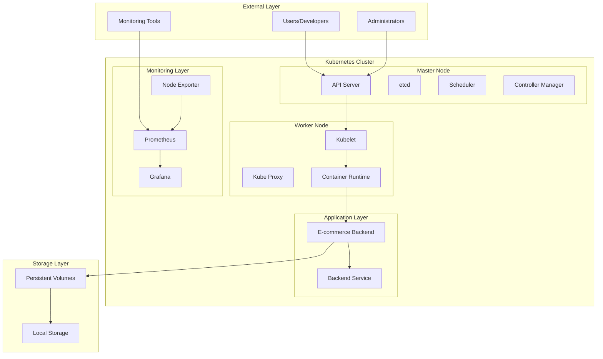
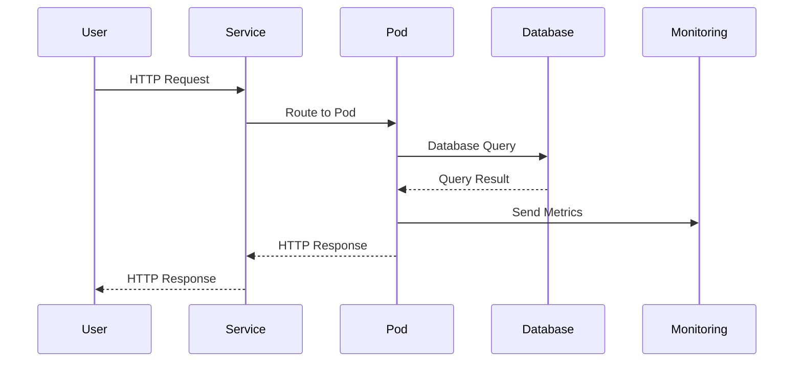
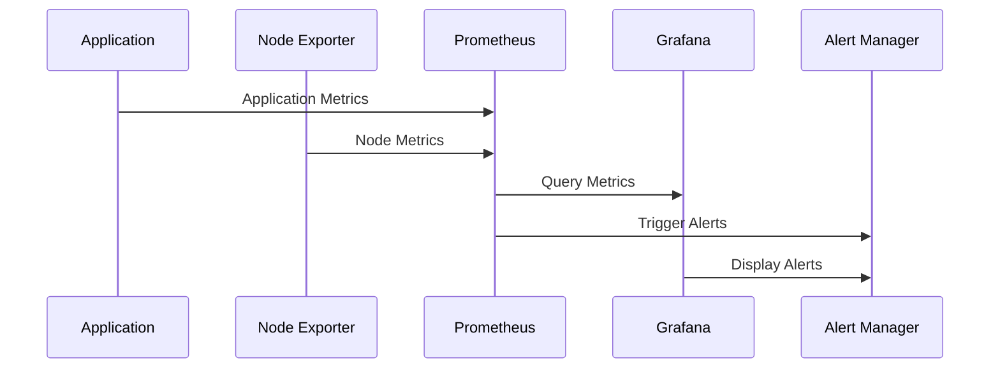
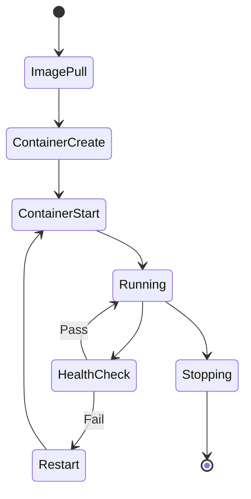
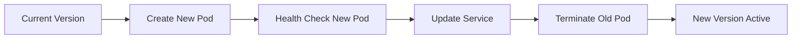
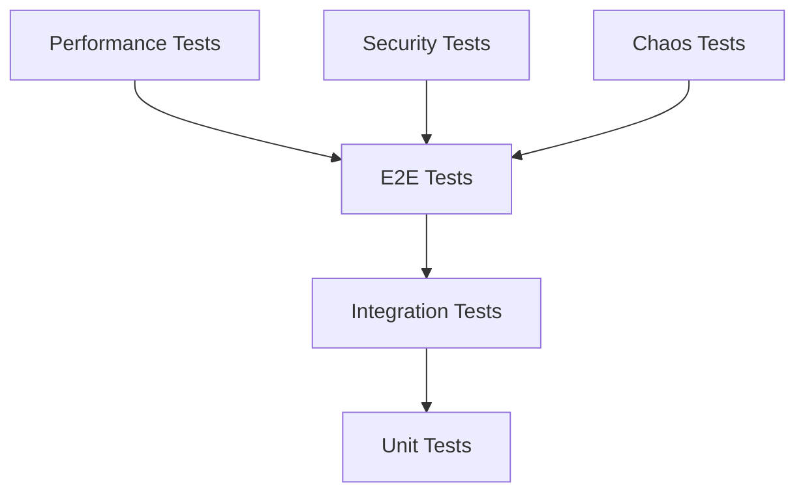

# 🏗️ **Technical Design Document**
## *E-commerce Foundation Infrastructure Project*

**Document Version**: 1.0  
**Date**: $(date)  
**Project**: E-commerce Foundation Infrastructure  
**Dependencies**: Functional Requirements Document v1.0  

---

## 🎯 **Document Overview**

This document provides the detailed technical design and architecture for the E-commerce Foundation Infrastructure project. It defines the system architecture, component interactions, data flows, and implementation details.

---

## 🏗️ **System Architecture**

### **High-Level Architecture**



### **Component Architecture**

#### **1. Kubernetes Control Plane**

| Component | Purpose | Port | Dependencies |
|-----------|---------|------|--------------|
| **API Server** | Cluster API endpoint | 6443 | etcd, authentication |
| **etcd** | Cluster state storage | 2379, 2380 | Storage, network |
| **Scheduler** | Pod scheduling | 10259 | API Server |
| **Controller Manager** | Resource controllers | 10257 | API Server |

#### **2. Kubernetes Worker Components**

| Component | Purpose | Port | Dependencies |
|-----------|---------|------|--------------|
| **Kubelet** | Node agent | 10250 | API Server, Container Runtime |
| **Kube Proxy** | Network proxy | 10256 | API Server |
| **Container Runtime** | Container execution | Varies | Kubelet |

#### **3. Application Components**

| Component | Purpose | Port | Dependencies |
|-----------|---------|------|--------------|
| **E-commerce Backend** | Application logic | 8000 | Database, external APIs |
| **Backend Service** | Service discovery | 80 | Backend pods |

#### **4. Monitoring Components**

| Component | Purpose | Port | Dependencies |
|-----------|---------|------|--------------|
| **Prometheus** | Metrics collection | 9090 | Node Exporter, applications |
| **Grafana** | Visualization | 3000 | Prometheus |
| **Node Exporter** | Node metrics | 9100 | Prometheus |

---

## 🔧 **Detailed Component Design**

### **1. E-commerce Backend Container**

#### **1.1 Container Specification**

```yaml
# Container Configuration
Image: ecommerce-backend:v1.0.0
Base Image: python:3.11-slim
User: appuser (UID: 1000)
Working Directory: /app
Exposed Port: 8000
Health Check: /health endpoint
```

#### **1.2 Multi-Stage Build Process**

```dockerfile
# Stage 1: Builder
FROM python:3.11-slim as builder
WORKDIR /app
COPY requirements.txt .
RUN pip install --no-cache-dir --user -r requirements.txt

# Stage 2: Runtime
FROM python:3.11-slim
RUN groupadd -r appuser && useradd -r -g appuser appuser
WORKDIR /app
COPY --from=builder /root/.local /home/appuser/.local
COPY --chown=appuser:appuser . .
USER appuser
ENV PATH=/home/appuser/.local/bin:$PATH
EXPOSE 8000
HEALTHCHECK --interval=30s --timeout=3s --start-period=5s --retries=3 \
    CMD curl -f http://localhost:8000/health || exit 1
CMD ["python", "main.py"]
```

#### **1.3 Security Configuration**

| Security Feature | Implementation | Rationale |
|------------------|----------------|-----------|
| **Non-root User** | appuser (UID: 1000) | Principle of least privilege |
| **Read-only Root FS** | readOnlyRootFilesystem: true | Prevent file system modifications |
| **No Privilege Escalation** | allowPrivilegeEscalation: false | Prevent privilege escalation |
| **Drop Capabilities** | ALL capabilities dropped | Minimal capability set |
| **Security Context** | runAsNonRoot: true | Enforce non-root execution |

### **2. Kubernetes Deployment Design**

#### **2.1 Namespace Design**

```yaml
# Namespace Configuration
apiVersion: v1
kind: Namespace
metadata:
  name: ecommerce
  labels:
    name: ecommerce
    environment: development
    project: ecommerce-foundation
---
# Resource Quota
apiVersion: v1
kind: ResourceQuota
metadata:
  name: ecommerce-quota
  namespace: ecommerce
spec:
  hard:
    requests.cpu: "2"
    requests.memory: 4Gi
    limits.cpu: "4"
    limits.memory: 8Gi
    persistentvolumeclaims: "4"
    pods: "10"
    services: "5"
```

#### **2.2 Deployment Design**

```yaml
# Deployment Configuration
apiVersion: apps/v1
kind: Deployment
metadata:
  name: ecommerce-backend
  namespace: ecommerce
spec:
  replicas: 2
  strategy:
    type: RollingUpdate
    rollingUpdate:
      maxUnavailable: 1
      maxSurge: 1
  selector:
    matchLabels:
      app: ecommerce-backend
  template:
    metadata:
      labels:
        app: ecommerce-backend
        version: v1.0.0
    spec:
      securityContext:
        runAsNonRoot: true
        runAsUser: 1000
        fsGroup: 1000
      containers:
      - name: ecommerce-backend
        image: ecommerce-backend:v1.0.0
        ports:
        - containerPort: 8000
          name: http
        env:
        - name: ENVIRONMENT
          value: "development"
        - name: LOG_LEVEL
          value: "INFO"
        resources:
          requests:
            memory: "256Mi"
            cpu: "250m"
          limits:
            memory: "512Mi"
            cpu: "500m"
        livenessProbe:
          httpGet:
            path: /health
            port: 8000
          initialDelaySeconds: 30
          periodSeconds: 10
          timeoutSeconds: 5
          failureThreshold: 3
        readinessProbe:
          httpGet:
            path: /health
            port: 8000
          initialDelaySeconds: 5
          periodSeconds: 5
          timeoutSeconds: 3
          failureThreshold: 3
        volumeMounts:
        - name: uploads
          mountPath: /app/uploads
        - name: config
          mountPath: /app/config
      volumes:
      - name: uploads
        emptyDir: {}
      - name: config
        configMap:
          name: ecommerce-config
```

#### **2.3 Service Design**

```yaml
# Service Configuration
apiVersion: v1
kind: Service
metadata:
  name: ecommerce-backend-service
  namespace: ecommerce
  labels:
    app: ecommerce-backend
spec:
  selector:
    app: ecommerce-backend
  ports:
  - port: 80
    targetPort: 8000
    protocol: TCP
    name: http
  type: ClusterIP
  sessionAffinity: None
```

### **3. Monitoring Architecture Design**

#### **3.1 Prometheus Configuration**

```yaml
# Prometheus Configuration
global:
  scrape_interval: 15s
  evaluation_interval: 15s
  external_labels:
    cluster: 'ecommerce-cluster'
    environment: 'development'

rule_files:
  - "ecommerce-alerts.yml"

scrape_configs:
  - job_name: 'kubernetes-nodes'
    kubernetes_sd_configs:
    - role: node
    relabel_configs:
    - source_labels: [__address__]
      regex: '(.*):10250'
      target_label: __address__
      replacement: '${1}:9100'
    - action: labelmap
      regex: __meta_kubernetes_node_label_(.+)

  - job_name: 'ecommerce-backend'
    kubernetes_sd_configs:
    - role: endpoints
      namespaces:
        names:
        - ecommerce
    relabel_configs:
    - source_labels: [__meta_kubernetes_service_name]
      action: keep
      regex: ecommerce-backend-service
    - source_labels: [__meta_kubernetes_endpoint_port_name]
      action: keep
      regex: http
```

#### **3.2 Grafana Dashboard Design**

```json
{
  "dashboard": {
    "title": "E-commerce Infrastructure Overview",
    "panels": [
      {
        "title": "Cluster Health",
        "type": "stat",
        "targets": [
          {
            "expr": "up{job=\"kubernetes-nodes\"}",
            "legendFormat": "Node {{instance}}"
          }
        ]
      },
      {
        "title": "Application Health",
        "type": "stat",
        "targets": [
          {
            "expr": "up{job=\"ecommerce-backend\"}",
            "legendFormat": "Backend {{instance}}"
          }
        ]
      },
      {
        "title": "Resource Usage",
        "type": "graph",
        "targets": [
          {
            "expr": "rate(container_cpu_usage_seconds_total[5m])",
            "legendFormat": "CPU Usage"
          },
          {
            "expr": "container_memory_usage_bytes",
            "legendFormat": "Memory Usage"
          }
        ]
      }
    ]
  }
}
```

---

## 🔄 **Data Flow Design**

### **1. Application Data Flow**



### **2. Monitoring Data Flow**



### **3. Container Lifecycle Flow**



---

## 🛡️ **Security Design**

### **1. Network Security**

#### **1.1 Network Policies**

```yaml
# Network Policy for E-commerce Backend
apiVersion: networking.k8s.io/v1
kind: NetworkPolicy
metadata:
  name: ecommerce-backend-netpol
  namespace: ecommerce
spec:
  podSelector:
    matchLabels:
      app: ecommerce-backend
  policyTypes:
  - Ingress
  - Egress
  ingress:
  - from:
    - namespaceSelector:
        matchLabels:
          name: ecommerce
    ports:
    - protocol: TCP
      port: 8000
  egress:
  - to:
    - namespaceSelector:
        matchLabels:
          name: ecommerce
    ports:
    - protocol: TCP
      port: 8000
  - to: []
    ports:
    - protocol: TCP
      port: 443
    - protocol: TCP
      port: 80
```

#### **1.2 Service Mesh Considerations**

| Component | Current Implementation | Future Enhancement |
|-----------|----------------------|-------------------|
| **Service Discovery** | Kubernetes Services | Istio Service Mesh |
| **Load Balancing** | Kube-proxy | Istio Load Balancer |
| **Security** | Network Policies | mTLS, RBAC |
| **Observability** | Prometheus/Grafana | Jaeger, Kiali |

### **2. Access Control Design**

#### **2.1 RBAC Configuration**

```yaml
# Service Account
apiVersion: v1
kind: ServiceAccount
metadata:
  name: ecommerce-backend-sa
  namespace: ecommerce

---
# Role
apiVersion: rbac.authorization.k8s.io/v1
kind: Role
metadata:
  name: ecommerce-backend-role
  namespace: ecommerce
rules:
- apiGroups: [""]
  resources: ["configmaps", "secrets"]
  verbs: ["get", "list", "watch"]
- apiGroups: [""]
  resources: ["pods"]
  verbs: ["get", "list", "watch"]

---
# RoleBinding
apiVersion: rbac.authorization.k8s.io/v1
kind: RoleBinding
metadata:
  name: ecommerce-backend-rolebinding
  namespace: ecommerce
subjects:
- kind: ServiceAccount
  name: ecommerce-backend-sa
  namespace: ecommerce
roleRef:
  kind: Role
  name: ecommerce-backend-role
  apiGroup: rbac.authorization.k8s.io
```

### **3. Secrets Management**

#### **3.1 Secret Configuration**

```yaml
# Secret for Application
apiVersion: v1
kind: Secret
metadata:
  name: ecommerce-secrets
  namespace: ecommerce
type: Opaque
data:
  database-url: <base64-encoded-url>
  api-key: <base64-encoded-key>
  jwt-secret: <base64-encoded-secret>
```

#### **3.2 Secret Usage in Deployment**

```yaml
# Secret Mount in Deployment
spec:
  template:
    spec:
      containers:
      - name: ecommerce-backend
        env:
        - name: DATABASE_URL
          valueFrom:
            secretKeyRef:
              name: ecommerce-secrets
              key: database-url
        - name: API_KEY
          valueFrom:
            secretKeyRef:
              name: ecommerce-secrets
              key: api-key
        volumeMounts:
        - name: secrets
          mountPath: /app/secrets
          readOnly: true
      volumes:
      - name: secrets
        secret:
          secretName: ecommerce-secrets
```

---

## 📊 **Performance Design**

### **1. Resource Allocation Strategy**

#### **1.1 CPU Allocation**

| Component | Requests | Limits | Burst Capacity |
|-----------|----------|--------|----------------|
| **E-commerce Backend** | 250m | 500m | 1000m |
| **Prometheus** | 200m | 400m | 800m |
| **Grafana** | 100m | 200m | 400m |
| **Node Exporter** | 50m | 100m | 200m |

#### **1.2 Memory Allocation**

| Component | Requests | Limits | Working Set |
|-----------|----------|--------|-------------|
| **E-commerce Backend** | 256Mi | 512Mi | 400Mi |
| **Prometheus** | 512Mi | 1Gi | 800Mi |
| **Grafana** | 128Mi | 256Mi | 200Mi |
| **Node Exporter** | 32Mi | 64Mi | 50Mi |

### **2. Scaling Strategy**

#### **2.1 Horizontal Pod Autoscaling**

```yaml
# HPA Configuration
apiVersion: autoscaling/v2
kind: HorizontalPodAutoscaler
metadata:
  name: ecommerce-backend-hpa
  namespace: ecommerce
spec:
  scaleTargetRef:
    apiVersion: apps/v1
    kind: Deployment
    name: ecommerce-backend
  minReplicas: 2
  maxReplicas: 10
  metrics:
  - type: Resource
    resource:
      name: cpu
      target:
        type: Utilization
        averageUtilization: 70
  - type: Resource
    resource:
      name: memory
      target:
        type: Utilization
        averageUtilization: 80
```

#### **2.2 Vertical Pod Autoscaling**

```yaml
# VPA Configuration
apiVersion: autoscaling.k8s.io/v1
kind: VerticalPodAutoscaler
metadata:
  name: ecommerce-backend-vpa
  namespace: ecommerce
spec:
  targetRef:
    apiVersion: apps/v1
    kind: Deployment
    name: ecommerce-backend
  updatePolicy:
    updateMode: "Auto"
  resourcePolicy:
    containerPolicies:
    - containerName: ecommerce-backend
      minAllowed:
        cpu: 100m
        memory: 128Mi
      maxAllowed:
        cpu: 1000m
        memory: 1Gi
```

---

## 🔄 **Deployment Strategy**

### **1. Rolling Update Strategy**

#### **1.1 Deployment Configuration**

```yaml
# Rolling Update Strategy
strategy:
  type: RollingUpdate
  rollingUpdate:
    maxUnavailable: 1
    maxSurge: 1
```

#### **1.2 Update Process**



### **2. Blue-Green Deployment**

#### **2.1 Blue-Green Strategy**

| Phase | Blue Environment | Green Environment | Service Traffic |
|-------|------------------|-------------------|-----------------|
| **Initial** | v1.0.0 (Active) | v1.0.0 (Standby) | 100% Blue |
| **Deploy** | v1.0.0 (Active) | v1.1.0 (Testing) | 100% Blue |
| **Switch** | v1.0.0 (Standby) | v1.1.0 (Active) | 100% Green |
| **Cleanup** | v1.0.0 (Terminated) | v1.1.0 (Active) | 100% Green |

---

## 🧪 **Testing Strategy**

### **1. Testing Pyramid**



### **2. Test Categories**

| Test Type | Coverage | Frequency | Tools |
|-----------|----------|-----------|-------|
| **Unit Tests** | 80%+ | Every commit | pytest, jest |
| **Integration Tests** | 70%+ | Every PR | testcontainers |
| **E2E Tests** | 60%+ | Every release | playwright |
| **Performance Tests** | 100% | Weekly | k6, jmeter |
| **Security Tests** | 100% | Every build | trivy, snyk |
| **Chaos Tests** | 100% | Monthly | chaos-mesh |

---

## 📋 **Implementation Phases**

### **Phase 1: Foundation (Weeks 1-2)**

| Week | Tasks | Deliverables |
|------|-------|--------------|
| **Week 1** | Environment setup, containerization | Container images, Dockerfiles |
| **Week 2** | Kubernetes cluster setup | Working cluster, basic deployment |

### **Phase 2: Application (Weeks 3-4)**

| Week | Tasks | Deliverables |
|------|-------|--------------|
| **Week 3** | Application deployment, service configuration | Running application, service discovery |
| **Week 4** | Monitoring setup, basic alerting | Prometheus, Grafana, dashboards |

### **Phase 3: Enhancement (Weeks 5-6)**

| Week | Tasks | Deliverables |
|------|-------|--------------|
| **Week 5** | Security hardening, RBAC | Security policies, access control |
| **Week 6** | Performance optimization, testing | Optimized performance, test results |

---

## 📊 **Success Metrics**

### **Technical Metrics**

| Metric | Target | Measurement Method |
|--------|--------|-------------------|
| **Response Time** | <1 second | Load testing |
| **Availability** | 99.9% | Monitoring |
| **Resource Usage** | <80% | Prometheus metrics |
| **Deployment Time** | <5 minutes | CI/CD pipeline |

### **Business Metrics**

| Metric | Target | Measurement Method |
|--------|--------|-------------------|
| **MTTR** | <15 minutes | Incident tracking |
| **Deployment Frequency** | Daily | Release tracking |
| **Change Failure Rate** | <5% | Release tracking |
| **Recovery Time** | <1 hour | Disaster recovery testing |

---

**Document Status**: Draft  
**Review Date**: $(date + 14 days)  
**Approval Required**: Technical Lead, Senior Architect
