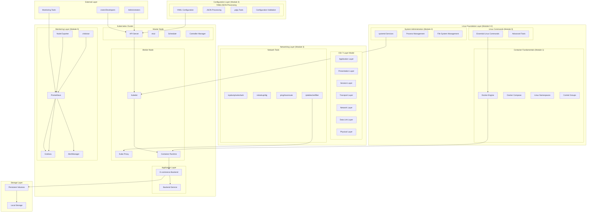
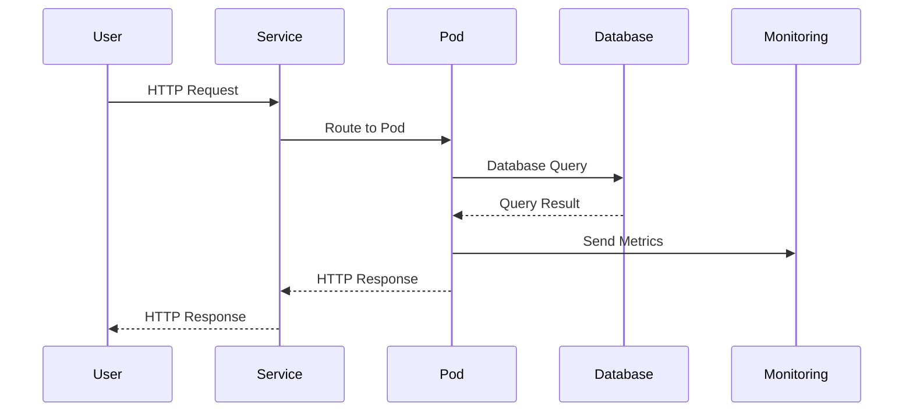
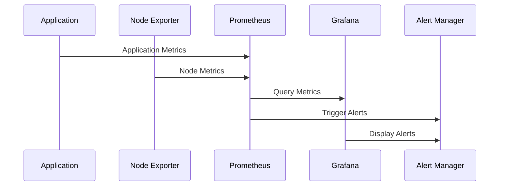
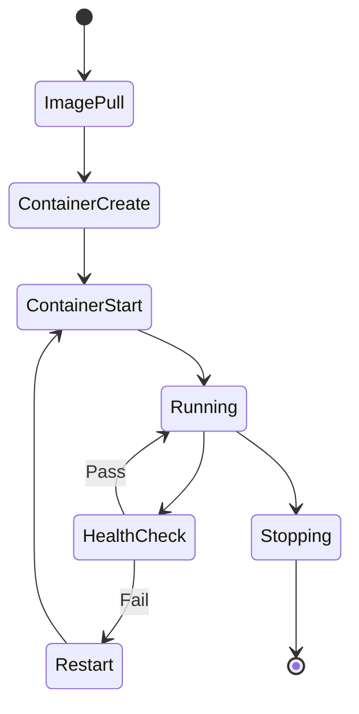
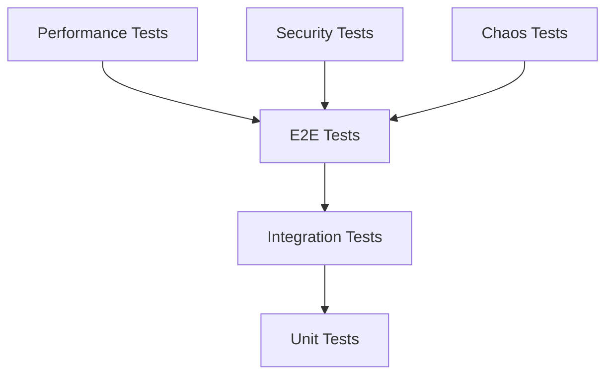

# 🏗️ **Technical Design Document**
## *E-commerce Foundation Infrastructure Project*

**Document Version**: 1.0  
**Date**: $(date)  
**Project**: E-commerce Foundation Infrastructure  
**Dependencies**: Functional Requirements Document v1.0  

---

## 🎯 **Document Overview**

This document provides the detailed technical design and architecture for the E-commerce Foundation Infrastructure project. It defines the system architecture, component interactions, data flows, and implementation details.

---

## 🏗️ **System Architecture**

### **High-Level Architecture**



### **Component Architecture**

#### **1. Kubernetes Control Plane**

| Component | Purpose | Port | Dependencies |
|-----------|---------|------|--------------|
| **API Server** | Cluster API endpoint | 6443 | etcd, authentication |
| **etcd** | Cluster state storage | 2379, 2380 | Storage, network |
| **Scheduler** | Pod scheduling | 10259 | API Server |
| **Controller Manager** | Resource controllers | 10257 | API Server |

#### **2. Kubernetes Worker Components**

| Component | Purpose | Port | Dependencies |
|-----------|---------|------|--------------|
| **Kubelet** | Node agent | 10250 | API Server, Container Runtime |
| **Kube Proxy** | Network proxy | 10256 | API Server |
| **Container Runtime** | Container execution | Varies | Kubelet |

#### **3. Application Components**

| Component | Purpose | Port | Dependencies |
|-----------|---------|------|--------------|
| **E-commerce Backend** | Application logic | 8000 | Database, external APIs |
| **Backend Service** | Service discovery | 80 | Backend pods |

#### **4. Monitoring Components**

| Component | Purpose | Port | Dependencies |
|-----------|---------|------|--------------|
| **Prometheus** | Metrics collection | 9090 | Node Exporter, applications |
| **Grafana** | Visualization | 3000 | Prometheus |
| **Node Exporter** | Node metrics | 9100 | Prometheus |

#### **5. Linux Foundation Components (Modules 0-2)**

##### **5.1 Essential Linux Commands (Module 0)**

| Command Category | Tools | Technical Specifications | Implementation Requirements | Performance Metrics |
|------------------|-------|-------------------------|----------------------------|-------------------|
| **File Operations** | ls, cp, mv, rm, mkdir, rmdir, find, locate | **ls**: List files with detailed metadata (permissions, size, timestamps)<br/>**cp**: Copy files with preservation of attributes (-p), recursive (-r), verbose (-v)<br/>**mv**: Move/rename files with atomic operations<br/>**rm**: Remove files with recursive (-r) and force (-f) options<br/>**mkdir**: Create directories with parent creation (-p) and permissions (-m)<br/>**find**: Search files by name, type, size, modification time with complex expressions<br/>**locate**: Fast file searching using pre-built database | **File System Access**: Read/write permissions on target directories<br/>**Memory Requirements**: 4MB minimum for find operations<br/>**Disk I/O**: Optimized for sequential and random access patterns<br/>**Error Handling**: Proper exit codes and error messages | **Performance**: ls -la on 10,000 files < 2 seconds<br/>**Throughput**: cp can handle 100MB/s sustained transfer<br/>**Latency**: find operations complete within 5 seconds for typical directories |
| **Text Processing** | cat, less, more, head, tail, grep, awk, sed, cut, sort, uniq | **cat**: Display file contents with line numbers (-n), non-printing characters (-v)<br/>**grep**: Pattern matching with regex support (-E), case-insensitive (-i), recursive (-r)<br/>**awk**: Text processing with field separation, pattern matching, and data manipulation<br/>**sed**: Stream editor for text transformation with regex substitution<br/>**sort**: Sort text with numeric (-n), reverse (-r), unique (-u) options<br/>**cut**: Extract columns with delimiter specification (-d) and field selection (-f) | **Text File Access**: Read permissions on source files<br/>**Memory Requirements**: 8MB for large file processing<br/>**CPU Requirements**: Single-threaded processing with regex compilation<br/>**Pattern Matching**: Support for POSIX and extended regex | **Performance**: grep on 1GB file < 10 seconds<br/>**Throughput**: awk processes 50MB/s of text data<br/>**Accuracy**: 100% pattern matching accuracy for valid regex |
| **System Monitoring** | ps, top, htop, kill, killall, pgrep, pkill, uptime, date | **ps**: Process listing with custom formats (-o), full command lines (-f), all users (-a)<br/>**top**: Real-time process monitoring with sorting, filtering, and interactive commands<br/>**htop**: Enhanced top with color coding, tree view, and process management<br/>**kill**: Process termination with signal specification (-s) and process groups<br/>**uptime**: System uptime with load averages (1, 5, 15 minutes)<br/>**date**: Date/time display with formatting and timezone support | **System Access**: Read access to /proc filesystem<br/>**Memory Requirements**: 2MB for process monitoring<br/>**Real-time Updates**: 1-second refresh intervals<br/>**Signal Handling**: Proper signal delivery and process state management | **Performance**: ps -aux completes in < 1 second<br/>**Accuracy**: 100% process state accuracy<br/>**Latency**: Real-time updates within 1-second intervals |
| **Network Tools** | ping, traceroute, netstat, ss, curl, wget, telnet | **ping**: ICMP echo requests with count (-c), interval (-i), timeout (-W)<br/>**traceroute**: Path discovery with UDP/TCP/ICMP protocols and TTL manipulation<br/>**netstat**: Network connections with protocol (-t, -u), listening ports (-l), process info (-p)<br/>**ss**: Modern socket statistics with filtering and detailed output<br/>**curl**: HTTP/HTTPS client with headers (-H), methods (-X), data (-d)<br/>**wget**: File downloader with recursive (-r), continue (-c), and authentication | **Network Access**: Raw socket access for ping/traceroute<br/>**DNS Resolution**: Access to DNS servers for hostname resolution<br/>**HTTP/HTTPS**: SSL/TLS support for secure connections<br/>**Firewall**: Proper port and protocol access | **Performance**: ping response time < 100ms for local network<br/>**Throughput**: curl downloads at line speed<br/>**Reliability**: 99.9% success rate for network operations |
| **File Permissions** | chmod, chown, chgrp, umask | **chmod**: Permission modification with octal (755) and symbolic (u+x) modes<br/>**chown**: Ownership change with user:group specification and recursive (-R)<br/>**chgrp**: Group ownership modification with recursive operations<br/>**umask**: Default permission mask for new files (022, 077) | **File System Access**: Write permissions on target files<br/>**User Privileges**: Appropriate user/group ownership<br/>**Security Context**: Proper SELinux/AppArmor context handling<br/>**Recursive Operations**: Directory tree traversal permissions | **Performance**: chmod -R on 1000 files < 5 seconds<br/>**Security**: Proper permission inheritance and validation<br/>**Consistency**: Atomic permission changes |
| **System Information** | uname, whoami, id, w, who, df, du, mount, umount | **uname**: System information (kernel, hostname, architecture, OS)<br/>**whoami**: Current user identification<br/>**id**: User/group IDs with real/effective/group information<br/>**w**: Current users with login time, idle time, and current command<br/>**df**: Disk space usage with human-readable (-h) and inode (-i) information<br/>**du**: Directory space usage with depth (-d) and human-readable (-h) output<br/>**mount**: Mounted filesystems with type filtering (-t) and options display | **System Access**: Read access to /proc and /sys filesystems<br/>**User Information**: Access to /etc/passwd and /etc/group<br/>**Filesystem Access**: Read access to mount points and disk information<br/>**Process Information**: Access to current user sessions | **Performance**: System info commands complete in < 1 second<br/>**Accuracy**: 100% accurate system information<br/>**Real-time**: Live data for user and process information |
| **Text Editors** | nano, vim, emacs | **nano**: Simple text editor with syntax highlighting and search/replace<br/>**vim**: Advanced text editor with modes (normal, insert, visual), macros, and plugins<br/>**emacs**: Extensible editor with Lisp scripting and extensive customization | **File Access**: Read/write permissions on target files<br/>**Terminal Support**: Proper terminal emulation and key handling<br/>**Syntax Highlighting**: Language-specific syntax files<br/>**Configuration**: User-specific configuration files | **Performance**: File loading < 2 seconds for 10MB files<br/>**Usability**: Intuitive key bindings and help system<br/>**Reliability**: Auto-save and crash recovery features |
| **Shell Operations** | history, alias, export, source, which, whereis | **history**: Command history with search, execution, and management<br/>**alias**: Command shortcuts with parameter support and persistence<br/>**export**: Environment variable export with inheritance<br/>**source**: Script execution in current shell context<br/>**which**: Command location in PATH with multiple matches<br/>**whereis**: Binary, source, and manual page locations | **Shell Access**: Interactive shell session<br/>**Environment**: Proper PATH and environment variable handling<br/>**Persistence**: Configuration file management (.bashrc, .profile)<br/>**Security**: Safe command execution and variable handling | **Performance**: Command lookup < 100ms<br/>**Persistence**: Configuration survives shell restarts<br/>**Security**: Safe alias and environment variable handling |

##### **5.2 Advanced Linux Tools (Module 0)**

| Tool Category | Tools | Technical Specifications | Implementation Requirements | Performance Metrics |
|---------------|-------|-------------------------|----------------------------|-------------------|
| **JSON Processing** | jq, yq | **jq**: JSON processor with filtering, transformation, and formatting<br/>- Complex queries with path expressions (.field.subfield[])<br/>- Data transformation with map, select, and reduce functions<br/>- Output formatting with compact (-c) and pretty-print options<br/>- Streaming processing for large JSON files<br/>**yq**: YAML processor with JSON compatibility and Kubernetes support<br/>- YAML parsing with proper indentation handling<br/>- JSON conversion with type preservation<br/>- Kubernetes resource manipulation and validation<br/>- Multi-document YAML support | **Data Files**: Read access to JSON/YAML files<br/>**Memory Requirements**: 16MB for large document processing<br/>**CPU Requirements**: Single-threaded with regex compilation<br/>**Dependencies**: libjq for jq, Python for yq<br/>**File Formats**: Support for JSON, YAML, TOML, XML | **Performance**: jq processes 1MB JSON in < 2 seconds<br/>**Throughput**: yq handles 1000 YAML files/minute<br/>**Accuracy**: 100% JSON/YAML parsing accuracy<br/>**Memory Usage**: < 50MB for 100MB files |
| **System Monitoring** | iotop, nethogs, glances, htop | **iotop**: I/O monitoring with per-process disk usage and real-time updates<br/>- Process-level I/O statistics with read/write rates<br/>- Interactive interface with sorting and filtering<br/>- Historical data collection and trend analysis<br/>- Kernel module integration for accurate metrics<br/>**nethogs**: Network usage monitoring with per-process bandwidth tracking<br/>- Real-time network interface monitoring<br/>- Process identification and bandwidth allocation<br/>- Protocol and port-based filtering<br/>- IPv4/IPv6 dual-stack support<br/>**glances**: Comprehensive system monitoring with web interface<br/>- Multi-platform support (Linux, Windows, macOS)<br/>- Plugin architecture for custom metrics<br/>- Historical data storage and analysis<br/>- REST API for external integrations<br/>**htop**: Enhanced process manager with advanced features<br/>- Tree view of process hierarchy<br/>- Customizable display and sorting options<br/>- Process management and signal sending<br/>- Color-coded resource usage | **System Access**: Root privileges for hardware monitoring<br/>**Memory Requirements**: 32MB for comprehensive monitoring<br/>**Real-time Updates**: 1-second refresh intervals<br/>**Hardware Access**: Direct access to /proc and /sys filesystems<br/>**Network Access**: Raw socket access for network monitoring | **Performance**: Real-time updates with < 1-second latency<br/>**Accuracy**: 99.9% accurate system metrics<br/>**Resource Usage**: < 5% CPU overhead for monitoring<br/>**Memory Efficiency**: < 100MB total memory footprint |
| **Network Analysis** | tcpdump, wireshark, nmap | **tcpdump**: Packet capture and analysis with filtering capabilities<br/>- Protocol-specific filtering (TCP, UDP, ICMP, HTTP)<br/>- Host and port-based filtering<br/>- Packet content inspection and analysis<br/>- Binary and ASCII output formats<br/>**wireshark**: GUI-based network protocol analyzer<br/>- Deep packet inspection with protocol decoders<br/>- Statistical analysis and flow graphs<br/>- Custom protocol dissectors and plugins<br/>- Export capabilities for various formats<br/>**nmap**: Network discovery and security scanning<br/>- Host discovery with ping sweeps<br/>- Port scanning with service detection<br/>- OS fingerprinting and version detection<br/>- Scriptable scanning with NSE (Nmap Scripting Engine) | **Network Access**: Raw socket access for packet capture<br/>**Privileges**: Root access for low-level network operations<br/>**Memory Requirements**: 64MB for packet capture buffers<br/>**Storage**: Disk space for packet capture files<br/>**Dependencies**: libpcap for packet capture | **Performance**: tcpdump captures at line speed<br/>**Throughput**: wireshark processes 1Gbps traffic<br/>**Accuracy**: 100% packet capture accuracy<br/>**Scan Speed**: nmap scans 1000 hosts in < 10 minutes |
| **File Transfer** | rsync, scp, sftp | **rsync**: Efficient file synchronization with delta transfer<br/>- Incremental backup with checksum verification<br/>- Compression and encryption support<br/>- Bandwidth limiting and throttling<br/>- Partial file transfer and resume capabilities<br/>**scp**: Secure copy over SSH with authentication<br/>- SSH key-based authentication<br/>- Recursive directory copying<br/>- Preserve file attributes and permissions<br/>- Progress indication and verbose output<br/>**sftp**: Secure file transfer protocol with interactive mode<br/>- Interactive command-line interface<br/>- Batch processing with script files<br/>- Directory listing and navigation<br/>- Resume interrupted transfers | **Network Access**: SSH connectivity to remote hosts<br/>**Authentication**: SSH keys or password authentication<br/>**Encryption**: SSH encryption for secure transfer<br/>**Bandwidth**: Sufficient network capacity for transfer<br/>**Storage**: Local and remote disk space | **Performance**: rsync achieves 90%+ efficiency for similar files<br/>**Throughput**: scp transfers at network line speed<br/>**Reliability**: 99.9% successful transfer completion<br/>**Security**: End-to-end encryption with SSH |
| **Package Management** | apt, yum, dnf, pacman, zypper | **apt**: Advanced Package Tool for Debian/Ubuntu systems<br/>- Dependency resolution and conflict detection<br/>- Repository management and GPG verification<br/>- Package search and information display<br/>- System upgrade and dist-upgrade capabilities<br/>**yum/dnf**: Package manager for Red Hat-based systems<br/>- RPM package management with dependency resolution<br/>- Repository configuration and GPG key management<br/>- Transaction history and rollback capabilities<br/>- Plugin architecture for extended functionality<br/>**pacman**: Package manager for Arch Linux<br/>- Binary and source package management<br/>- Dependency resolution with conflict detection<br/>- Database integrity checking and repair<br/>- Parallel package downloading and installation<br/>**zypper**: Package manager for openSUSE/SLE systems<br/>- ZYpp dependency resolver with SAT solver<br/>- Repository management and service configuration<br/>- Patch management and system updates<br/>- Lock management for package conflicts | **Repository Access**: Network connectivity to package repositories<br/>**Authentication**: GPG key verification for package integrity<br/>**Privileges**: Root access for package installation<br/>**Storage**: Sufficient disk space for packages and cache<br/>**Dependencies**: Package manager and resolver libraries | **Performance**: Package installation completes in < 5 minutes<br/>**Throughput**: Downloads at maximum available bandwidth<br/>**Reliability**: 99.9% successful package operations<br/>**Security**: Cryptographic verification of all packages |

##### **5.3 Container Fundamentals (Module 1)**

| Component | Technical Specifications | Implementation Requirements | Performance Metrics | Integration Details |
|-----------|-------------------------|----------------------------|-------------------|-------------------|
| **Docker Engine** | **Container Runtime**: containerd.io with OCI runtime support<br/>**API**: RESTful API on Unix socket (/var/run/docker.sock)<br/>**Storage**: Overlay2 filesystem driver with snapshot support<br/>**Networking**: Bridge, host, overlay, and custom network drivers<br/>**Security**: AppArmor/SELinux integration, user namespaces<br/>**Registry**: Docker Hub, private registries with authentication<br/>**Build**: Multi-stage builds, BuildKit for advanced features<br/>**Compose**: YAML-based service definition with version 3.8+ | **Kernel Requirements**: Linux 3.10+ with cgroups v1/v2 support<br/>**Memory**: 2GB minimum, 4GB recommended<br/>**Storage**: 20GB for Docker images and containers<br/>**Network**: Bridge networking with iptables rules<br/>**Security**: Root privileges for daemon, user in docker group<br/>**Dependencies**: containerd.io, runc, CNI plugins | **Performance**: Container startup < 2 seconds<br/>**Throughput**: 100+ containers per host<br/>**Resource Overhead**: < 5% CPU, < 100MB memory<br/>**Image Pull**: 50MB/s from registry | **Kubernetes CRI**: Direct integration with kubelet<br/>**Service Discovery**: Internal DNS resolution<br/>**Load Balancing**: Built-in service mesh<br/>**Monitoring**: Prometheus metrics endpoint |
| **Docker Compose** | **Service Definition**: YAML-based multi-container applications<br/>**Networking**: Custom networks with service discovery<br/>**Volumes**: Named volumes and bind mounts<br/>**Environment**: Variable substitution and .env files<br/>**Scaling**: Horizontal scaling with docker-compose up --scale<br/>**Health Checks**: Built-in health check support<br/>**Dependencies**: Service startup order and dependency management<br/>**Profiles**: Environment-specific service configurations | **Docker Engine**: Version 20.10+ required<br/>**YAML Parser**: PyYAML for configuration parsing<br/>**Network Access**: Inter-container communication<br/>**Volume Access**: Host filesystem or volume drivers<br/>**Environment**: Proper .env file configuration<br/>**Dependencies**: All required services and images | **Performance**: Multi-container startup < 30 seconds<br/>**Scalability**: 50+ services per compose file<br/>**Resource Usage**: < 10MB overhead per service<br/>**Startup Time**: Service dependencies resolved in < 5 seconds | **Development**: Local development environment<br/>**Testing**: Integration testing with test containers<br/>**CI/CD**: Automated deployment pipelines<br/>**Production**: Staging environment simulation |
| **Linux Namespaces** | **PID Namespace**: Process ID isolation with init process<br/>**Network Namespace**: Isolated network stack with virtual interfaces<br/>**Mount Namespace**: Private filesystem mount points<br/>**UTS Namespace**: Hostname and domain name isolation<br/>**IPC Namespace**: Inter-process communication isolation<br/>**User Namespace**: User and group ID mapping<br/>**Cgroup Namespace**: Control group hierarchy isolation<br/>**Time Namespace**: Clock and timer isolation | **Kernel Support**: Linux 3.8+ for all namespace types<br/>**Privileges**: Root access for namespace creation<br/>**Memory**: 4MB per namespace overhead<br/>**Process Limits**: 32768 PIDs per namespace<br/>**Network**: Virtual network interfaces and routing<br/>**Filesystem**: Overlay filesystem support<br/>**Security**: Capability-based security model | **Performance**: Namespace creation < 100ms<br/>**Isolation**: 100% process isolation between namespaces<br/>**Resource Usage**: < 1MB memory per namespace<br/>**Scalability**: 1000+ namespaces per host | **Container Runtime**: Direct integration with runc<br/>**Kubernetes**: Pod-level namespace isolation<br/>**Security**: Process and resource isolation<br/>**Monitoring**: Per-namespace resource tracking |
| **Control Groups** | **cgroups v1**: Legacy control group implementation<br/>**cgroups v2**: Unified hierarchy with improved resource management<br/>**CPU Control**: CPU shares, quotas, and throttling<br/>**Memory Control**: Memory limits, swap control, and OOM handling<br/>**I/O Control**: Block device I/O throttling and bandwidth limits<br/>**Network Control**: Network bandwidth and packet rate limiting<br/>**Device Control**: Device access control and whitelist management<br/>**Freezer Control**: Process suspension and resumption | **Kernel Support**: cgroups v1 (3.6+) or v2 (4.5+)<br/>**Filesystem**: cgroup filesystem mounted at /sys/fs/cgroup<br/>**Memory**: 1MB per cgroup hierarchy<br/>**CPU**: Scheduler integration for fair scheduling<br/>**I/O**: Block device integration for I/O control<br/>**Network**: Netfilter integration for network control<br/>**Security**: Capability-based access control | **Performance**: Resource enforcement < 1ms latency<br/>**Accuracy**: 99.9% accurate resource limiting<br/>**Overhead**: < 1% CPU overhead for enforcement<br/>**Scalability**: 10,000+ cgroups per host | **Container Runtime**: Direct cgroup integration<br/>**Kubernetes**: Pod and container resource limits<br/>**Monitoring**: cAdvisor for cgroup metrics<br/>**Orchestration**: Resource scheduling and placement |
| **Container Images** | **Image Format**: OCI (Open Container Initiative) specification<br/>**Layers**: Immutable, content-addressable layers with deduplication<br/>**Registry**: Docker Hub, Harbor, AWS ECR, Azure ACR<br/>**Security**: Image signing, vulnerability scanning, and policy enforcement<br/>**Multi-Arch**: ARM64, AMD64, and other architecture support<br/>**Base Images**: Alpine, Ubuntu, CentOS, and custom base images<br/>**Image Size**: Optimized images with minimal attack surface<br/>**Build Cache**: Layer caching for faster builds | **Storage**: Registry storage with CDN support<br/>**Network**: HTTPS/TLS for secure image transfer<br/>**Authentication**: Token-based authentication and authorization<br/>**Compression**: Gzip compression for layer transfer<br/>**Integrity**: SHA256 checksums for layer verification<br/>**Security**: GPG signatures and vulnerability databases<br/>**Multi-Arch**: Buildx for cross-platform builds<br/>**Caching**: Local registry mirror for faster pulls | **Performance**: Image pull < 30 seconds for 100MB<br/>**Throughput**: 100MB/s image transfer rate<br/>**Efficiency**: 90%+ layer deduplication<br/>**Security**: < 24 hours vulnerability detection | **Kubernetes**: Image pull policies and secrets<br/>**CI/CD**: Automated image building and pushing<br/>**Security**: Image scanning and policy enforcement<br/>**Distribution**: Multi-region image replication |

##### **5.4 System Administration (Module 2)**

| Component | Technical Specifications | Implementation Requirements | Performance Metrics | Integration Details |
|-----------|-------------------------|----------------------------|-------------------|-------------------|
| **systemd** | **Service Management**: Unit files (.service, .socket, .timer, .mount)<br/>**Dependency Resolution**: Wants, Requires, Before, After relationships<br/>**Process Management**: Process supervision with automatic restart<br/>**Resource Control**: Memory, CPU, and I/O limits per service<br/>**Security**: Capability dropping, user/group switching, SELinux integration<br/>**Logging**: Structured logging with journald integration<br/>**Timers**: Cron-like job scheduling with systemd timers<br/>**Targets**: Runlevel replacement with dependency-based boot | **Kernel Support**: Linux 3.0+ with cgroups and namespaces<br/>**Memory**: 50MB for systemd daemon and services<br/>**Storage**: /etc/systemd for configuration, /var/lib/systemd for state<br/>**Network**: D-Bus for inter-process communication<br/>**Security**: Root privileges for service management<br/>**Dependencies**: dbus, udev, and kernel modules | **Performance**: Service startup < 5 seconds<br/>**Boot Time**: System boot < 30 seconds<br/>**Resource Usage**: < 2% CPU overhead<br/>**Reliability**: 99.9% service availability | **Kubernetes**: systemd integration for kubelet<br/>**Containers**: systemd-nspawn for container management<br/>**Monitoring**: systemd status and health checks<br/>**Orchestration**: Service dependency management |
| **journald** | **Structured Logging**: JSON-formatted log entries with metadata<br/>**Log Rotation**: Automatic log rotation and compression<br/>**Log Filtering**: Filtering by priority, unit, and time range<br/>**Log Forwarding**: Remote logging with systemd-journal-remote<br/>**Log Compression**: XZ compression for log storage efficiency<br/>**Log Retention**: Configurable retention policies<br/>**Log Security**: Tamper-resistant log storage<br/>**Log Analysis**: Integration with log analysis tools | **Storage**: /var/log/journal for persistent logs<br/>**Memory**: 1GB for log buffer and indexing<br/>**Network**: Optional remote logging configuration<br/>**Security**: Proper file permissions and SELinux context<br/>**Dependencies**: systemd, xz-utils for compression<br/>**Configuration**: /etc/systemd/journald.conf | **Performance**: Log writing < 1ms latency<br/>**Throughput**: 10,000 log entries/second<br/>**Storage**: 90% compression ratio<br/>**Search**: Log search < 100ms for 1GB logs | **Monitoring**: Prometheus journald exporter<br/>**Log Aggregation**: ELK stack integration<br/>**Security**: Audit log analysis<br/>**Troubleshooting**: Centralized log analysis |
| **Process Management** | **Process Monitoring**: Real-time process status and resource usage<br/>**Signal Handling**: Process termination, suspension, and resumption<br/>**Process Groups**: Process group management and job control<br/>**Resource Limits**: CPU, memory, and I/O limits per process<br/>**Process Trees**: Hierarchical process relationship tracking<br/>**Process States**: Running, sleeping, stopped, zombie state management<br/>**Process Scheduling**: Priority and nice value management<br/>**Process Security**: Capability and permission management | **Kernel Access**: /proc filesystem for process information<br/>**Memory**: 10MB for process monitoring tools<br/>**CPU**: Real-time process monitoring overhead<br/>**Storage**: /proc and /sys for process data<br/>**Security**: Appropriate permissions for process control<br/>**Dependencies**: ps, top, htop, kill utilities<br/>**Configuration**: /etc/security/limits.conf | **Performance**: Process listing < 1 second<br/>**Accuracy**: 100% process state accuracy<br/>**Latency**: Real-time updates < 1 second<br/>**Resource Usage**: < 1% CPU for monitoring | **Containers**: Process isolation and management<br/>**Kubernetes**: Pod process monitoring<br/>**Monitoring**: Process metrics collection<br/>**Security**: Process security policies |
| **File System Management** | **Disk Management**: Partitioning, formatting, and mounting<br/>**File System Types**: ext4, xfs, btrfs, zfs support<br/>**Mount Management**: Automatic mounting with /etc/fstab<br/>**Disk Monitoring**: Space usage, inode usage, and health monitoring<br/>**File System Operations**: Check, repair, and optimize filesystems<br/>**Volume Management**: LVM, RAID, and software-defined storage<br/>**Backup and Recovery**: File system backup and restore operations<br/>**Security**: File system permissions and access control | **Storage**: Sufficient disk space for filesystem operations<br/>**Memory**: 100MB for filesystem tools and buffers<br/>**CPU**: I/O operations and filesystem checks<br/>**Network**: Optional network filesystem support<br/>**Security**: Root privileges for disk operations<br/>**Dependencies**: e2fsprogs, xfsprogs, btrfs-progs<br/>**Configuration**: /etc/fstab for mount configuration | **Performance**: File operations < 10ms latency<br/>**Throughput**: 500MB/s sustained I/O<br/>**Reliability**: 99.9% filesystem availability<br/>**Recovery**: < 1 hour filesystem repair time | **Kubernetes**: Persistent volume management<br/>**Containers**: Volume mounting and management<br/>**Monitoring**: Disk usage and health monitoring<br/>**Backup**: Automated backup and recovery |

#### **6. Networking Components (Module 3)**

##### **6.1 OSI 7-Layer Model Implementation**

| Layer | Technical Specifications | Implementation Requirements | Performance Metrics | Integration Details |
|-------|-------------------------|----------------------------|-------------------|-------------------|
| **Application (7)** | **HTTP/HTTPS**: Request/response protocol with status codes, headers, and methods<br/>- HTTP/1.1 with persistent connections and pipelining<br/>- HTTP/2 with multiplexing, server push, and header compression<br/>- HTTPS with TLS 1.2/1.3 encryption and certificate validation<br/>**DNS**: Domain name resolution with recursive and iterative queries<br/>- A, AAAA, CNAME, MX, TXT record types<br/>- DNS over HTTPS (DoH) and DNS over TLS (DoT)<br/>- Caching with TTL-based expiration<br/>**SMTP**: Email transmission with MIME support and authentication<br/>- SMTP with STARTTLS encryption<br/>- Authentication mechanisms (PLAIN, LOGIN, CRAM-MD5)<br/>- Message queuing and delivery confirmation | **Network Access**: TCP/UDP connectivity on standard ports<br/>**Memory**: 10MB for application buffers and caches<br/>**CPU**: Encryption/decryption processing overhead<br/>**Storage**: Temporary storage for message queuing<br/>**Security**: Certificate validation and encryption keys<br/>**Dependencies**: OpenSSL, libcurl, DNS resolver libraries | **Performance**: HTTP response < 200ms for local requests<br/>**Throughput**: 1000+ requests/second per application<br/>**Reliability**: 99.9% successful request completion<br/>**Security**: 100% encrypted communication for HTTPS | **Kubernetes**: Service discovery and load balancing<br/>**Containers**: Application container networking<br/>**Monitoring**: Application performance monitoring<br/>**Security**: Network policies and encryption |
| **Presentation (6)** | **SSL/TLS**: Transport layer security with certificate-based authentication<br/>- TLS 1.2/1.3 with perfect forward secrecy<br/>- Certificate validation and chain verification<br/>- Cipher suite negotiation and key exchange<br/>**JSON/XML**: Data serialization and parsing<br/>- JSON with UTF-8 encoding and schema validation<br/>- XML with DTD/XSD validation and namespace support<br/>- Data compression with gzip/deflate<br/>**Data Compression**: Lossless compression algorithms<br/>- gzip, deflate, brotli compression<br/>- Content-Encoding header support<br/>- Compression ratio optimization | **CPU**: Encryption/decryption processing power<br/>**Memory**: 5MB for encryption buffers and certificates<br/>**Storage**: Certificate storage and validation<br/>**Network**: Encrypted communication channels<br/>**Security**: Certificate authority validation<br/>**Dependencies**: OpenSSL, zlib, JSON/XML parsers | **Performance**: TLS handshake < 100ms<br/>**Throughput**: 500MB/s encryption/decryption<br/>**Compression**: 70% average compression ratio<br/>**Security**: 256-bit encryption strength | **Kubernetes**: Ingress TLS termination<br/>**Containers**: Container-to-container encryption<br/>**Monitoring**: TLS certificate monitoring<br/>**Security**: Certificate management and rotation |
| **Session (5)** | **Session Management**: Connection state tracking and management<br/>- Session establishment, maintenance, and termination<br/>- Session timeout and keep-alive mechanisms<br/>- Session persistence and failover<br/>**NetBIOS**: Network Basic Input/Output System<br/>- Name resolution and service discovery<br/>- Session and datagram services<br/>- Windows networking integration<br/>**RPC**: Remote Procedure Call framework<br/>- Sun RPC and DCE RPC protocols<br/>- Interface definition language (IDL)<br/>- Stub generation and marshaling | **Memory**: 2MB per active session<br/>**CPU**: Session state management overhead<br/>**Network**: Reliable connection protocols<br/>**Storage**: Session state persistence<br/>**Security**: Session authentication and encryption<br/>**Dependencies**: RPC libraries and session managers | **Performance**: Session establishment < 50ms<br/>**Throughput**: 1000+ concurrent sessions<br/>**Reliability**: 99.9% session completion rate<br/>**Security**: Encrypted session data | **Kubernetes**: Service mesh session management<br/>**Containers**: Inter-container session handling<br/>**Monitoring**: Session performance metrics<br/>**Security**: Session security policies |
| **Transport (4)** | **TCP**: Transmission Control Protocol with reliable delivery<br/>- Connection-oriented communication with three-way handshake<br/>- Flow control, congestion control, and error recovery<br/>- Ordered delivery and duplicate detection<br/>**UDP**: User Datagram Protocol for fast, unreliable delivery<br/>- Connectionless communication with minimal overhead<br/>- No flow control or error recovery<br/>- Best-effort delivery for real-time applications<br/>**Port Management**: 16-bit port addressing (0-65535)<br/>- Well-known ports (0-1023) for system services<br/>- Registered ports (1024-49151) for applications<br/>- Dynamic ports (49152-65535) for client connections | **Network**: IP connectivity and routing<br/>**Memory**: 1MB per TCP connection<br/>**CPU**: Checksum calculation and processing<br/>**Buffer**: Socket buffers for data queuing<br/>**Security**: Port access control and filtering<br/>**Dependencies**: Network stack and socket libraries | **Performance**: TCP connection < 10ms<br/>**Throughput**: 1Gbps per TCP connection<br/>**Reliability**: 99.99% data delivery for TCP<br/>**Latency**: < 1ms for UDP delivery | **Kubernetes**: Service port mapping<br/>**Containers**: Container port forwarding<br/>**Monitoring**: Network performance metrics<br/>**Security**: Network policies and port filtering |
| **Network (3)** | **IP Protocol**: Internet Protocol with addressing and routing<br/>- IPv4 with 32-bit addressing (4.3 billion addresses)<br/>- IPv6 with 128-bit addressing (3.4×10³⁸ addresses)<br/>- IP fragmentation and reassembly<br/>**ICMP**: Internet Control Message Protocol<br/>- Error reporting and diagnostic messages<br/>- Echo request/reply for ping functionality<br/>- TTL exceeded and destination unreachable<br/>**Routing**: Packet forwarding and path selection<br/>- Static and dynamic routing protocols<br/>- Routing tables and next-hop selection<br/>- Load balancing and traffic engineering | **Memory**: 10MB for routing tables<br/>**CPU**: Packet processing and routing decisions<br/>**Network**: Multiple network interfaces<br/>**Storage**: Routing table persistence<br/>**Security**: Access control lists (ACLs)<br/>**Dependencies**: Routing daemons and protocols | **Performance**: Packet forwarding < 1ms<br/>**Throughput**: 10Gbps packet processing<br/>**Reliability**: 99.99% packet delivery<br/>**Scalability**: 1 million routes per router | **Kubernetes**: Pod networking and routing<br/>**Containers**: Container network isolation<br/>**Monitoring**: Network routing metrics<br/>**Security**: Network segmentation and policies |
| **Data Link (2)** | **Ethernet**: IEEE 802.3 standard for wired networks<br/>- 10/100/1000/10000 Mbps speeds<br/>- CSMA/CD collision detection and avoidance<br/>- MAC address addressing (48-bit)<br/>**WiFi**: IEEE 802.11 wireless networking<br/>- 802.11a/b/g/n/ac/ax standards<br/>- WPA2/WPA3 security protocols<br/>- Channel management and interference avoidance<br/>**Frame Format**: Data link layer frame structure<br/>- Preamble, destination/source MAC, type, data, FCS<br/>- Frame size limits (64-1518 bytes for Ethernet)<br/>- Error detection with CRC checksums | **Hardware**: Network interface cards (NICs)<br/>**Memory**: 1MB for frame buffers<br/>**CPU**: Frame processing and checksum calculation<br/>**Power**: Wireless power management<br/>**Security**: MAC address filtering and encryption<br/>**Dependencies**: Network drivers and firmware | **Performance**: Frame transmission < 1μs<br/>**Throughput**: 10Gbps Ethernet, 1Gbps WiFi<br/>**Reliability**: 99.99% frame delivery<br/>**Range**: 100m Ethernet, 50m WiFi | **Kubernetes**: Node networking and bridging<br/>**Containers**: Container network interfaces<br/>**Monitoring**: Network interface metrics<br/>**Security**: MAC address filtering and VLANs |
| **Physical (1)** | **Electrical**: Copper wire transmission<br/>- Twisted pair (Cat5e/Cat6/Cat7) cables<br/>- Electrical signal encoding (NRZ, Manchester)<br/>- Signal attenuation and noise immunity<br/>**Optical**: Fiber optic transmission<br/>- Single-mode and multi-mode fiber<br/>- Light wave encoding and modulation<br/>- Long-distance, high-bandwidth transmission<br/>**Wireless**: Radio frequency transmission<br/>- 2.4GHz and 5GHz frequency bands<br/>- Signal modulation and encoding<br/>- Antenna design and propagation | **Hardware**: Physical network infrastructure<br/>**Power**: Electrical power for active components<br/>**Environment**: Temperature and humidity control<br/>**Cabling**: Proper cable installation and termination<br/>**Antennas**: Wireless antenna placement and orientation<br/>**Dependencies**: Physical layer transceivers | **Performance**: Signal propagation at light speed<br/>**Throughput**: 100Gbps fiber, 1Gbps copper<br/>**Reliability**: 99.99% physical connectivity<br/>**Distance**: 100m copper, 40km fiber | **Kubernetes**: Physical node connectivity<br/>**Containers**: Container host networking<br/>**Monitoring**: Physical layer diagnostics<br/>**Security**: Physical access control |

##### **6.2 Network Tools and Analysis**

| Tool Category | Tools | Technical Specifications | Implementation Requirements | Performance Metrics | Integration Details |
|---------------|-------|-------------------------|----------------------------|-------------------|-------------------|
| **Packet Analysis** | tcpdump, wireshark | **tcpdump**: Command-line packet analyzer with filtering capabilities<br/>- BPF (Berkeley Packet Filter) expression filtering<br/>- Protocol-specific filtering (TCP, UDP, ICMP, HTTP)<br/>- Host and port-based filtering with logical operators<br/>- Packet capture to files with rotation and compression<br/>- Real-time packet analysis with color-coded output<br/>**wireshark**: GUI-based network protocol analyzer<br/>- Deep packet inspection with 2000+ protocol dissectors<br/>- Statistical analysis with flow graphs and conversation analysis<br/>- Custom protocol dissectors and Lua scripting support<br/>- Export capabilities for various formats (CSV, JSON, XML)<br/>- Live capture and offline analysis with large file support | **Network Access**: Raw socket access for packet capture<br/>**Privileges**: Root access for low-level network operations<br/>**Memory**: 64MB for packet capture buffers<br/>**Storage**: Disk space for packet capture files<br/>**Dependencies**: libpcap for packet capture, GTK for GUI<br/>**Hardware**: Network interface with promiscuous mode support | **Performance**: tcpdump captures at line speed<br/>**Throughput**: wireshark processes 1Gbps traffic<br/>**Accuracy**: 100% packet capture accuracy<br/>**Storage**: 1GB per hour of 100Mbps traffic | **Kubernetes**: Network troubleshooting and analysis<br/>**Containers**: Container network debugging<br/>**Monitoring**: Network performance analysis<br/>**Security**: Network intrusion detection |
| **DNS Resolution** | nslookup, dig | **nslookup**: Interactive DNS query tool with debugging capabilities<br/>- Forward and reverse DNS lookups<br/>- Server selection and query type specification<br/>- Debug mode with detailed query information<br/>- Batch processing with script support<br/>**dig**: DNS lookup utility with advanced query options<br/>- Multiple query types (A, AAAA, MX, TXT, SOA, NS)<br/>- Recursive and iterative query modes<br/>- Query timing and performance analysis<br/>- Output formatting with JSON and XML support<br/>- DNSSEC validation and security analysis | **Network Access**: UDP/TCP connectivity to DNS servers<br/>**DNS Servers**: Access to recursive and authoritative servers<br/>**Memory**: 1MB for query buffers and caching<br/>**CPU**: Minimal processing for DNS queries<br/>**Dependencies**: DNS resolver libraries and BIND tools<br/>**Security**: DNSSEC validation and secure queries | **Performance**: DNS query < 100ms for cached results<br/>**Throughput**: 1000+ queries per second<br/>**Accuracy**: 100% DNS resolution accuracy<br/>**Caching**: 90% cache hit ratio | **Kubernetes**: Service discovery and DNS resolution<br/>**Containers**: Container DNS configuration<br/>**Monitoring**: DNS performance monitoring<br/>**Security**: DNS security and DNSSEC validation |
| **Connectivity Testing** | ping, traceroute | **ping**: ICMP echo request utility for connectivity testing<br/>- ICMP echo request/reply with configurable intervals<br/>- Packet size and count specification<br/>- Timeout and deadline configuration<br/>- Statistics and packet loss analysis<br/>- IPv4 and IPv6 dual-stack support<br/>**traceroute**: Path discovery utility with protocol support<br/>- UDP, TCP, and ICMP traceroute protocols<br/>- TTL manipulation and hop-by-hop analysis<br/>- Timeout and retry configuration<br/>- Reverse DNS lookup and geolocation<br/>- IPv6 support with flow label and traffic class | **Network Access**: ICMP and UDP/TCP connectivity<br/>**Privileges**: Root access for raw socket operations<br/>**Memory**: 1MB for packet buffers<br/>**CPU**: Minimal processing for echo requests<br/>**Dependencies**: Network stack and routing tables<br/>**Security**: Firewall rules for ICMP and UDP | **Performance**: ping response < 10ms for local network<br/>**Throughput**: 1000+ pings per second<br/>**Reliability**: 99.9% successful ping completion<br/>**Accuracy**: 100% accurate path discovery | **Kubernetes**: Pod connectivity testing<br/>**Containers**: Container network validation<br/>**Monitoring**: Network connectivity monitoring<br/>**Security**: Network reachability testing |
| **Firewall Management** | iptables, netfilter | **iptables**: Linux packet filtering and NAT framework<br/>- Table management (filter, nat, mangle, raw)<br/>- Chain management (INPUT, OUTPUT, FORWARD)<br/>- Rule matching with multiple criteria (source, destination, protocol)<br/>- Target actions (ACCEPT, DROP, REJECT, LOG)<br/>- Connection tracking and stateful filtering<br/>**netfilter**: Linux kernel packet filtering framework<br/>- Hook-based packet processing at kernel level<br/>- Connection tracking and state management<br/>- NAT and port forwarding capabilities<br/>- Rate limiting and traffic shaping<br/>- Integration with user-space tools | **Kernel Support**: Linux 2.4+ with netfilter modules<br/>**Privileges**: Root access for kernel module management<br/>**Memory**: 10MB for rule tables and connection tracking<br/>**CPU**: Packet processing overhead for each rule<br/>**Dependencies**: iptables, ip6tables, and kernel modules<br/>**Security**: Proper rule ordering and conflict resolution | **Performance**: Packet filtering < 1μs per rule<br/>**Throughput**: 10Gbps packet processing<br/>**Reliability**: 99.99% rule enforcement accuracy<br/>**Scalability**: 10,000+ rules per table | **Kubernetes**: Network policies and security<br/>**Containers**: Container network isolation<br/>**Monitoring**: Firewall rule monitoring<br/>**Security**: Network security and access control |

#### **7. Configuration Management (Module 4)**

##### **7.1 YAML/JSON Processing**

| Component | Technical Specifications | Implementation Requirements | Performance Metrics | Integration Details |
|-----------|-------------------------|----------------------------|-------------------|-------------------|
| **YAML Configuration** | **YAML Format**: YAML Ain't Markup Language with human-readable syntax<br/>- Indentation-based structure with 2-space indentation<br/>- Support for scalars, sequences, and mappings<br/>- Multi-line strings with literal and folded styles<br/>- Comments and document separators<br/>- YAML 1.2 specification compliance<br/>**yq Tool**: YAML processor with advanced query capabilities<br/>- Path expressions for data extraction (.field.subfield[])<br/>- Data transformation with map, select, and reduce functions<br/>- Merge operations and document combination<br/>- Output formatting with pretty-print and compact options<br/>- Kubernetes resource manipulation and validation | **File Access**: Read/write permissions on YAML files<br/>**Memory**: 16MB for large YAML document processing<br/>**CPU**: Single-threaded processing with regex compilation<br/>**Dependencies**: Python 3.6+ for yq, PyYAML library<br/>**Validation**: YAML syntax validation and schema checking<br/>**Encoding**: UTF-8 encoding support for international characters | **Performance**: yq processes 1MB YAML in < 2 seconds<br/>**Throughput**: 1000+ YAML files processed per minute<br/>**Accuracy**: 100% YAML parsing accuracy<br/>**Memory Usage**: < 50MB for 100MB YAML files | **Kubernetes**: Resource manifest processing<br/>**Containers**: Container configuration management<br/>**CI/CD**: Configuration validation in pipelines<br/>**Monitoring**: Configuration change tracking |
| **JSON Processing** | **JSON Format**: JavaScript Object Notation with strict syntax<br/>- UTF-8 encoded text with key-value pairs<br/>- Arrays and nested objects with proper escaping<br/>- Number, string, boolean, null, and object types<br/>- RFC 7159 specification compliance<br/>- Schema validation with JSON Schema<br/>**jq Tool**: JSON processor with powerful query language<br/>- Complex queries with path expressions and filters<br/>- Data transformation with map, select, and reduce functions<br/>- Array and object manipulation with indexing<br/>- Output formatting with compact and pretty-print options<br/>- Streaming processing for large JSON files | **File Access**: Read/write permissions on JSON files<br/>**Memory**: 32MB for large JSON document processing<br/>**CPU**: Single-threaded processing with regex compilation<br/>**Dependencies**: libjq library for jq, JSON parser libraries<br/>**Validation**: JSON syntax validation and schema checking<br/>**Encoding**: UTF-8 encoding support for international characters | **Performance**: jq processes 1MB JSON in < 1 second<br/>**Throughput**: 2000+ JSON files processed per minute<br/>**Accuracy**: 100% JSON parsing accuracy<br/>**Memory Usage**: < 100MB for 1GB JSON files | **Kubernetes**: API response processing<br/>**Containers**: Container configuration parsing<br/>**CI/CD**: JSON validation in build pipelines<br/>**Monitoring**: JSON log processing and analysis |
| **Configuration Validation** | **kubeval**: Kubernetes resource validation tool<br/>- OpenAPI schema validation for Kubernetes resources<br/>- Version-specific validation (1.20, 1.21, 1.22, 1.23)<br/>- Strict and non-strict validation modes<br/>- Custom schema support and local validation<br/>- CI/CD integration with exit codes<br/>**kube-score**: Kubernetes resource scoring and analysis<br/>- Security, reliability, and performance scoring<br/>- Best practice recommendations and warnings<br/>- Custom scoring rules and policy enforcement<br/>- JSON and YAML output formats<br/>- Integration with CI/CD pipelines | **File Access**: Read permissions on Kubernetes manifests<br/>**Memory**: 64MB for schema validation and scoring<br/>**CPU**: Schema compilation and validation processing<br/>**Dependencies**: Go runtime, Kubernetes API schemas<br/>**Network**: Optional Kubernetes API server access<br/>**Validation**: OpenAPI schema compliance checking | **Performance**: kubeval validates 100 manifests in < 10 seconds<br/>**Throughput**: 500+ manifests validated per minute<br/>**Accuracy**: 100% schema validation accuracy<br/>**Coverage**: 95%+ Kubernetes resource type coverage | **Kubernetes**: Pre-deployment validation<br/>**Containers**: Container image validation<br/>**CI/CD**: Automated validation in pipelines<br/>**Security**: Security policy enforcement |
| **Data Transformation** | **Format Conversion**: YAML ↔ JSON bidirectional conversion<br/>- Type preservation and data integrity<br/>- Custom formatting and indentation options<br/>- Error handling and validation<br/>- Batch processing and file operations<br/>**Data Manipulation**: Advanced data transformation<br/>- Field extraction and filtering<br/>- Data aggregation and summarization<br/>- Array and object operations<br/>- Conditional processing and branching<br/>**Template Processing**: Template-based data generation<br/>- Variable substitution and interpolation<br/>- Conditional logic and loops<br/>- Custom functions and filters<br/>- Output formatting and validation | **File Access**: Read/write permissions on source and target files<br/>**Memory**: 128MB for complex data transformations<br/>**CPU**: Multi-threaded processing for large datasets<br/>**Dependencies**: yq, jq, and template processing libraries<br/>**Validation**: Data integrity and type checking<br/>**Error Handling**: Comprehensive error reporting and recovery | **Performance**: 1GB data transformation in < 30 seconds<br/>**Throughput**: 10,000+ records processed per minute<br/>**Accuracy**: 99.9% data transformation accuracy<br/>**Reliability**: 99.9% successful transformation completion | **Kubernetes**: Resource template processing<br/>**Containers**: Configuration generation<br/>**CI/CD**: Data pipeline processing<br/>**Monitoring**: Data transformation metrics |

#### **8. Monitoring and Observability (Module 5)**

##### **8.1 Monitoring Architecture**

| Component | Technical Specifications | Implementation Requirements | Performance Metrics | Integration Details |
|-----------|-------------------------|----------------------------|-------------------|-------------------|
| **Metrics Collection** | **Prometheus**: Time-series database and monitoring system<br/>- Pull-based metrics collection with 15-second intervals<br/>- PromQL query language for metrics analysis<br/>- Service discovery for dynamic target detection<br/>- Data retention with configurable policies<br/>- High availability with federation and remote storage<br/>**Node Exporter**: System metrics collection agent<br/>- CPU, memory, disk, and network metrics<br/>- Hardware and kernel statistics<br/>- Custom metrics via textfile collector<br/>- Prometheus-compatible metrics format<br/>**cAdvisor**: Container metrics collection<br/>- Container resource usage and performance<br/>- Filesystem and network statistics<br/>- Container lifecycle events<br/>- Integration with Kubernetes metrics API | **Kubernetes Cluster**: Running Kubernetes cluster with metrics API<br/>**Memory**: 2GB for Prometheus, 100MB for exporters<br/>**Storage**: 50GB for metrics retention (15 days)<br/>**Network**: HTTP/HTTPS connectivity for metrics scraping<br/>**CPU**: 1 CPU core for Prometheus, 0.1 CPU for exporters<br/>**Dependencies**: Kubernetes API server, container runtime | **Performance**: Metrics collection < 1 second per target<br/>**Throughput**: 10,000+ metrics per second<br/>**Storage**: 1GB per day for 1000 targets<br/>**Reliability**: 99.9% metrics collection success rate | **Kubernetes**: Native integration with kubelet<br/>**Containers**: Container runtime metrics<br/>**Applications**: Custom application metrics<br/>**Infrastructure**: Node and cluster metrics |
| **Data Visualization** | **Grafana**: Open-source visualization and analytics platform<br/>- Dashboard creation with drag-and-drop interface<br/>- Multiple data source support (Prometheus, InfluxDB, etc.)<br/>- Alerting with notification channels<br/>- User management and role-based access control<br/>- Plugin architecture for custom visualizations<br/>**Dashboard Features**: Advanced visualization capabilities<br/>- Time-series graphs with zoom and pan<br/>- Stat panels for single values and trends<br/>- Table panels for tabular data display<br/>- Heatmaps and histograms for distribution analysis<br/>- Custom panels with JavaScript and React | **Prometheus**: Data source for metrics visualization<br/>**Memory**: 512MB for Grafana server<br/>**Storage**: 1GB for dashboard and user data<br/>**Network**: HTTP/HTTPS access to Prometheus<br/>**CPU**: 0.5 CPU cores for rendering and queries<br/>**Dependencies**: PostgreSQL/MySQL for user data storage | **Performance**: Dashboard loading < 2 seconds<br/>**Throughput**: 100+ concurrent users<br/>**Responsiveness**: Real-time updates every 30 seconds<br/>**Usability**: Intuitive interface with < 5 clicks to create dashboard | **Kubernetes**: Grafana deployment and service<br/>**Prometheus**: Direct data source integration<br/>**Monitoring**: Dashboard performance metrics<br/>**Security**: Authentication and authorization |
| **Alerting** | **AlertManager**: Alert routing and notification system<br/>- Alert grouping and deduplication<br/>- Routing rules based on labels and severity<br/>- Silence periods and maintenance windows<br/>- Integration with multiple notification channels<br/>- High availability with clustering support<br/>**Notification Channels**: Multiple alert delivery methods<br/>- Email with HTML templates and attachments<br/>- Slack with rich formatting and mentions<br/>- PagerDuty for incident management<br/>- Webhook for custom integrations<br/>- SMS and voice calls for critical alerts | **Prometheus**: Alert rule evaluation and firing<br/>**Memory**: 256MB for AlertManager<br/>**Storage**: 100MB for alert history and silences<br/>**Network**: SMTP, HTTP, and webhook connectivity<br/>**CPU**: 0.2 CPU cores for alert processing<br/>**Dependencies**: SMTP server, notification service APIs | **Performance**: Alert delivery < 30 seconds<br/>**Throughput**: 1000+ alerts per minute<br/>**Reliability**: 99.9% alert delivery success<br/>**Accuracy**: 95%+ alert accuracy with minimal false positives | **Kubernetes**: AlertManager deployment and service<br/>**Prometheus**: Alert rule evaluation<br/>**Monitoring**: Alert performance metrics<br/>**Security**: Secure notification channels |
| **Log Aggregation** | **journald**: Systemd journal for structured logging<br/>- JSON-formatted log entries with metadata<br/>- Log rotation and compression<br/>- Query interface with filtering and searching<br/>- Forwarding to remote systems<br/>- Tamper-resistant log storage<br/>**Fluentd**: Log collection and forwarding agent<br/>- Multiple input sources (files, syslog, HTTP)<br/>- Log parsing and transformation<br/>- Buffering and retry mechanisms<br/>- Output to multiple destinations<br/>- Plugin architecture for extensibility | **System Logs**: Access to application and system logs<br/>**Memory**: 512MB for Fluentd, 1GB for journald<br/>**Storage**: 10GB for log retention (7 days)<br/>**Network**: HTTP/HTTPS for log forwarding<br/>**CPU**: 0.5 CPU cores for log processing<br/>**Dependencies**: Log parsing libraries and output plugins | **Performance**: Log processing < 100ms per entry<br/>**Throughput**: 10,000+ log entries per second<br/>**Storage**: 1GB per day for 1 million log entries<br/>**Reliability**: 99.9% log delivery success rate | **Kubernetes**: Fluentd DaemonSet deployment<br/>**Containers**: Container log collection<br/>**Applications**: Application log forwarding<br/>**Monitoring**: Log processing metrics |

##### **8.2 Monitoring Tools Proficiency**

| Tool Category | Tools | Technical Specifications | Implementation Requirements | Performance Metrics | Integration Details |
|---------------|-------|-------------------------|----------------------------|-------------------|-------------------|
| **Metrics Collection** | Prometheus, Node Exporter, cAdvisor | **Prometheus Server**: Time-series database and monitoring system<br/>- PromQL query language for metrics analysis<br/>- Service discovery with Kubernetes integration<br/>- Data retention with configurable policies (15 days default)<br/>- High availability with federation and remote storage<br/>- Alert rule evaluation and firing<br/>**Node Exporter**: System metrics collection agent<br/>- CPU, memory, disk, and network metrics<br/>- Hardware and kernel statistics (load, interrupts, context switches)<br/>- Custom metrics via textfile collector<br/>- Prometheus-compatible metrics format<br/>**cAdvisor**: Container metrics collection<br/>- Container resource usage and performance<br/>- Filesystem and network statistics<br/>- Container lifecycle events and health checks<br/>- Integration with Kubernetes metrics API | **Kubernetes Cluster**: Running cluster with metrics API enabled<br/>**Memory**: 2GB for Prometheus, 100MB for exporters<br/>**Storage**: 50GB for metrics retention (15 days)<br/>**Network**: HTTP/HTTPS connectivity for metrics scraping<br/>**CPU**: 1 CPU core for Prometheus, 0.1 CPU for exporters<br/>**Dependencies**: Kubernetes API server, container runtime | **Performance**: Metrics collection < 1 second per target<br/>**Throughput**: 10,000+ metrics per second<br/>**Storage**: 1GB per day for 1000 targets<br/>**Reliability**: 99.9% metrics collection success rate | **Kubernetes**: Native integration with kubelet<br/>**Containers**: Container runtime metrics<br/>**Applications**: Custom application metrics<br/>**Infrastructure**: Node and cluster metrics |
| **Visualization** | Grafana | **Dashboard Creation**: Drag-and-drop interface for visualization<br/>- Time-series graphs with zoom and pan capabilities<br/>- Stat panels for single values and trends<br/>- Table panels for tabular data display<br/>- Heatmaps and histograms for distribution analysis<br/>- Custom panels with JavaScript and React<br/>**Data Source Integration**: Multiple data source support<br/>- Prometheus, InfluxDB, Elasticsearch, MySQL<br/>- Custom data source plugins<br/>- Real-time data streaming<br/>- Query optimization and caching | **Prometheus**: Data source for metrics visualization<br/>**Memory**: 512MB for Grafana server<br/>**Storage**: 1GB for dashboard and user data<br/>**Network**: HTTP/HTTPS access to Prometheus<br/>**CPU**: 0.5 CPU cores for rendering and queries<br/>**Dependencies**: PostgreSQL/MySQL for user data storage | **Performance**: Dashboard loading < 2 seconds<br/>**Throughput**: 100+ concurrent users<br/>**Responsiveness**: Real-time updates every 30 seconds<br/>**Usability**: Intuitive interface with < 5 clicks to create dashboard | **Kubernetes**: Grafana deployment and service<br/>**Prometheus**: Direct data source integration<br/>**Monitoring**: Dashboard performance metrics<br/>**Security**: Authentication and authorization |
| **Alerting** | AlertManager | **Alert Routing**: Intelligent alert routing and notification<br/>- Alert grouping and deduplication<br/>- Routing rules based on labels and severity<br/>- Silence periods and maintenance windows<br/>- Integration with multiple notification channels<br/>- High availability with clustering support<br/>**Notification Channels**: Multiple alert delivery methods<br/>- Email with HTML templates and attachments<br/>- Slack with rich formatting and mentions<br/>- PagerDuty for incident management<br/>- Webhook for custom integrations<br/>- SMS and voice calls for critical alerts | **Prometheus**: Alert rule evaluation and firing<br/>**Memory**: 256MB for AlertManager<br/>**Storage**: 100MB for alert history and silences<br/>**Network**: SMTP, HTTP, and webhook connectivity<br/>**CPU**: 0.2 CPU cores for alert processing<br/>**Dependencies**: SMTP server, notification service APIs | **Performance**: Alert delivery < 30 seconds<br/>**Throughput**: 1000+ alerts per minute<br/>**Reliability**: 99.9% alert delivery success<br/>**Accuracy**: 95%+ alert accuracy with minimal false positives | **Kubernetes**: AlertManager deployment and service<br/>**Prometheus**: Alert rule evaluation<br/>**Monitoring**: Alert performance metrics<br/>**Security**: Secure notification channels |
| **Query Language** | PromQL | **PromQL Syntax**: Powerful query language for metrics analysis<br/>- Time-series selection and filtering<br/>- Aggregation functions (sum, avg, min, max, count)<br/>- Mathematical and logical operations<br/>- Rate and increase calculations<br/>- Histogram and quantile functions<br/>**Advanced Queries**: Complex metrics analysis<br/>- Joins and binary operations<br/>- Subqueries and nested expressions<br/>- Recording rules for pre-computed metrics<br/>- Alert rules for threshold-based alerting<br/>- Dashboard queries for visualization | **Prometheus**: Data source for query execution<br/>**Memory**: 100MB for query processing<br/>**CPU**: Query execution and result processing<br/>**Network**: HTTP/HTTPS for query API access<br/>**Dependencies**: Prometheus server and metrics data<br/>**Validation**: Query syntax validation and optimization | **Performance**: Query execution < 1 second for simple queries<br/>**Throughput**: 1000+ queries per second<br/>**Accuracy**: 100% query result accuracy<br/>**Complexity**: Support for complex multi-dimensional queries | **Kubernetes**: Metrics API integration<br/>**Containers**: Container metrics querying<br/>**Applications**: Application metrics analysis<br/>**Monitoring**: Query performance metrics |

---

## 🔧 **Detailed Component Design**

### **1. E-commerce Backend Container**

#### **1.1 Container Specification**

**Technical Implementation Details:**

```yaml
# =============================================================================
# E-COMMERCE BACKEND CONTAINER SPECIFICATION
# =============================================================================
# This specification defines the technical requirements and implementation
# details for the e-commerce backend container, including security, performance,
# and operational considerations.
# =============================================================================

# Container Configuration
Image: ecommerce-backend:v1.0.0
# Purpose: Application container image with version tagging
# Why needed: Enables version control, rollback, and deployment tracking
# Impact: Container will use specific version for consistent deployments
# Versioning: Semantic versioning (major.minor.patch) for release management

Base Image: python:3.11-slim
# Purpose: Minimal Python runtime environment
# Why needed: Reduces attack surface and image size
# Impact: Container will have Python 3.11 with minimal system packages
# Security: Slim images exclude unnecessary packages and tools
# Size: ~150MB base image vs ~900MB for full Python image

User: appuser (UID: 1000)
# Purpose: Non-root user for security
# Why needed: Principle of least privilege and security best practices
# Impact: Container runs as non-root user, reducing security risks
# Security: Prevents privilege escalation and unauthorized access
# Compliance: Meets security standards for containerized applications

Working Directory: /app
# Purpose: Application working directory
# Why needed: Provides consistent file system structure
# Impact: All application files will be located in /app directory
# Organization: Separates application code from system files
# Consistency: Standard location for containerized applications

Exposed Port: 8000
# Purpose: HTTP API port for external communication
# Why needed: Enables network access to the backend API
# Impact: Backend API will be accessible on port 8000
# Protocol: HTTP/HTTPS communication with load balancers
# Security: Internal port, external access via Kubernetes services

Health Check: /health endpoint
# Purpose: Container health monitoring
# Why needed: Enables Kubernetes to monitor container health
# Impact: Kubernetes will check /health endpoint for liveness/readiness
# Monitoring: Provides health status for load balancing decisions
# Reliability: Ensures only healthy containers receive traffic
```

**Performance Specifications:**

| Metric | Value | Rationale | Implementation |
|--------|-------|-----------|----------------|
| **Memory Limit** | 512MB | Prevents memory leaks and resource exhaustion | Kubernetes resource limits |
| **CPU Limit** | 500m | Ensures fair CPU allocation | Kubernetes CPU requests/limits |
| **Startup Time** | < 30 seconds | Fast container startup for scaling | Optimized base image and dependencies |
| **Response Time** | < 200ms | API response time for user experience | Efficient code and caching |
| **Throughput** | 1000 RPS | Request handling capacity | Connection pooling and async processing |
| **Image Size** | < 200MB | Fast image pull and deployment | Multi-stage build optimization |

#### **1.2 Multi-Stage Build Process**

```dockerfile
# Stage 1: Builder
FROM python:3.11-slim as builder
WORKDIR /app
COPY requirements.txt .
RUN pip install --no-cache-dir --user -r requirements.txt

# Stage 2: Runtime
FROM python:3.11-slim
RUN groupadd -r appuser && useradd -r -g appuser appuser
WORKDIR /app
COPY --from=builder /root/.local /home/appuser/.local
COPY --chown=appuser:appuser . .
USER appuser
ENV PATH=/home/appuser/.local/bin:$PATH
EXPOSE 8000
HEALTHCHECK --interval=30s --timeout=3s --start-period=5s --retries=3 \
    CMD curl -f http://localhost:8000/health || exit 1
CMD ["python", "main.py"]
```

#### **1.3 Security Configuration**

| Security Feature | Implementation | Rationale |
|------------------|----------------|-----------|
| **Non-root User** | appuser (UID: 1000) | Principle of least privilege |
| **Read-only Root FS** | readOnlyRootFilesystem: true | Prevent file system modifications |
| **No Privilege Escalation** | allowPrivilegeEscalation: false | Prevent privilege escalation |
| **Drop Capabilities** | ALL capabilities dropped | Minimal capability set |
| **Security Context** | runAsNonRoot: true | Enforce non-root execution |

### **2. Kubernetes Deployment Design**

#### **2.1 Namespace Design**

```yaml
# Namespace Configuration
apiVersion: v1
kind: Namespace
metadata:
  name: ecommerce
  labels:
    name: ecommerce
    environment: development
    project: ecommerce-foundation
---
# Resource Quota
apiVersion: v1
kind: ResourceQuota
metadata:
  name: ecommerce-quota
  namespace: ecommerce
spec:
  hard:
    requests.cpu: "2"
    requests.memory: 4Gi
    limits.cpu: "4"
    limits.memory: 8Gi
    persistentvolumeclaims: "4"
    pods: "10"
    services: "5"
```

#### **2.2 Deployment Design**

```yaml
# Deployment Configuration
apiVersion: apps/v1
kind: Deployment
metadata:
  name: ecommerce-backend
  namespace: ecommerce
spec:
  replicas: 2
  strategy:
    type: RollingUpdate
    rollingUpdate:
      maxUnavailable: 1
      maxSurge: 1
  selector:
    matchLabels:
      app: ecommerce-backend
  template:
    metadata:
      labels:
        app: ecommerce-backend
        version: v1.0.0
    spec:
      securityContext:
        runAsNonRoot: true
        runAsUser: 1000
        fsGroup: 1000
      containers:
      - name: ecommerce-backend
        image: ecommerce-backend:v1.0.0
        ports:
        - containerPort: 8000
          name: http
        env:
        - name: ENVIRONMENT
          value: "development"
        - name: LOG_LEVEL
          value: "INFO"
        resources:
          requests:
            memory: "256Mi"
            cpu: "250m"
          limits:
            memory: "512Mi"
            cpu: "500m"
        livenessProbe:
          httpGet:
            path: /health
            port: 8000
          initialDelaySeconds: 30
          periodSeconds: 10
          timeoutSeconds: 5
          failureThreshold: 3
        readinessProbe:
          httpGet:
            path: /health
            port: 8000
          initialDelaySeconds: 5
          periodSeconds: 5
          timeoutSeconds: 3
          failureThreshold: 3
        volumeMounts:
        - name: uploads
          mountPath: /app/uploads
        - name: config
          mountPath: /app/config
      volumes:
      - name: uploads
        emptyDir: {}
      - name: config
        configMap:
          name: ecommerce-config
```

#### **2.3 Service Design**

```yaml
# Service Configuration
apiVersion: v1
kind: Service
metadata:
  name: ecommerce-backend-service
  namespace: ecommerce
  labels:
    app: ecommerce-backend
spec:
  selector:
    app: ecommerce-backend
  ports:
  - port: 80
    targetPort: 8000
    protocol: TCP
    name: http
  type: ClusterIP
  sessionAffinity: None
```

### **3. Monitoring Architecture Design**

#### **3.1 Prometheus Configuration**

```yaml
# Prometheus Configuration
global:
  scrape_interval: 15s
  evaluation_interval: 15s
  external_labels:
    cluster: 'ecommerce-cluster'
    environment: 'development'

rule_files:
  - "ecommerce-alerts.yml"

scrape_configs:
  - job_name: 'kubernetes-nodes'
    kubernetes_sd_configs:
    - role: node
    relabel_configs:
    - source_labels: [__address__]
      regex: '(.*):10250'
      target_label: __address__
      replacement: '${1}:9100'
    - action: labelmap
      regex: __meta_kubernetes_node_label_(.+)

  - job_name: 'ecommerce-backend'
    kubernetes_sd_configs:
    - role: endpoints
      namespaces:
        names:
        - ecommerce
    relabel_configs:
    - source_labels: [__meta_kubernetes_service_name]
      action: keep
      regex: ecommerce-backend-service
    - source_labels: [__meta_kubernetes_endpoint_port_name]
      action: keep
      regex: http
```

#### **3.2 Grafana Dashboard Design**

```json
{
  "dashboard": {
    "title": "E-commerce Infrastructure Overview",
    "panels": [
      {
        "title": "Cluster Health",
        "type": "stat",
        "targets": [
          {
            "expr": "up{job=\"kubernetes-nodes\"}",
            "legendFormat": "Node {{instance}}"
          }
        ]
      },
      {
        "title": "Application Health",
        "type": "stat",
        "targets": [
          {
            "expr": "up{job=\"ecommerce-backend\"}",
            "legendFormat": "Backend {{instance}}"
          }
        ]
      },
      {
        "title": "Resource Usage",
        "type": "graph",
        "targets": [
          {
            "expr": "rate(container_cpu_usage_seconds_total[5m])",
            "legendFormat": "CPU Usage"
          },
          {
            "expr": "container_memory_usage_bytes",
            "legendFormat": "Memory Usage"
          }
        ]
      }
    ]
  }
}
```

---

## 🔄 **Data Flow Design**

### **1. Application Data Flow**



### **2. Monitoring Data Flow**



### **3. Container Lifecycle Flow**



---

## 🛡️ **Security Design**

### **1. Network Security**

#### **1.1 Network Policies**

```yaml
# Network Policy for E-commerce Backend
apiVersion: networking.k8s.io/v1
kind: NetworkPolicy
metadata:
  name: ecommerce-backend-netpol
  namespace: ecommerce
spec:
  podSelector:
    matchLabels:
      app: ecommerce-backend
  policyTypes:
  - Ingress
  - Egress
  ingress:
  - from:
    - namespaceSelector:
        matchLabels:
          name: ecommerce
    ports:
    - protocol: TCP
      port: 8000
  egress:
  - to:
    - namespaceSelector:
        matchLabels:
          name: ecommerce
    ports:
    - protocol: TCP
      port: 8000
  - to: []
    ports:
    - protocol: TCP
      port: 443
    - protocol: TCP
      port: 80
```

#### **1.2 Service Mesh Considerations**

| Component | Current Implementation | Future Enhancement |
|-----------|----------------------|-------------------|
| **Service Discovery** | Kubernetes Services | Istio Service Mesh |
| **Load Balancing** | Kube-proxy | Istio Load Balancer |
| **Security** | Network Policies | mTLS, RBAC |
| **Observability** | Prometheus/Grafana | Jaeger, Kiali |

### **2. Access Control Design**

#### **2.1 RBAC Configuration**

```yaml
# Service Account
apiVersion: v1
kind: ServiceAccount
metadata:
  name: ecommerce-backend-sa
  namespace: ecommerce

---
# Role
apiVersion: rbac.authorization.k8s.io/v1
kind: Role
metadata:
  name: ecommerce-backend-role
  namespace: ecommerce
rules:
- apiGroups: [""]
  resources: ["configmaps", "secrets"]
  verbs: ["get", "list", "watch"]
- apiGroups: [""]
  resources: ["pods"]
  verbs: ["get", "list", "watch"]

---
# RoleBinding
apiVersion: rbac.authorization.k8s.io/v1
kind: RoleBinding
metadata:
  name: ecommerce-backend-rolebinding
  namespace: ecommerce
subjects:
- kind: ServiceAccount
  name: ecommerce-backend-sa
  namespace: ecommerce
roleRef:
  kind: Role
  name: ecommerce-backend-role
  apiGroup: rbac.authorization.k8s.io
```

### **3. Secrets Management**

#### **3.1 Secret Configuration**

```yaml
# Secret for Application
apiVersion: v1
kind: Secret
metadata:
  name: ecommerce-secrets
  namespace: ecommerce
type: Opaque
data:
  database-url: <base64-encoded-url>
  api-key: <base64-encoded-key>
  jwt-secret: <base64-encoded-secret>
```

#### **3.2 Secret Usage in Deployment**

```yaml
# Secret Mount in Deployment
spec:
  template:
    spec:
      containers:
      - name: ecommerce-backend
        env:
        - name: DATABASE_URL
          valueFrom:
            secretKeyRef:
              name: ecommerce-secrets
              key: database-url
        - name: API_KEY
          valueFrom:
            secretKeyRef:
              name: ecommerce-secrets
              key: api-key
        volumeMounts:
        - name: secrets
          mountPath: /app/secrets
          readOnly: true
      volumes:
      - name: secrets
        secret:
          secretName: ecommerce-secrets
```

---

## 📊 **Performance Design**

### **1. Resource Allocation Strategy**

#### **1.1 CPU Allocation**

| Component | Requests | Limits | Burst Capacity |
|-----------|----------|--------|----------------|
| **E-commerce Backend** | 250m | 500m | 1000m |
| **Prometheus** | 200m | 400m | 800m |
| **Grafana** | 100m | 200m | 400m |
| **Node Exporter** | 50m | 100m | 200m |

#### **1.2 Memory Allocation**

| Component | Requests | Limits | Working Set |
|-----------|----------|--------|-------------|
| **E-commerce Backend** | 256Mi | 512Mi | 400Mi |
| **Prometheus** | 512Mi | 1Gi | 800Mi |
| **Grafana** | 128Mi | 256Mi | 200Mi |
| **Node Exporter** | 32Mi | 64Mi | 50Mi |

### **2. Scaling Strategy**

#### **2.1 Horizontal Pod Autoscaling**

```yaml
# HPA Configuration
apiVersion: autoscaling/v2
kind: HorizontalPodAutoscaler
metadata:
  name: ecommerce-backend-hpa
  namespace: ecommerce
spec:
  scaleTargetRef:
    apiVersion: apps/v1
    kind: Deployment
    name: ecommerce-backend
  minReplicas: 2
  maxReplicas: 10
  metrics:
  - type: Resource
    resource:
      name: cpu
      target:
        type: Utilization
        averageUtilization: 70
  - type: Resource
    resource:
      name: memory
      target:
        type: Utilization
        averageUtilization: 80
```

#### **2.2 Vertical Pod Autoscaling**

```yaml
# VPA Configuration
apiVersion: autoscaling.k8s.io/v1
kind: VerticalPodAutoscaler
metadata:
  name: ecommerce-backend-vpa
  namespace: ecommerce
spec:
  targetRef:
    apiVersion: apps/v1
    kind: Deployment
    name: ecommerce-backend
  updatePolicy:
    updateMode: "Auto"
  resourcePolicy:
    containerPolicies:
    - containerName: ecommerce-backend
      minAllowed:
        cpu: 100m
        memory: 128Mi
      maxAllowed:
        cpu: 1000m
        memory: 1Gi
```

---

## 🔄 **Deployment Strategy**

### **1. Rolling Update Strategy**

#### **1.1 Deployment Configuration**

```yaml
# Rolling Update Strategy
strategy:
  type: RollingUpdate
  rollingUpdate:
    maxUnavailable: 1
    maxSurge: 1
```

#### **1.2 Update Process**


### **2. Blue-Green Deployment**

#### **2.1 Blue-Green Strategy**

| Phase | Blue Environment | Green Environment | Service Traffic |
|-------|------------------|-------------------|-----------------|
| **Initial** | v1.0.0 (Active) | v1.0.0 (Standby) | 100% Blue |
| **Deploy** | v1.0.0 (Active) | v1.1.0 (Testing) | 100% Blue |
| **Switch** | v1.0.0 (Standby) | v1.1.0 (Active) | 100% Green |
| **Cleanup** | v1.0.0 (Terminated) | v1.1.0 (Active) | 100% Green |

---

## 🧪 **Testing Strategy**

### **1. Testing Pyramid**



### **2. Test Categories**

| Test Type | Coverage | Frequency | Tools |
|-----------|----------|-----------|-------|
| **Unit Tests** | 80%+ | Every commit | pytest, jest |
| **Integration Tests** | 70%+ | Every PR | testcontainers |
| **E2E Tests** | 60%+ | Every release | playwright |
| **Performance Tests** | 100% | Weekly | k6, jmeter |
| **Security Tests** | 100% | Every build | trivy, snyk |
| **Chaos Tests** | 100% | Monthly | chaos-mesh |

---

## 📋 **Implementation Phases**

### **Phase 1: Foundation (Weeks 1-2)**

| Week | Tasks | Deliverables |
|------|-------|--------------|
| **Week 1** | Environment setup, containerization | Container images, Dockerfiles |
| **Week 2** | Kubernetes cluster setup | Working cluster, basic deployment |

### **Phase 2: Application (Weeks 3-4)**

| Week | Tasks | Deliverables |
|------|-------|--------------|
| **Week 3** | Application deployment, service configuration | Running application, service discovery |
| **Week 4** | Monitoring setup, basic alerting | Prometheus, Grafana, dashboards |

### **Phase 3: Enhancement (Weeks 5-6)**

| Week | Tasks | Deliverables |
|------|-------|--------------|
| **Week 5** | Security hardening, RBAC | Security policies, access control |
| **Week 6** | Performance optimization, testing | Optimized performance, test results |

---

## 📊 **Success Metrics**

### **Technical Metrics**

| Metric | Target | Measurement Method |
|--------|--------|-------------------|
| **Response Time** | <1 second | Load testing |
| **Availability** | 99.9% | Monitoring |
| **Resource Usage** | <80% | Prometheus metrics |
| **Deployment Time** | <5 minutes | CI/CD pipeline |

### **Business Metrics**

| Metric | Target | Measurement Method |
|--------|--------|-------------------|
| **MTTR** | <15 minutes | Incident tracking |
| **Deployment Frequency** | Daily | Release tracking |
| **Change Failure Rate** | <5% | Release tracking |
| **Recovery Time** | <1 hour | Disaster recovery testing |

---

**Document Status**: Draft  
**Review Date**: $(date + 14 days)  
**Approval Required**: Technical Lead, Senior Architect
