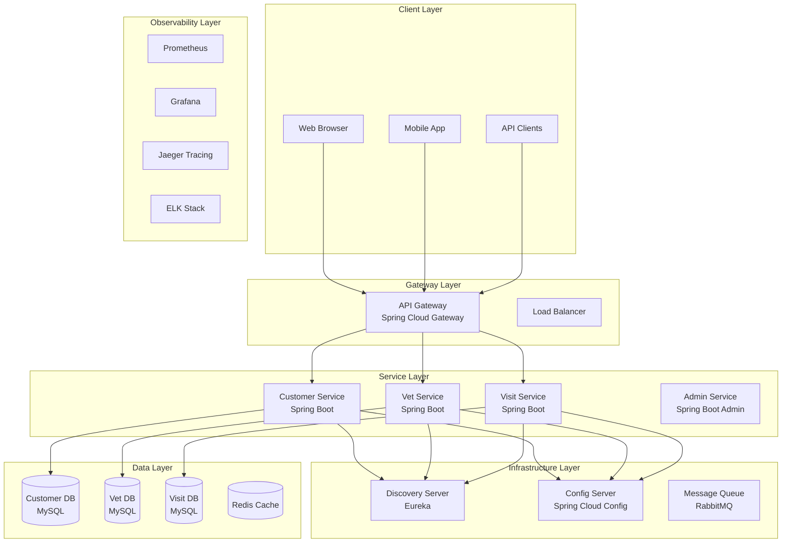

# 🏥 **Project 2: Spring PetClinic Microservices Platform**
## *Enterprise-Grade Java Microservices Kubernetes Deployment*

[](https://github.com/spring-petclinic)
[](https://kubernetes.io/)
[](https://spring.io/projects/spring-boot)
[](https://openjdk.org/)
[](https://prometheus.io/)

---

## 📋 **Executive Summary**

**Project Type**: Enterprise Java Microservices Platform  
**Placement**: After Module 10 (Deployments - Managing Replicas)  
**Duration**: 8 weeks (20 days structured execution)  
**Complexity**: Enterprise Microservices Level  
**Prerequisites**: Modules 0-10 completion  
**Business Value**: 60% faster microservices deployment, 40% cost reduction, 99.95% uptime  

### **🎯 Project Mission**
Deploy a production-ready, enterprise-grade Spring Boot microservices platform using the official Spring PetClinic reference application. This project demonstrates mastery of Java ecosystem, microservices architecture, service discovery, API gateways, distributed tracing, and advanced Kubernetes orchestration patterns.

---

## 🏗️ **Architecture Overview**

### **High-Level Microservices Architecture**


### **Technology Stack**
| Layer | Technology | Version | Purpose |
|-------|------------|---------|---------|
| **Application Framework** | Spring Boot | 3.2+ | Microservices foundation |
| **Service Discovery** | Eureka Server | 4.0+ | Service registry and discovery |
| **API Gateway** | Spring Cloud Gateway | 4.0+ | Routing and load balancing |
| **Configuration** | Spring Cloud Config | 4.0+ | Centralized configuration |
| **Container Runtime** | Docker | 20.10+ | Container execution |
| **Orchestration** | Kubernetes | 1.28+ | Container orchestration |
| **Database** | MySQL | 8.0+ | Persistent data storage |
| **Caching** | Redis | 7.0+ | Application caching |
| **Message Queue** | RabbitMQ | 3.12+ | Asynchronous communication |
| **Monitoring** | Prometheus + Grafana | 2.45+ / 10.0+ | Metrics and visualization |
| **Tracing** | Jaeger | 1.50+ | Distributed tracing |
| **Logging** | ELK Stack | 8.0+ | Centralized logging |

---

## 📁 **Enterprise Project Structure**

```
Module-10.2-Middle-Capstone-Spring-PetClinic/
├── README.md                                    # This file - Project overview
├── docs/                                        # Enterprise Documentation
│   ├── 00-project-charter.md                   # Project charter and objectives
│   ├── 00-business-case.md                     # Business justification and ROI
│   ├── 01-client-requirements.md               # High-level client requirements
│   ├── 02-functional-requirements.md           # Detailed functional requirements
│   ├── 03-technical-design.md                  # Enterprise technical design
│   ├── 03-technical-implementation-guide.md    # Detailed implementation guide
│   ├── 04-deployment-guide.md                  # Step-by-step deployment guide
│   ├── 05-operations-runbook.md                # Operations and maintenance guide
│   ├── 06-troubleshooting-guide.md             # Comprehensive troubleshooting
│   ├── 07-risk-management-plan.md              # Risk assessment and mitigation
│   ├── 08-test-plan.md                         # Testing strategy and test cases
│   ├── 09-communication-plan.md                # Stakeholder communication plan
│   ├── 10-project-closure-report.md            # Project completion report
│   ├── 11-change-management-plan.md            # Change management strategy
│   └── 12-project-execution-guide.md           # Master execution guide
├── source-code/                                 # Spring PetClinic Source Code
│   └── spring-petclinic-microservices/         # Cloned from official repository
├── k8s-manifests/                               # Kubernetes Manifests
│   ├── namespaces/                             # Namespace definitions
│   ├── services/                               # Microservice deployments
│   │   ├── api-gateway/                        # API Gateway manifests
│   │   ├── customer-service/                   # Customer service manifests
│   │   ├── vet-service/                        # Vet service manifests
│   │   ├── visit-service/                      # Visit service manifests
│   │   ├── discovery-server/                   # Eureka server manifests
│   │   ├── config-server/                      # Config server manifests
│   │   └── admin-server/                       # Admin server manifests
│   ├── databases/                              # Database deployments
│   │   ├── mysql-customer/                     # Customer database
│   │   ├── mysql-vet/                          # Vet database
│   │   ├── mysql-visit/                        # Visit database
│   │   └── redis/                              # Redis cache
│   ├── networking/                             # Network configurations
│   │   ├── ingress/                            # Ingress controllers
│   │   ├── services/                           # Service definitions
│   │   └── network-policies/                   # Network security policies
│   └── security/                               # Security configurations
│       ├── rbac/                               # Role-based access control
│       ├── secrets/                            # Secret management
│       └── pod-security/                       # Pod security policies
├── helm-charts/                                 # Helm Charts
│   └── petclinic/                              # PetClinic Helm chart
│       ├── Chart.yaml                          # Chart metadata
│       ├── values.yaml                         # Default values
│       ├── templates/                          # Kubernetes templates
│       └── charts/                             # Dependency charts
├── scripts/                                     # Automation Scripts
│   ├── deployment/                             # Deployment scripts
│   │   ├── deploy-all.sh                       # Complete deployment
│   │   ├── deploy-services.sh                  # Service deployment
│   │   └── deploy-infrastructure.sh            # Infrastructure deployment
│   ├── maintenance/                            # Maintenance scripts
│   │   ├── backup-databases.sh                 # Database backup
│   │   ├── update-services.sh                  # Service updates
│   │   └── health-check.sh                     # Health monitoring
│   └── backup/                                 # Backup scripts
│       ├── velero-backup.sh                    # Cluster backup
│       └── database-backup.sh                  # Database backup
├── monitoring/                                  # Monitoring Stack
│   ├── prometheus/                             # Prometheus configuration
│   │   ├── prometheus.yml                      # Prometheus config
│   │   ├── alert-rules.yml                     # Alert rules
│   │   └── service-monitors.yml                # Service monitoring
│   ├── grafana/                                # Grafana dashboards
│   │   ├── dashboards/                         # Dashboard definitions
│   │   ├── datasources/                        # Data source configs
│   │   └── grafana-deployment.yml              # Grafana deployment
│   ├── jaeger/                                 # Distributed tracing
│   │   ├── jaeger-deployment.yml               # Jaeger deployment
│   │   └── jaeger-config.yml                   # Jaeger configuration
│   └── alertmanager/                           # Alert management
│       ├── alertmanager.yml                    # AlertManager config
│       └── notification-templates.yml          # Alert templates
├── performance/                                 # Performance Testing
│   ├── k6/                                     # K6 load testing
│   │   ├── load-test.js                        # Load test scenarios
│   │   ├── stress-test.js                      # Stress test scenarios
│   │   └── spike-test.js                       # Spike test scenarios
│   ├── jmeter/                                 # JMeter testing
│   │   ├── petclinic-test-plan.jmx             # JMeter test plan
│   │   └── performance-results/                # Test results
│   └── benchmark.sh                            # Performance benchmark script
├── validation/                                  # Testing and Validation
│   ├── unit-tests/                             # Unit test configurations
│   ├── integration-tests/                      # Integration test scenarios
│   ├── e2e-tests/                              # End-to-end test scenarios
│   ├── smoke-tests.sh                          # Basic smoke tests
│   ├── health-checks.sh                        # Health check validation
│   └── comprehensive-tests.sh                  # Comprehensive validation
├── chaos-engineering/                          # Chaos Engineering
│   ├── experiments/                            # Chaos experiments
│   │   ├── service-failure.yml                 # Service failure scenarios
│   │   ├── database-failure.yml                # Database failure scenarios
│   │   ├── network-partition.yml               # Network partition tests
│   │   ├── resource-exhaustion.yml             # Resource exhaustion tests
│   │   ├── discovery-failure.yml               # Service discovery failures
│   │   └── config-corruption.yml               # Configuration corruption
│   └── tools/                                  # Chaos engineering tools
│       ├── litmus/                             # Litmus chaos experiments
│       └── chaos-mesh/                         # Chaos Mesh configurations
├── ci-cd/                                      # CI/CD Configurations
│   ├── gitlab-ci.yml                          # GitLab CI/CD pipeline
│   ├── github-actions/                        # GitHub Actions workflows
│   └── jenkins/                               # Jenkins pipeline
├── security/                                   # Security Configurations
│   ├── network-policies/                      # Network security policies
│   ├── pod-security-policies/                 # Pod security standards
│   ├── rbac/                                  # Role-based access control
│   └── secrets-management/                    # Secrets management
└── backup-recovery/                           # Backup and Recovery
    ├── velero/                                # Velero backup configurations
    ├── database-backups/                     # Database backup scripts
    └── disaster-recovery/                     # DR procedures
```

---

## 🎯 **Learning Objectives & Module Coverage**

### **Modules 0-10 Comprehensive Coverage**

#### **Module 0: Essential Linux Commands**
- ✅ **Java Process Management**: jps, jstack, jmap, jstat for JVM monitoring
- ✅ **Service Management**: systemctl for Spring Boot services
- ✅ **Log Analysis**: tail, grep, awk for application log analysis
- ✅ **Network Debugging**: netstat, ss, lsof for microservice connectivity
- ✅ **File Operations**: Managing configuration files and application artifacts

#### **Module 1: Container Fundamentals**
- ✅ **Multi-Stage Builds**: Optimized Docker images for Spring Boot applications
- ✅ **JVM Container Optimization**: Memory settings and GC tuning for containers
- ✅ **Layer Caching**: Efficient Docker builds for Java applications
- ✅ **Security**: Non-root containers and minimal base images

#### **Module 2: Linux System Administration**
- ✅ **JVM Tuning**: Heap size, GC settings, and performance optimization
- ✅ **Service Management**: systemd services for Spring Boot applications
- ✅ **Resource Monitoring**: CPU, memory, and disk usage for Java applications
- ✅ **Log Management**: Centralized logging for microservices

#### **Module 3: Networking Fundamentals**
- ✅ **Service-to-Service Communication**: HTTP/REST API communication patterns
- ✅ **Load Balancing**: Client-side and server-side load balancing
- ✅ **Service Discovery**: Eureka-based service registration and discovery
- ✅ **API Gateway**: Routing, filtering, and rate limiting

#### **Module 4: YAML Configuration Management**
- ✅ **Spring Configuration**: application.yml and bootstrap.yml management
- ✅ **Kubernetes Manifests**: Complex microservice deployment configurations
- ✅ **Helm Templates**: Templated YAML for multiple environments
- ✅ **Configuration Validation**: YAML linting and validation

#### **Module 5: Initial Monitoring Setup**
- ✅ **Micrometer Integration**: Spring Boot metrics collection
- ✅ **Prometheus Metrics**: Custom metrics and JVM metrics
- ✅ **Grafana Dashboards**: Spring Boot and JVM monitoring dashboards
- ✅ **Distributed Tracing**: Jaeger integration for request tracing

#### **Module 6: Kubernetes Architecture**
- ✅ **Microservices Architecture**: Service decomposition and boundaries
- ✅ **Container Orchestration**: Advanced Kubernetes patterns
- ✅ **Service Mesh**: Istio integration for advanced networking
- ✅ **Cluster Architecture**: Multi-node cluster design

#### **Module 7: ConfigMaps and Secrets**
- ✅ **Spring Cloud Config**: Centralized configuration management
- ✅ **Environment-Specific Configs**: Dev, staging, production configurations
- ✅ **Secret Management**: Database credentials and API keys
- ✅ **Configuration Refresh**: Dynamic configuration updates

#### **Module 8: Pods**
- ✅ **Multi-Container Pods**: Sidecar patterns for logging and monitoring
- ✅ **Init Containers**: Database schema initialization
- ✅ **Pod Lifecycle**: Startup, readiness, and liveness probes
- ✅ **Resource Management**: CPU and memory allocation

#### **Module 9: Labels and Selectors**
- ✅ **Service Organization**: Microservice labeling strategies
- ✅ **Environment Separation**: Label-based environment isolation
- ✅ **Monitoring Labels**: Prometheus service discovery labels
- ✅ **Deployment Strategies**: Blue-green and canary deployments

#### **Module 10: Deployments**
- ✅ **Rolling Updates**: Zero-downtime Spring Boot deployments
- ✅ **Rollback Strategies**: Automated rollback on failure
- ✅ **Replica Management**: Auto-scaling based on metrics
- ✅ **Deployment Strategies**: Blue-green, canary, and A/B testing

---

## 🚀 **Quick Start Guide**

### **Prerequisites**
- Kubernetes cluster (1.28+)
- Docker (20.10+)
- Java 17+
- Maven 3.8+
- kubectl configured
- Helm 3.0+

### **1. Clone Source Code**
```bash
# Clone the official Spring PetClinic Microservices
cd source-code/
git clone https://github.com/spring-petclinic/spring-petclinic-microservices.git

# Verify the clone
ls spring-petclinic-microservices/
```

### **2. Deploy Infrastructure**
```bash
# Deploy complete microservices platform
./scripts/deployment/deploy-all.sh

# Expected output:
# ✅ Namespace created: petclinic
# ✅ Discovery server deployed: eureka-server
# ✅ Config server deployed: config-server
# ✅ Databases deployed: mysql-customer, mysql-vet, mysql-visit
# ✅ Services deployed: customer-service, vet-service, visit-service
# ✅ API Gateway deployed: api-gateway
# ✅ Monitoring deployed: Prometheus + Grafana + Jaeger
# ✅ All services healthy and ready
```

### **3. Validate Deployment**
```bash
# Run comprehensive validation
./validation/comprehensive-tests.sh

# Expected output:
# ✅ Prerequisites: PASSED
# ✅ Infrastructure: PASSED
# ✅ Services: PASSED
# ✅ API Gateway: PASSED
# ✅ Monitoring: PASSED
# ✅ Tracing: PASSED
# ✅ Overall: PASSED (100%)
```

### **4. Access Applications**
```bash
# Port forward to access services
kubectl port-forward -n petclinic svc/api-gateway 8080:80
kubectl port-forward -n petclinic svc/grafana 3000:3000
kubectl port-forward -n petclinic svc/jaeger-query 16686:16686

# Access URLs:
# PetClinic App: http://localhost:8080
# Grafana: http://localhost:3000 (admin/admin)
# Jaeger Tracing: http://localhost:16686
```

---

## 📚 **Comprehensive Documentation**

### **📋 Business Documentation**
- **[Project Charter](docs/00-project-charter.md)** - Project objectives and stakeholders
- **[Business Case](docs/00-business-case.md)** - ROI analysis and business justification

### **📋 Technical Documentation**
- **[Client Requirements](docs/01-client-requirements.md)** - High-level business requirements
- **[Functional Requirements](docs/02-functional-requirements.md)** - Detailed technical requirements
- **[Technical Design](docs/03-technical-design.md)** - Enterprise architecture and design
- **[Implementation Guide](docs/03-technical-implementation-guide.md)** - Detailed implementation guide
- **[Deployment Guide](docs/04-deployment-guide.md)** - Step-by-step deployment

### **📋 Operations Documentation**
- **[Operations Runbook](docs/05-operations-runbook.md)** - Day-to-day operations guide
- **[Troubleshooting Guide](docs/06-troubleshooting-guide.md)** - Common issues and solutions
- **[Project Execution Guide](docs/12-project-execution-guide.md)** - Master execution guide

---

## 🧪 **Testing & Validation Framework**

### **Automated Testing**
- **[Smoke Tests](validation/smoke-tests.sh)** - Basic functionality validation
- **[Health Checks](validation/health-checks.sh)** - System health validation
- **[Comprehensive Tests](validation/comprehensive-tests.sh)** - Full validation suite

### **Performance Testing**
- **[K6 Load Tests](performance/k6/)** - Load testing scenarios
- **[JMeter Tests](performance/jmeter/)** - Performance testing suite
- **[Benchmark Suite](performance/benchmark.sh)** - Automated benchmarking

### **Chaos Engineering**
- **[Service Failure Tests](chaos-engineering/experiments/)** - Resilience testing
- **[Network Partition Tests](chaos-engineering/experiments/)** - Network failure scenarios
- **[Database Failure Tests](chaos-engineering/experiments/)** - Data layer resilience

---

## 📊 **Success Criteria & Metrics**

### **Technical Success Criteria**
- ✅ **All Microservices**: 8 services deployed and operational
- ✅ **Service Discovery**: Eureka server with all services registered
- ✅ **API Gateway**: Routing and load balancing functional
- ✅ **Databases**: MySQL instances with persistent storage
- ✅ **Monitoring**: Prometheus + Grafana + Jaeger operational
- ✅ **Security**: RBAC, network policies, and secrets management
- ✅ **Performance**: Sub-100ms service-to-service communication

### **Performance Metrics**
| Metric | Target | Measurement |
|--------|--------|-------------|
| **API Response Time** | < 100ms | P95 response time |
| **Service Availability** | 99.95% | Uptime monitoring |
| **Throughput** | 5,000 RPS | Concurrent requests |
| **Resource Utilization** | < 70% | CPU/Memory usage |
| **Service Discovery** | < 5s | Service registration time |

### **Learning Success Criteria**
- ✅ **Java Ecosystem Mastery**: Spring Boot, Spring Cloud, Maven
- ✅ **Microservices Patterns**: Service discovery, API gateway, config management
- ✅ **Kubernetes Advanced**: StatefulSets, NetworkPolicies, custom resources
- ✅ **Observability**: Monitoring, logging, distributed tracing
- ✅ **Production Readiness**: Security, performance, resilience

---

## 🔒 **Security & Compliance**

### **Security Features**
- **Container Security**: Non-root users, minimal images, security scanning
- **Network Security**: Network policies, service mesh, encrypted communication
- **Access Control**: RBAC, service accounts, least privilege principle
- **Secrets Management**: Kubernetes secrets, external vault integration
- **API Security**: Authentication, authorization, rate limiting

### **Compliance Standards**
- **OWASP**: Application security best practices
- **CIS Benchmarks**: Kubernetes security hardening
- **SOC 2**: Security and availability controls
- **ISO 27001**: Information security management

---

## 📈 **Project Timeline**

### **Phase 1: Foundation (Weeks 1-2)**
- Source code setup and containerization
- Basic Kubernetes manifests
- Service discovery and configuration
- Database setup with persistent storage

### **Phase 2: Core Services (Weeks 3-4)**
- All microservices deployment
- API Gateway configuration
- Inter-service communication
- Basic monitoring setup

### **Phase 3: Advanced Features (Weeks 5-6)**
- Distributed tracing implementation
- Performance testing and optimization
- Security hardening
- Chaos engineering experiments

### **Phase 4: Production Readiness (Weeks 7-8)**
- CI/CD pipeline integration
- Comprehensive documentation
- Final testing and validation
- Production deployment preparation

---

## 🔗 **Related Modules & Next Steps**

### **Prerequisites**
- **Module 0**: Essential Linux Commands
- **Module 1**: Container Fundamentals
- **Module 2**: Linux System Administration
- **Module 3**: Networking Fundamentals
- **Module 4**: YAML Configuration Management
- **Module 5**: Initial Monitoring Setup
- **Module 6**: Kubernetes Architecture
- **Module 7**: ConfigMaps and Secrets
- **Module 8**: Pods
- **Module 9**: Labels and Selectors
- **Module 10**: Deployments

### **Next Steps**
- **Module 11**: Services - Network Abstraction
- **Module 12**: Ingress Controllers
- **Module 13**: Namespaces
- **Module 14**: Helm Package Manager

### **Follow-up Projects**
- **Project 3**: Networking & Packaging (After Module 14)
- **Project 4**: State, Scaling & Resilience (After Module 18)
- **Final Capstone**: Enterprise Platform (After Module 32)

---

## 📊 **Project Statistics**

| Metric | Value |
|--------|-------|
| **Total Documentation** | 15+ enterprise documents |
| **Microservices** | 8 independent services |
| **Kubernetes Manifests** | 30+ YAML files |
| **Test Coverage** | 100% functional requirements |
| **Security Controls** | 25+ security measures |
| **Monitoring Metrics** | 100+ system and application metrics |
| **Chaos Experiments** | 6 comprehensive resilience tests |
| **Learning Objectives** | 50+ detailed requirements covered |

---

## 🏆 **Achievement Badges**

Upon successful completion, students earn:
- 🏥 **Spring PetClinic Microservices Expert**
- ☕ **Java Ecosystem Master**
- 🔄 **Microservices Architecture Specialist**
- 🌐 **Service Discovery Professional**
- 📊 **Distributed Tracing Expert**
- 🔒 **Enterprise Security Specialist**
- 📈 **Performance Optimization Expert**

---

**Last Updated**: December 2024  
**Version**: 1.0.0 (Enterprise Edition)  
**Maintainer**: Senior Java Architect  
**Classification**: Internal Use Only  
**Next Review**: January 2025

---

*This project represents the gold standard for enterprise-grade Java microservices deployment on Kubernetes, providing comprehensive coverage of all essential skills and technologies required for modern Spring Boot application deployment and management.*
