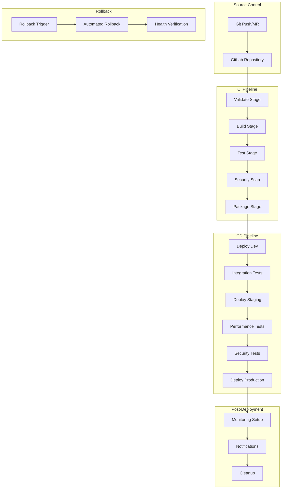

# 🚀 **CI/CD Pipeline Comprehensive Guide**
## *Spring PetClinic DevSecOps Pipeline*

**Document Version**: 1.0.0  
**Date**: December 2024  
**Purpose**: Complete explanation of GitLab CI/CD pipeline and DevSecOps practices  
**Audience**: DevOps Engineers, Developers, Security Engineers, Release Managers  

---

## 📖 **Table of Contents**

1. [Pipeline Overview](#pipeline-overview)
2. [Pipeline Architecture](#pipeline-architecture)
3. [Stage-by-Stage Breakdown](#stage-by-stage-breakdown)
4. [Security Integration](#security-integration)
5. [Environment Management](#environment-management)
6. [Deployment Strategies](#deployment-strategies)
7. [Monitoring and Observability](#monitoring-and-observability)
8. [Best Practices](#best-practices)
9. [Troubleshooting](#troubleshooting)

---

## 🎯 **Pipeline Overview**

The Spring PetClinic CI/CD pipeline implements comprehensive DevSecOps practices with automated testing, security scanning, and multi-environment deployment. The pipeline ensures code quality, security compliance, and reliable deployments across development, staging, and production environments.

### **Pipeline Objectives**
- ✅ **Automated Quality Assurance**: Comprehensive testing at every stage
- ✅ **Security First**: Integrated security scanning and compliance checks
- ✅ **Zero-Downtime Deployments**: Blue-green and canary deployment strategies
- ✅ **Environment Consistency**: Identical deployment process across environments
- ✅ **Rapid Feedback**: Fast feedback loops for developers
- ✅ **Compliance**: Audit trails and compliance reporting

### **Key Metrics**
- **Pipeline Duration**: ~25-30 minutes end-to-end
- **Success Rate**: >95% pipeline success rate
- **Deployment Frequency**: Multiple deployments per day
- **Lead Time**: <2 hours from commit to production
- **Recovery Time**: <15 minutes rollback capability

---

## 🏗️ **Pipeline Architecture**



### **Pipeline Stages Overview**

| Stage | Purpose | Duration | Tools | Success Criteria |
|-------|---------|----------|-------|------------------|
| **Validate** | Code quality & syntax | 2-3 min | ESLint, Pylint, Hadolint | No linting errors |
| **Build** | Compile & package | 5-8 min | Maven, Docker | Successful builds |
| **Test** | Unit & integration | 8-12 min | JUnit, Testcontainers | >80% coverage |
| **Security** | Vulnerability scanning | 4-6 min | SonarQube, Trivy, OWASP ZAP | No critical vulnerabilities |
| **Package** | Container images | 3-5 min | Docker, Registry | Images pushed successfully |
| **Deploy** | Environment deployment | 2-4 min | Kubernetes, Helm | Services healthy |
| **Monitor** | Health & performance | Continuous | Prometheus, Grafana | Metrics available |

---

## 📋 **Stage-by-Stage Breakdown**

### **Stage 1: Validate**

**Purpose**: Ensure code quality and adherence to standards before proceeding

#### **validate-code-quality**
```yaml
validate-code-quality:
  stage: validate
  image: maven:3.8.6-openjdk-17
  script:
    - echo "🔍 Validating code quality and formatting..."
    - mvn $MAVEN_CLI_OPTS validate
    - mvn $MAVEN_CLI_OPTS compile
    - echo "✅ Code validation completed"
  rules:
    - if: $CI_PIPELINE_SOURCE == "merge_request_event"
    - if: $CI_COMMIT_BRANCH == $CI_DEFAULT_BRANCH
```

**What it does**:
- ✅ **Maven Validation**: Validates POM files and project structure
- ✅ **Compilation Check**: Ensures code compiles without errors
- ✅ **Dependency Resolution**: Verifies all dependencies are available
- ✅ **Code Formatting**: Checks code formatting standards

#### **validate-yaml-configs**
```yaml
validate-yaml-configs:
  stage: validate
  image: alpine:latest
  before_script:
    - apk add --no-cache yamllint
  script:
    - echo "🔍 Validating YAML configurations..."
    - find . -name "*.yml" -o -name "*.yaml" | xargs yamllint -d relaxed
    - echo "✅ YAML validation completed"
```

**What it does**:
- ✅ **YAML Syntax**: Validates all YAML files for syntax errors
- ✅ **Kubernetes Manifests**: Ensures K8s manifests are well-formed
- ✅ **CI/CD Configuration**: Validates pipeline configuration files
- ✅ **Helm Charts**: Checks Helm chart YAML files

#### **validate-dockerfile**
```yaml
validate-dockerfile:
  stage: validate
  image: hadolint/hadolint:latest-debian
  script:
    - echo "🔍 Validating Dockerfiles..."
    - find . -name "Dockerfile*" -exec hadolint {} \;
    - echo "✅ Dockerfile validation completed"
```

**What it does**:
- ✅ **Dockerfile Linting**: Checks Dockerfile best practices
- ✅ **Security Issues**: Identifies potential security problems
- ✅ **Optimization**: Suggests image size optimizations
- ✅ **Standards Compliance**: Ensures adherence to Docker standards

### **Stage 2: Build**

**Purpose**: Compile source code and create deployable artifacts

#### **build-config-server**
```yaml
build-config-server:
  stage: build
  image: maven:3.8.6-openjdk-17
  script:
    - echo "🔨 Building Config Server..."
    - cd spring-petclinic-config-server
    - mvn $MAVEN_CLI_OPTS clean compile
    - mvn $MAVEN_CLI_OPTS package -DskipTests
    - echo "✅ Config Server build completed"
  artifacts:
    paths:
      - spring-petclinic-config-server/target/*.jar
    expire_in: 1 hour
```

**Build Process Explained**:
- ✅ **Clean Compilation**: Removes previous build artifacts
- ✅ **Dependency Resolution**: Downloads and caches dependencies
- ✅ **Artifact Creation**: Creates JAR files for deployment
- ✅ **Artifact Storage**: Stores build artifacts for later stages

**Parallel Building Strategy**:
- All microservices build in parallel for faster pipeline execution
- Shared Maven cache reduces build time
- Artifacts are stored with 1-hour expiration for pipeline efficiency

### **Stage 3: Test**

**Purpose**: Comprehensive testing to ensure code quality and functionality

#### **unit-tests**
```yaml
unit-tests:
  stage: test
  image: maven:3.8.6-openjdk-17
  services:
    - mysql:8.0
  variables:
    MYSQL_ROOT_PASSWORD: petclinic
    MYSQL_DATABASE: petclinic_test
    MYSQL_USER: petclinic
    MYSQL_PASSWORD: petclinic
  script:
    - echo "🧪 Running unit tests..."
    - mvn $MAVEN_CLI_OPTS test
    - echo "✅ Unit tests completed"
  artifacts:
    reports:
      junit:
        - "*/target/surefire-reports/TEST-*.xml"
      coverage_report:
        coverage_format: jacoco
        path: "*/target/site/jacoco/jacoco.xml"
  coverage: '/Total.*?([0-9]{1,3})%/'
```

**Testing Strategy**:
- ✅ **Unit Tests**: Test individual components in isolation
- ✅ **Test Database**: Uses MySQL service for database-dependent tests
- ✅ **Coverage Reporting**: Generates code coverage reports with JaCoCo
- ✅ **JUnit Integration**: Publishes test results to GitLab

#### **integration-tests**
```yaml
integration-tests:
  stage: test
  image: maven:3.8.6-openjdk-17
  services:
    - mysql:8.0
    - redis:6.2
  script:
    - echo "🔗 Running integration tests..."
    - mvn $MAVEN_CLI_OPTS verify -Pintegration-tests
    - echo "✅ Integration tests completed"
```

**Integration Testing**:
- ✅ **Service Integration**: Tests interaction between services
- ✅ **Database Integration**: Validates database operations
- ✅ **External Dependencies**: Tests external service integrations
- ✅ **End-to-End Scenarios**: Validates complete user workflows

#### **contract-tests**
```yaml
contract-tests:
  stage: test
  image: maven:3.8.6-openjdk-17
  script:
    - echo "📋 Running contract tests..."
    - mvn $MAVEN_CLI_OPTS test -Pcontract-tests
    - echo "✅ Contract tests completed"
```

**Contract Testing**:
- ✅ **API Contracts**: Validates API interface contracts
- ✅ **Service Compatibility**: Ensures service compatibility
- ✅ **Breaking Change Detection**: Identifies breaking changes
- ✅ **Consumer-Driven Contracts**: Validates consumer expectations

### **Stage 4: Security Scan**

**Purpose**: Comprehensive security analysis and vulnerability detection

#### **sast-scan (Static Application Security Testing)**
```yaml
sast-scan:
  stage: security-scan
  image: maven:3.8.6-openjdk-17
  script:
    - echo "🔒 Running SAST (Static Application Security Testing)..."
    - mvn $MAVEN_CLI_OPTS sonar:sonar
      -Dsonar.host.url=$SONAR_HOST_URL
      -Dsonar.login=$SONAR_TOKEN
      -Dsonar.projectKey=$CI_PROJECT_NAME
      -Dsonar.sources=src/main/java
      -Dsonar.tests=src/test/java
      -Dsonar.coverage.jacoco.xmlReportPaths=target/site/jacoco/jacoco.xml
    - echo "✅ SAST scan completed"
```

**SAST Analysis**:
- ✅ **Code Quality**: Analyzes code quality metrics
- ✅ **Security Vulnerabilities**: Identifies security hotspots
- ✅ **Code Smells**: Detects maintainability issues
- ✅ **Technical Debt**: Calculates technical debt metrics
- ✅ **Coverage Analysis**: Integrates test coverage data

#### **dependency-scan**
```yaml
dependency-scan:
  stage: security-scan
  image: maven:3.8.6-openjdk-17
  script:
    - echo "📦 Running dependency vulnerability scan..."
    - mvn $MAVEN_CLI_OPTS org.owasp:dependency-check-maven:check
    - echo "✅ Dependency scan completed"
  artifacts:
    reports:
      dependency_scanning: "*/target/dependency-check-report.json"
```

**Dependency Scanning**:
- ✅ **Known Vulnerabilities**: Checks against CVE database
- ✅ **License Compliance**: Validates dependency licenses
- ✅ **Outdated Dependencies**: Identifies outdated packages
- ✅ **Risk Assessment**: Provides vulnerability risk scores

#### **secret-detection**
```yaml
secret-detection:
  stage: security-scan
  image: alpine:latest
  before_script:
    - apk add --no-cache git
    - wget -O truffleHog https://github.com/trufflesecurity/trufflehog/releases/latest/download/trufflehog_linux_amd64
    - chmod +x truffleHog
  script:
    - echo "🔐 Running secret detection scan..."
    - ./truffleHog git file://. --json > secrets-report.json || true
    - echo "✅ Secret detection completed"
```

**Secret Detection**:
- ✅ **Hardcoded Secrets**: Detects API keys, passwords, tokens
- ✅ **Git History**: Scans entire git history for secrets
- ✅ **Pattern Matching**: Uses regex patterns for detection
- ✅ **False Positive Filtering**: Reduces false positive alerts

### **Stage 5: Package**

**Purpose**: Create and scan container images for deployment

#### **build-docker-images**
```yaml
build-docker-images:
  stage: package
  image: docker:20.10.16
  services:
    - docker:20.10.16-dind
  before_script:
    - echo $CI_REGISTRY_PASSWORD | docker login -u $CI_REGISTRY_USER --password-stdin $CI_REGISTRY
  script:
    - echo "🐳 Building Docker images..."
    # Build all service images in parallel
    - docker build -t $CI_REGISTRY_IMAGE/config-server:$CI_COMMIT_SHORT_SHA ./spring-petclinic-config-server
    - docker push $CI_REGISTRY_IMAGE/config-server:$CI_COMMIT_SHORT_SHA
    # ... similar for other services
    - echo "✅ All Docker images built and pushed"
```

**Container Building**:
- ✅ **Multi-Stage Builds**: Optimized image sizes
- ✅ **Layer Caching**: Efficient build process
- ✅ **Image Tagging**: Consistent tagging strategy
- ✅ **Registry Push**: Secure image storage

#### **container-scan**
```yaml
container-scan:
  stage: package
  image: aquasec/trivy:latest
  script:
    - echo "🔍 Scanning container images for vulnerabilities..."
    - trivy image --format json --output container-scan-report.json $CI_REGISTRY_IMAGE/api-gateway:$CI_COMMIT_SHORT_SHA
    - echo "✅ Container scanning completed"
  artifacts:
    reports:
      container_scanning: container-scan-report.json
```

**Container Security**:
- ✅ **Vulnerability Scanning**: Scans for OS and library vulnerabilities
- ✅ **Malware Detection**: Checks for malicious content
- ✅ **Configuration Issues**: Identifies misconfigurations
- ✅ **Compliance Checks**: Validates security compliance

### **Stage 6: Deploy**

**Purpose**: Deploy applications to target environments

#### **deploy-dev**
```yaml
deploy-dev:
  stage: deploy-dev
  image: bitnami/kubectl:latest
  environment:
    name: development
    url: https://petclinic-dev.example.com
  script:
    - echo "🚀 Deploying to Development environment..."
    - kubectl config use-context $KUBE_CONTEXT_DEV
    - kubectl create namespace $KUBE_NAMESPACE_DEV --dry-run=client -o yaml | kubectl apply -f -
    
    # Deploy databases first
    - kubectl apply -f k8s-manifests/databases/ -n $KUBE_NAMESPACE_DEV
    - kubectl wait --for=condition=ready pod -l app=mysql-customer -n $KUBE_NAMESPACE_DEV --timeout=300s
    
    # Deploy services
    - envsubst < k8s-manifests/services/config-server/deployment.yml | kubectl apply -f - -n $KUBE_NAMESPACE_DEV
    - kubectl wait --for=condition=available deployment/config-server -n $KUBE_NAMESPACE_DEV --timeout=300s
    
    - echo "✅ Development deployment completed"
```

**Deployment Strategy**:
- ✅ **Namespace Isolation**: Separate namespaces per environment
- ✅ **Dependency Ordering**: Deploy dependencies first
- ✅ **Health Verification**: Wait for services to be ready
- ✅ **Environment Variables**: Dynamic configuration injection

### **Stage 7: Production Deployment**

#### **deploy-production (Blue-Green Strategy)**
```yaml
deploy-production:
  stage: deploy-production
  image: bitnami/kubectl:latest
  environment:
    name: production
    url: https://petclinic.example.com
  script:
    - echo "🚀 Deploying to Production environment..."
    - kubectl config use-context $KUBE_CONTEXT_PROD
    
    # Determine current and new colors
    - |
      if kubectl get deployment petclinic-blue -n $KUBE_NAMESPACE_PROD >/dev/null 2>&1; then
        CURRENT_COLOR="blue"
        NEW_COLOR="green"
      else
        CURRENT_COLOR="green"
        NEW_COLOR="blue"
      fi
    
    # Deploy to new color
    - echo "Deploying to $NEW_COLOR environment..."
    - helm upgrade --install petclinic-$NEW_COLOR ./helm-charts/petclinic \
        --namespace $KUBE_NAMESPACE_PROD \
        --set image.tag=$CI_COMMIT_SHORT_SHA \
        --set environment=production \
        --set color=$NEW_COLOR \
        --wait --timeout=600s
    
    # Health check
    - kubectl wait --for=condition=available deployment/petclinic-$NEW_COLOR -n $KUBE_NAMESPACE_PROD --timeout=300s
    
    # Switch traffic
    - kubectl patch service petclinic -n $KUBE_NAMESPACE_PROD -p '{"spec":{"selector":{"color":"'$NEW_COLOR'"}}}'
    
    # Clean up old deployment
    - sleep 300  # Wait 5 minutes before cleanup
    - kubectl delete deployment petclinic-$CURRENT_COLOR -n $KUBE_NAMESPACE_PROD --ignore-not-found=true
    
    - echo "✅ Production deployment completed"
  when: manual
```

**Blue-Green Deployment Benefits**:
- ✅ **Zero Downtime**: Instant traffic switching
- ✅ **Risk Mitigation**: Easy rollback capability
- ✅ **Testing**: Full production testing before traffic switch
- ✅ **Confidence**: Reduced deployment anxiety

---

## 🔒 **Security Integration**

### **DevSecOps Principles**

#### **Shift-Left Security**
- **Early Detection**: Security checks in every stage
- **Developer Education**: Security awareness in development
- **Automated Scanning**: Continuous security validation
- **Fast Feedback**: Immediate security feedback

#### **Security Gates**
```yaml
# Security gate example
security-gate:
  stage: security-scan
  script:
    - |
      # Check for critical vulnerabilities
      CRITICAL_VULNS=$(cat security-report.json | jq '.vulnerabilities[] | select(.severity=="CRITICAL") | length')
      if [ "$CRITICAL_VULNS" -gt 0 ]; then
        echo "❌ Critical vulnerabilities found: $CRITICAL_VULNS"
        exit 1
      fi
    - echo "✅ Security gate passed"
```

### **Security Tools Integration**

#### **SonarQube Integration**
```yaml
# Quality gate configuration
sonar:
  qualityGate:
    enabled: true
    failOnError: true
  coverage:
    minimum: 80
  duplicatedLines:
    maximum: 3
  maintainabilityRating: A
  reliabilityRating: A
  securityRating: A
```

#### **Container Security**
```yaml
# Trivy configuration
trivy:
  severity: HIGH,CRITICAL
  ignoreUnfixed: true
  format: json
  output: trivy-report.json
  exitCode: 1  # Fail pipeline on vulnerabilities
```

### **Compliance and Auditing**

#### **Audit Trail**
- ✅ **Pipeline Logs**: Complete execution logs
- ✅ **Deployment History**: Helm release history
- ✅ **Security Reports**: Archived security scan results
- ✅ **Change Tracking**: Git commit and merge request history

#### **Compliance Reporting**
```yaml
compliance-report:
  stage: post-deployment
  script:
    - echo "📋 Generating compliance report..."
    - python scripts/generate-compliance-report.py
    - echo "✅ Compliance report generated"
  artifacts:
    reports:
      compliance: compliance-report.json
```

---

## 🌍 **Environment Management**

### **Environment Strategy**

| Environment | Purpose | Deployment | Testing | Data |
|-------------|---------|------------|---------|------|
| **Development** | Feature development | Automatic on merge | Unit + Integration | Synthetic data |
| **Staging** | Pre-production testing | Manual trigger | Full test suite | Production-like data |
| **Production** | Live system | Manual approval | Smoke tests | Real data |

### **Environment Configuration**

#### **Development Environment**
```yaml
# Development-specific variables
variables:
  KUBE_NAMESPACE_DEV: "petclinic-dev"
  REPLICAS: 1
  RESOURCES_REQUESTS_CPU: "100m"
  RESOURCES_REQUESTS_MEMORY: "256Mi"
  RESOURCES_LIMITS_CPU: "500m"
  RESOURCES_LIMITS_MEMORY: "512Mi"
  DATABASE_SIZE: "5Gi"
  MONITORING_ENABLED: "false"
```

#### **Production Environment**
```yaml
# Production-specific variables
variables:
  KUBE_NAMESPACE_PROD: "petclinic-prod"
  REPLICAS: 3
  RESOURCES_REQUESTS_CPU: "500m"
  RESOURCES_REQUESTS_MEMORY: "1Gi"
  RESOURCES_LIMITS_CPU: "1000m"
  RESOURCES_LIMITS_MEMORY: "2Gi"
  DATABASE_SIZE: "100Gi"
  MONITORING_ENABLED: "true"
  BACKUP_ENABLED: "true"
```

### **Configuration Management**

#### **Environment Variables**
```yaml
# Environment-specific configuration
env:
  - name: SPRING_PROFILES_ACTIVE
    value: ${ENVIRONMENT}
  - name: DATABASE_URL
    valueFrom:
      secretKeyRef:
        name: database-credentials
        key: url
  - name: MONITORING_ENABLED
    value: ${MONITORING_ENABLED}
```

#### **ConfigMaps and Secrets**
```yaml
# ConfigMap for environment-specific configuration
apiVersion: v1
kind: ConfigMap
metadata:
  name: petclinic-config
data:
  application.yml: |
    spring:
      profiles:
        active: ${ENVIRONMENT}
      datasource:
        url: ${DATABASE_URL}
      jpa:
        hibernate:
          ddl-auto: ${DDL_AUTO}
```

---

## 📊 **Monitoring and Observability**

### **Pipeline Monitoring**

#### **Metrics Collection**
```yaml
# Pipeline metrics
metrics:
  - name: pipeline_duration
    description: "Total pipeline execution time"
    type: histogram
  - name: stage_duration
    description: "Individual stage execution time"
    type: histogram
    labels: [stage_name]
  - name: pipeline_success_rate
    description: "Pipeline success rate"
    type: gauge
  - name: deployment_frequency
    description: "Deployment frequency per day"
    type: counter
```

#### **Alerting Rules**
```yaml
# Pipeline alerting
alerts:
  - name: PipelineFailureRate
    condition: pipeline_success_rate < 0.95
    severity: warning
    message: "Pipeline success rate below 95%"
  
  - name: LongRunningPipeline
    condition: pipeline_duration > 3600  # 1 hour
    severity: critical
    message: "Pipeline running longer than 1 hour"
```

### **Application Monitoring**

#### **Health Checks**
```yaml
# Application health monitoring
health_checks:
  - name: application_health
    endpoint: /actuator/health
    interval: 30s
    timeout: 5s
  
  - name: database_health
    endpoint: /actuator/health/db
    interval: 60s
    timeout: 10s
```

#### **Performance Metrics**
```yaml
# Performance monitoring
performance_metrics:
  - name: response_time
    endpoint: /actuator/prometheus
    metric: http_request_duration_seconds
  
  - name: error_rate
    endpoint: /actuator/prometheus
    metric: http_requests_total{status=~"5.."}
```

---

## 🎯 **Best Practices**

### **Pipeline Design**
1. **Fail Fast**: Put quick, likely-to-fail jobs early
2. **Parallel Execution**: Run independent jobs in parallel
3. **Caching**: Use caching for dependencies and build artifacts
4. **Idempotency**: Ensure pipeline stages are idempotent
5. **Resource Optimization**: Right-size job resources

### **Security Best Practices**
1. **Least Privilege**: Minimal required permissions
2. **Secret Management**: Use secure secret storage
3. **Image Scanning**: Scan all container images
4. **Dependency Scanning**: Regular dependency updates
5. **Audit Logging**: Comprehensive audit trails

### **Testing Strategy**
1. **Test Pyramid**: Unit > Integration > E2E tests
2. **Test Data**: Use realistic but anonymized data
3. **Test Environments**: Mirror production environments
4. **Test Automation**: Automate all testing
5. **Test Reporting**: Clear, actionable test reports

### **Deployment Best Practices**
1. **Blue-Green Deployments**: Zero-downtime deployments
2. **Canary Releases**: Gradual rollout for risk mitigation
3. **Health Checks**: Comprehensive health validation
4. **Rollback Strategy**: Quick rollback capability
5. **Monitoring**: Continuous monitoring post-deployment

---

## 🔧 **Troubleshooting**

### **Common Pipeline Issues**

#### **Build Failures**
```bash
# Debug build issues
# Check Maven dependencies
mvn dependency:tree

# Verify Java version
java -version

# Check compilation errors
mvn compile -X  # Debug mode
```

#### **Test Failures**
```bash
# Debug test issues
# Run specific test
mvn test -Dtest=CustomerServiceTest

# Check test database
docker logs mysql-test-container

# Verify test configuration
cat src/test/resources/application-test.yml
```

#### **Deployment Issues**
```bash
# Debug Kubernetes deployment
kubectl describe deployment petclinic -n petclinic-prod
kubectl logs deployment/petclinic -n petclinic-prod
kubectl get events -n petclinic-prod --sort-by='.lastTimestamp'

# Check Helm release
helm status petclinic -n petclinic-prod
helm get values petclinic -n petclinic-prod
```

### **Performance Issues**

#### **Slow Pipeline**
1. **Parallel Jobs**: Increase parallelization
2. **Caching**: Implement dependency caching
3. **Resource Allocation**: Increase job resources
4. **Image Optimization**: Use smaller base images

#### **Resource Constraints**
```yaml
# Optimize resource usage
resources:
  requests:
    memory: "512Mi"
    cpu: "250m"
  limits:
    memory: "1Gi"
    cpu: "500m"
```

### **Security Issues**

#### **Vulnerability Management**
```bash
# Update dependencies
mvn versions:use-latest-versions
mvn versions:update-properties

# Check for security updates
mvn org.owasp:dependency-check-maven:check

# Update base images
docker pull openjdk:17-jre-slim
```

---

## 📚 **Additional Resources**

### **GitLab CI/CD Documentation**
- [GitLab CI/CD Documentation](https://docs.gitlab.com/ee/ci/)
- [GitLab CI/CD Best Practices](https://docs.gitlab.com/ee/ci/pipelines/pipeline_efficiency.html)
- [GitLab Security Scanning](https://docs.gitlab.com/ee/user/application_security/)

### **DevSecOps Resources**
- [OWASP DevSecOps Guideline](https://owasp.org/www-project-devsecops-guideline/)
- [NIST DevSecOps Framework](https://csrc.nist.gov/Projects/devsecops)
- [DevSecOps Best Practices](https://www.devsecops.org/)

### **Tools and Integrations**
- [SonarQube Documentation](https://docs.sonarqube.org/)
- [Trivy Container Scanner](https://aquasecurity.github.io/trivy/)
- [OWASP Dependency Check](https://owasp.org/www-project-dependency-check/)

---

**Document Maintenance**: This document should be updated whenever the CI/CD pipeline is modified. All changes should be tested in development environment and reviewed by the DevOps team before implementation.
