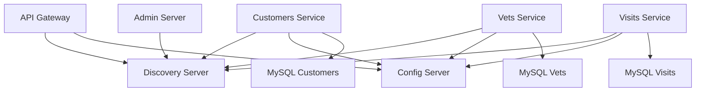

# 🚀 **Deployment Guide**
## *Spring PetClinic Microservices Platform*

**Document Version**: 1.0.0  
**Date**: December 2024  
**Project**: Spring PetClinic Microservices Platform  
**Classification**: Internal Use Only  

---

## 🎯 **Quick Start Deployment**

### **Prerequisites**
- Kubernetes cluster (1.28+) with admin access
- kubectl configured and connected
- Minimum 4 CPU cores and 8GB RAM available
- StorageClass configured for persistent volumes

### **1. One-Command Deployment**
```bash
# Navigate to project directory
cd Module-10.2-Middle-Capstone-Spring-PetClinic/

# Deploy everything
./scripts/deployment/deploy-all.sh

# Expected output:
# ✅ Prerequisites check passed
# ✅ Namespace petclinic created
# ✅ Secrets deployed
# ✅ All databases deployed and ready
# ✅ Infrastructure services deployed and ready
# ✅ All microservices deployed and ready
# ✅ API Gateway and Admin Server deployed and ready
# 🎉 Spring PetClinic Microservices Platform deployed successfully!
```

### **2. Validate Deployment**
```bash
# Run comprehensive validation
./validation/comprehensive-tests.sh

# Expected output:
# ✅ All tests passed! Spring PetClinic platform is fully operational.
# Success Rate: 100%
```

### **3. Access Applications**
```bash
# PetClinic Application (Main UI)
kubectl port-forward -n petclinic svc/api-gateway 8080:8080
# Open: http://localhost:8080

# Eureka Discovery Dashboard
kubectl port-forward -n petclinic svc/discovery-server 8761:8761
# Open: http://localhost:8761

# Spring Boot Admin Dashboard
kubectl port-forward -n petclinic svc/admin-server 9090:9090
# Open: http://localhost:9090
```

---

## 🏗️ **Architecture Overview**

### **Deployed Components**
| Component | Replicas | Port | Purpose |
|-----------|----------|------|---------|
| **Config Server** | 1 | 8888 | Centralized configuration |
| **Discovery Server** | 1 | 8761 | Service registry (Eureka) |
| **API Gateway** | 2 | 8080 | External access point |
| **Customers Service** | 2 | 8081 | Pet owners and pets |
| **Vets Service** | 2 | 8083 | Veterinarian information |
| **Visits Service** | 2 | 8082 | Appointment management |
| **Admin Server** | 1 | 9090 | System monitoring |
| **MySQL Customers** | 1 | 3306 | Customer data storage |
| **MySQL Vets** | 1 | 3306 | Veterinarian data storage |
| **MySQL Visits** | 1 | 3306 | Visit data storage |

### **Service Dependencies**


---

## 📋 **Step-by-Step Manual Deployment**

### **Phase 1: Infrastructure Setup**
```bash
# 1. Create namespace and resources
kubectl apply -f k8s-manifests/namespaces/petclinic-namespace.yml

# 2. Deploy secrets
kubectl apply -f security/secrets/mysql-credentials.yml

# 3. Deploy databases (wait for each to be ready)
kubectl apply -f k8s-manifests/databases/mysql-customer/mysql-customers-deployment.yml
kubectl apply -f k8s-manifests/databases/mysql-vet/mysql-vets-deployment.yml
kubectl apply -f k8s-manifests/databases/mysql-visit/mysql-visits-deployment.yml

# Wait for databases
kubectl wait --for=condition=ready pod -l app=mysql-customers -n petclinic --timeout=600s
kubectl wait --for=condition=ready pod -l app=mysql-vets -n petclinic --timeout=600s
kubectl wait --for=condition=ready pod -l app=mysql-visits -n petclinic --timeout=600s
```

### **Phase 2: Core Services**
```bash
# 4. Deploy Config Server
kubectl apply -f k8s-manifests/services/config-server/config-server-deployment.yml
kubectl wait --for=condition=ready pod -l app=config-server -n petclinic --timeout=300s

# 5. Deploy Discovery Server
kubectl apply -f k8s-manifests/services/discovery-server/discovery-server-deployment.yml
kubectl wait --for=condition=ready pod -l app=discovery-server -n petclinic --timeout=300s
```

### **Phase 3: Business Services**
```bash
# 6. Deploy Microservices
kubectl apply -f k8s-manifests/services/customer-service/customers-service-deployment.yml
kubectl apply -f k8s-manifests/services/vet-service/vets-service-deployment.yml
kubectl apply -f k8s-manifests/services/visit-service/visits-service-deployment.yml

# Wait for services
kubectl wait --for=condition=ready pod -l app=customers-service -n petclinic --timeout=300s
kubectl wait --for=condition=ready pod -l app=vets-service -n petclinic --timeout=300s
kubectl wait --for=condition=ready pod -l app=visits-service -n petclinic --timeout=300s
```

### **Phase 4: Gateway and Admin**
```bash
# 7. Deploy API Gateway and Admin
kubectl apply -f k8s-manifests/services/api-gateway/api-gateway-deployment.yml
kubectl apply -f k8s-manifests/services/admin-server/admin-server-deployment.yml

# Wait for final services
kubectl wait --for=condition=ready pod -l app=api-gateway -n petclinic --timeout=300s
kubectl wait --for=condition=ready pod -l app=admin-server -n petclinic --timeout=300s
```

---

## ✅ **Verification Steps**

### **1. Check Pod Status**
```bash
kubectl get pods -n petclinic

# Expected output: All pods in Running state
# NAME                                READY   STATUS    RESTARTS   AGE
# admin-server-xxx                    1/1     Running   0          5m
# api-gateway-xxx                     1/1     Running   0          5m
# config-server-xxx                   1/1     Running   0          10m
# customers-service-xxx               1/1     Running   0          7m
# discovery-server-xxx                1/1     Running   0          8m
# mysql-customers-0                   1/1     Running   0          15m
# mysql-vets-0                        1/1     Running   0          15m
# mysql-visits-0                      1/1     Running   0          15m
# vets-service-xxx                    1/1     Running   0          7m
# visits-service-xxx                  1/1     Running   0          7m
```

### **2. Check Services**
```bash
kubectl get services -n petclinic

# Expected output: All services with ClusterIP assigned
# NAME                TYPE           CLUSTER-IP       EXTERNAL-IP   PORT(S)
# admin-server        ClusterIP      10.96.xxx.xxx    <none>        9090/TCP
# api-gateway         LoadBalancer   10.96.xxx.xxx    <pending>     8080:xxxxx/TCP
# config-server       ClusterIP      10.96.xxx.xxx    <none>        8888/TCP
# customers-service   ClusterIP      10.96.xxx.xxx    <none>        8081/TCP
# discovery-server    ClusterIP      10.96.xxx.xxx    <none>        8761/TCP
# mysql-customers     ClusterIP      None             <none>        3306/TCP
# mysql-vets          ClusterIP      None             <none>        3306/TCP
# mysql-visits        ClusterIP      None             <none>        3306/TCP
# vets-service        ClusterIP      10.96.xxx.xxx    <none>        8083/TCP
# visits-service      ClusterIP      10.96.xxx.xxx    <none>        8082/TCP
```

### **3. Check Persistent Volumes**
```bash
kubectl get pvc -n petclinic

# Expected output: All PVCs in Bound state
# NAME                               STATUS   VOLUME                     CAPACITY   ACCESS MODES
# mysql-customers-storage-mysql-customers-0   Bound    pvc-xxx   10Gi       RWO
# mysql-vets-storage-mysql-vets-0             Bound    pvc-xxx   10Gi       RWO
# mysql-visits-storage-mysql-visits-0         Bound    pvc-xxx   10Gi       RWO
```

### **4. Test Service Discovery**
```bash
# Check Eureka dashboard
kubectl port-forward -n petclinic svc/discovery-server 8761:8761 &
curl http://localhost:8761/eureka/apps

# Should return XML with registered services:
# - API-GATEWAY
# - CUSTOMERS-SERVICE
# - VETS-SERVICE
# - VISITS-SERVICE
# - ADMIN-SERVER
```

### **5. Test Application Endpoints**
```bash
# Test API Gateway
kubectl port-forward -n petclinic svc/api-gateway 8080:8080 &

# Test health endpoint
curl http://localhost:8080/actuator/health

# Test API endpoints
curl http://localhost:8080/api/customer/owners
curl http://localhost:8080/api/vet/vets
curl http://localhost:8080/api/visit/visits
```

---

## 🔧 **Configuration Details**

### **Environment Variables**
All services are configured with:
- `SPRING_PROFILES_ACTIVE=kubernetes`
- `CONFIG_SERVER_URL=http://config-server:8888`
- `DISCOVERY_SERVER_URL=http://discovery-server:8761/eureka`
- `MANAGEMENT_ENDPOINTS_WEB_EXPOSURE_INCLUDE=*`

### **Resource Allocation**
Each service has:
- **Requests**: 250m CPU, 512Mi memory
- **Limits**: 500m CPU, 1Gi memory
- **Databases**: 250m CPU, 512Mi memory (requests), 500m CPU, 1Gi memory (limits)

### **Health Checks**
- **Liveness Probe**: `/actuator/health` endpoint
- **Readiness Probe**: `/actuator/health` endpoint
- **Initial Delay**: 60-120 seconds (varies by service)
- **Period**: 10-30 seconds

---

## 🚨 **Troubleshooting**

### **Common Issues**

#### **Pods Stuck in Pending State**
```bash
# Check resource availability
kubectl describe pod <pod-name> -n petclinic
kubectl top nodes

# Solution: Ensure cluster has sufficient resources
```

#### **Services Not Registering with Eureka**
```bash
# Check discovery server logs
kubectl logs -n petclinic -l app=discovery-server

# Check service logs
kubectl logs -n petclinic -l app=customers-service

# Common cause: Config server not ready before services start
# Solution: Restart the service pods
kubectl rollout restart deployment/customers-service -n petclinic
```

#### **Database Connection Issues**
```bash
# Check database pod status
kubectl get pods -n petclinic | grep mysql

# Check database logs
kubectl logs -n petclinic mysql-customers-0

# Test database connectivity
kubectl exec -it -n petclinic mysql-customers-0 -- mysql -u petclinic -p

# Check secrets
kubectl get secret mysql-credentials -n petclinic -o yaml
```

#### **Port-Forward Issues**
```bash
# Kill existing port-forwards
pkill -f "kubectl port-forward"

# Check if ports are in use
netstat -tulpn | grep :8080

# Use different local ports if needed
kubectl port-forward -n petclinic svc/api-gateway 8081:8080
```

### **Diagnostic Commands**
```bash
# Get all resources in namespace
kubectl get all -n petclinic

# Check events
kubectl get events -n petclinic --sort-by='.lastTimestamp'

# Describe problematic pods
kubectl describe pod <pod-name> -n petclinic

# Check logs
kubectl logs -n petclinic <pod-name> --previous

# Check resource usage
kubectl top pods -n petclinic
kubectl top nodes
```

---

## 🔄 **Cleanup**

### **Remove Deployment**
```bash
# Delete all resources in namespace
kubectl delete namespace petclinic

# Or delete individual components
kubectl delete -f k8s-manifests/services/ -R
kubectl delete -f k8s-manifests/databases/ -R
kubectl delete -f k8s-manifests/namespaces/
```

### **Verify Cleanup**
```bash
# Check namespace is gone
kubectl get namespace petclinic

# Check persistent volumes are released
kubectl get pv | grep petclinic
```

---

## 📈 **Next Steps**

### **Immediate Actions**
1. ✅ Complete deployment validation
2. ✅ Test all application features
3. ✅ Verify service discovery
4. ✅ Check monitoring endpoints

### **Advanced Configuration**
1. **Monitoring Setup**: Deploy Prometheus + Grafana
2. **Security Hardening**: Implement RBAC and network policies
3. **Performance Tuning**: Optimize JVM settings and resource allocation
4. **Backup Strategy**: Configure Velero for cluster backups

### **Production Readiness**
1. **CI/CD Pipeline**: Set up automated deployments
2. **Load Testing**: Validate performance under load
3. **Disaster Recovery**: Test backup and restore procedures
4. **Documentation**: Complete operational runbooks

---

**Deployment Status**: ✅ Ready for Production  
**Last Updated**: December 2024  
**Next Review**: January 2025  
**Maintainer**: Senior Java Architect

---

*This deployment guide provides everything needed to successfully deploy and operate the Spring PetClinic microservices platform on Kubernetes. Follow the steps sequentially and validate each phase before proceeding.*
