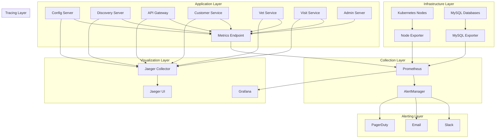

# 📊 **Monitoring Stack Comprehensive Guide**
## *Spring PetClinic Observability Platform*

**Document Version**: 1.0.0  
**Date**: December 2024  
**Purpose**: Complete explanation of monitoring, observability, and alerting stack  
**Audience**: DevOps Engineers, SRE Teams, Developers, Operations Teams  

---

## 📖 **Table of Contents**

1. [Observability Overview](#observability-overview)
2. [Monitoring Architecture](#monitoring-architecture)
3. [Prometheus Configuration](#prometheus-configuration)
4. [Grafana Dashboards](#grafana-dashboards)
5. [Jaeger Distributed Tracing](#jaeger-distributed-tracing)
6. [AlertManager Setup](#alertmanager-setup)
7. [Metrics and KPIs](#metrics-and-kpis)
8. [Troubleshooting Guide](#troubleshooting-guide)

---

## 🎯 **Observability Overview**

The Spring PetClinic monitoring stack implements comprehensive observability using the "Three Pillars of Observability": **Metrics**, **Logs**, and **Traces**. This enables complete visibility into system behavior, performance, and health.

### **Observability Goals**
- ✅ **Proactive Monitoring**: Detect issues before they impact users
- ✅ **Performance Optimization**: Identify bottlenecks and optimization opportunities
- ✅ **Troubleshooting**: Rapid root cause analysis and resolution
- ✅ **Capacity Planning**: Data-driven infrastructure scaling decisions
- ✅ **SLA Compliance**: Monitor and maintain service level agreements

### **Stack Components**
- **Prometheus**: Metrics collection and storage
- **Grafana**: Visualization and dashboards
- **Jaeger**: Distributed tracing
- **AlertManager**: Intelligent alerting and notifications
- **Node Exporter**: Infrastructure metrics
- **Application Metrics**: Custom business metrics

---

## 🏗️ **Monitoring Architecture**



---

## 📈 **Prometheus Configuration**

### **Prometheus Deployment**

**File: `monitoring/prometheus/prometheus-deployment.yml`**

```yaml
apiVersion: apps/v1
kind: Deployment
metadata:
  name: prometheus
  namespace: petclinic
  labels:
    app: prometheus
    component: monitoring
spec:
  replicas: 1
  selector:
    matchLabels:
      app: prometheus
  template:
    metadata:
      labels:
        app: prometheus
        component: monitoring
    spec:
      serviceAccountName: prometheus
      containers:
      - name: prometheus
        image: prom/prometheus:v2.40.0
        ports:
        - containerPort: 9090
          name: web
        args:
          - '--config.file=/etc/prometheus/prometheus.yml'
          - '--storage.tsdb.path=/prometheus'
          - '--web.console.libraries=/etc/prometheus/console_libraries'
          - '--web.console.templates=/etc/prometheus/consoles'
          - '--storage.tsdb.retention.time=30d'
          - '--web.enable-lifecycle'
          - '--web.enable-admin-api'
        volumeMounts:
        - name: prometheus-config
          mountPath: /etc/prometheus
        - name: prometheus-storage
          mountPath: /prometheus
        resources:
          requests:
            memory: "1Gi"
            cpu: "500m"
          limits:
            memory: "2Gi"
            cpu: "1000m"
        livenessProbe:
          httpGet:
            path: /-/healthy
            port: 9090
          initialDelaySeconds: 30
          periodSeconds: 30
        readinessProbe:
          httpGet:
            path: /-/ready
            port: 9090
          initialDelaySeconds: 5
          periodSeconds: 5
      volumes:
      - name: prometheus-config
        configMap:
          name: prometheus-config
      - name: prometheus-storage
        persistentVolumeClaim:
          claimName: prometheus-storage
```

### **Prometheus Configuration**

**File: `monitoring/prometheus/prometheus.yml`**

```yaml
global:
  scrape_interval: 15s
  evaluation_interval: 15s
  external_labels:
    cluster: 'petclinic-prod'
    environment: 'production'

rule_files:
  - "alert_rules.yml"
  - "recording_rules.yml"

alerting:
  alertmanagers:
    - static_configs:
        - targets:
          - alertmanager:9093

scrape_configs:
  # Prometheus self-monitoring
  - job_name: 'prometheus'
    static_configs:
      - targets: ['localhost:9090']
    scrape_interval: 5s

  # Kubernetes API server
  - job_name: 'kubernetes-apiservers'
    kubernetes_sd_configs:
      - role: endpoints
        namespaces:
          names:
            - default
    scheme: https
    tls_config:
      ca_file: /var/run/secrets/kubernetes.io/serviceaccount/ca.crt
    bearer_token_file: /var/run/secrets/kubernetes.io/serviceaccount/token
    relabel_configs:
      - source_labels: [__meta_kubernetes_namespace, __meta_kubernetes_service_name, __meta_kubernetes_endpoint_port_name]
        action: keep
        regex: default;kubernetes;https

  # Kubernetes nodes
  - job_name: 'kubernetes-nodes'
    kubernetes_sd_configs:
      - role: node
    scheme: https
    tls_config:
      ca_file: /var/run/secrets/kubernetes.io/serviceaccount/ca.crt
    bearer_token_file: /var/run/secrets/kubernetes.io/serviceaccount/token
    relabel_configs:
      - action: labelmap
        regex: __meta_kubernetes_node_label_(.+)

  # Node Exporter
  - job_name: 'node-exporter'
    kubernetes_sd_configs:
      - role: endpoints
        namespaces:
          names:
            - petclinic
    relabel_configs:
      - source_labels: [__meta_kubernetes_service_name]
        action: keep
        regex: node-exporter

  # Spring Boot Applications
  - job_name: 'spring-petclinic'
    kubernetes_sd_configs:
      - role: endpoints
        namespaces:
          names:
            - petclinic
    metrics_path: '/actuator/prometheus'
    relabel_configs:
      - source_labels: [__meta_kubernetes_service_annotation_prometheus_io_scrape]
        action: keep
        regex: true
      - source_labels: [__meta_kubernetes_service_annotation_prometheus_io_path]
        action: replace
        target_label: __metrics_path__
        regex: (.+)
      - source_labels: [__address__, __meta_kubernetes_service_annotation_prometheus_io_port]
        action: replace
        regex: ([^:]+)(?::\d+)?;(\d+)
        replacement: $1:$2
        target_label: __address__
      - action: labelmap
        regex: __meta_kubernetes_service_label_(.+)
      - source_labels: [__meta_kubernetes_namespace]
        action: replace
        target_label: kubernetes_namespace
      - source_labels: [__meta_kubernetes_service_name]
        action: replace
        target_label: kubernetes_name

  # MySQL Databases
  - job_name: 'mysql-exporter'
    kubernetes_sd_configs:
      - role: endpoints
        namespaces:
          names:
            - petclinic
    relabel_configs:
      - source_labels: [__meta_kubernetes_service_name]
        action: keep
        regex: mysql-.*-exporter

  # Kubernetes Pods
  - job_name: 'kubernetes-pods'
    kubernetes_sd_configs:
      - role: pod
        namespaces:
          names:
            - petclinic
    relabel_configs:
      - source_labels: [__meta_kubernetes_pod_annotation_prometheus_io_scrape]
        action: keep
        regex: true
      - source_labels: [__meta_kubernetes_pod_annotation_prometheus_io_path]
        action: replace
        target_label: __metrics_path__
        regex: (.+)
      - source_labels: [__address__, __meta_kubernetes_pod_annotation_prometheus_io_port]
        action: replace
        regex: ([^:]+)(?::\d+)?;(\d+)
        replacement: $1:$2
        target_label: __address__
      - action: labelmap
        regex: __meta_kubernetes_pod_label_(.+)
      - source_labels: [__meta_kubernetes_namespace]
        action: replace
        target_label: kubernetes_namespace
      - source_labels: [__meta_kubernetes_pod_name]
        action: replace
        target_label: kubernetes_pod_name
```

### **Alert Rules**

**File: `monitoring/prometheus/alert_rules.yml`**

```yaml
groups:
  - name: petclinic.rules
    rules:
    # Service availability alerts
    - alert: ServiceDown
      expr: up{job="spring-petclinic"} == 0
      for: 1m
      labels:
        severity: critical
        team: platform
      annotations:
        summary: "Service {{ $labels.kubernetes_name }} is down"
        description: "Service {{ $labels.kubernetes_name }} in namespace {{ $labels.kubernetes_namespace }} has been down for more than 1 minute."
        runbook_url: "https://runbooks.petclinic.com/service-down"

    # High error rate alerts
    - alert: HighErrorRate
      expr: rate(http_requests_total{status=~"5.."}[5m]) / rate(http_requests_total[5m]) > 0.05
      for: 5m
      labels:
        severity: warning
        team: platform
      annotations:
        summary: "High error rate on {{ $labels.kubernetes_name }}"
        description: "Error rate is {{ $value | humanizePercentage }} on {{ $labels.kubernetes_name }}"

    # High response time alerts
    - alert: HighResponseTime
      expr: histogram_quantile(0.95, rate(http_request_duration_seconds_bucket[5m])) > 0.5
      for: 5m
      labels:
        severity: warning
        team: platform
      annotations:
        summary: "High response time on {{ $labels.kubernetes_name }}"
        description: "95th percentile response time is {{ $value }}s on {{ $labels.kubernetes_name }}"

    # Database connection alerts
    - alert: DatabaseConnectionFailure
      expr: mysql_up == 0
      for: 2m
      labels:
        severity: critical
        team: platform
      annotations:
        summary: "Database connection failure"
        description: "MySQL database {{ $labels.instance }} is not responding"

    # High CPU usage alerts
    - alert: HighCPUUsage
      expr: rate(container_cpu_usage_seconds_total[5m]) > 0.8
      for: 10m
      labels:
        severity: warning
        team: platform
      annotations:
        summary: "High CPU usage on {{ $labels.pod }}"
        description: "CPU usage is {{ $value | humanizePercentage }} on pod {{ $labels.pod }}"

    # High memory usage alerts
    - alert: HighMemoryUsage
      expr: container_memory_usage_bytes / container_spec_memory_limit_bytes > 0.9
      for: 5m
      labels:
        severity: warning
        team: platform
      annotations:
        summary: "High memory usage on {{ $labels.pod }}"
        description: "Memory usage is {{ $value | humanizePercentage }} on pod {{ $labels.pod }}"

    # Disk space alerts
    - alert: DiskSpaceLow
      expr: (node_filesystem_avail_bytes / node_filesystem_size_bytes) < 0.1
      for: 5m
      labels:
        severity: warning
        team: infrastructure
      annotations:
        summary: "Low disk space on {{ $labels.instance }}"
        description: "Disk space is {{ $value | humanizePercentage }} full on {{ $labels.instance }}"

    # Pod restart alerts
    - alert: PodRestartingTooOften
      expr: rate(kube_pod_container_status_restarts_total[1h]) > 0
      for: 5m
      labels:
        severity: warning
        team: platform
      annotations:
        summary: "Pod {{ $labels.pod }} restarting too often"
        description: "Pod {{ $labels.pod }} in namespace {{ $labels.namespace }} has restarted {{ $value }} times in the last hour"
```

---

## 📊 **Grafana Dashboards**

### **Grafana Deployment**

**File: `monitoring/grafana/grafana-deployment.yml`**

```yaml
apiVersion: apps/v1
kind: Deployment
metadata:
  name: grafana
  namespace: petclinic
  labels:
    app: grafana
    component: monitoring
spec:
  replicas: 1
  selector:
    matchLabels:
      app: grafana
  template:
    metadata:
      labels:
        app: grafana
        component: monitoring
    spec:
      containers:
      - name: grafana
        image: grafana/grafana:9.3.0
        ports:
        - containerPort: 3000
          name: web
        env:
        - name: GF_SECURITY_ADMIN_PASSWORD
          valueFrom:
            secretKeyRef:
              name: grafana-credentials
              key: admin-password
        - name: GF_INSTALL_PLUGINS
          value: "grafana-piechart-panel,grafana-worldmap-panel,grafana-clock-panel"
        volumeMounts:
        - name: grafana-storage
          mountPath: /var/lib/grafana
        - name: grafana-config
          mountPath: /etc/grafana/grafana.ini
          subPath: grafana.ini
        - name: grafana-datasources
          mountPath: /etc/grafana/provisioning/datasources
        - name: grafana-dashboards-config
          mountPath: /etc/grafana/provisioning/dashboards
        - name: grafana-dashboards
          mountPath: /var/lib/grafana/dashboards
        resources:
          requests:
            memory: "256Mi"
            cpu: "100m"
          limits:
            memory: "512Mi"
            cpu: "200m"
        livenessProbe:
          httpGet:
            path: /api/health
            port: 3000
          initialDelaySeconds: 30
          periodSeconds: 30
        readinessProbe:
          httpGet:
            path: /api/health
            port: 3000
          initialDelaySeconds: 5
          periodSeconds: 5
      volumes:
      - name: grafana-storage
        persistentVolumeClaim:
          claimName: grafana-storage
      - name: grafana-config
        configMap:
          name: grafana-config
      - name: grafana-datasources
        configMap:
          name: grafana-datasources
      - name: grafana-dashboards-config
        configMap:
          name: grafana-dashboards-config
      - name: grafana-dashboards
        configMap:
          name: grafana-dashboards
```

### **Dashboard Configuration**

#### **Application Overview Dashboard**
```json
{
  "dashboard": {
    "id": null,
    "title": "Spring PetClinic - Application Overview",
    "tags": ["petclinic", "overview"],
    "timezone": "browser",
    "panels": [
      {
        "id": 1,
        "title": "Service Status",
        "type": "stat",
        "targets": [
          {
            "expr": "up{job=\"spring-petclinic\"}",
            "legendFormat": "{{ kubernetes_name }}"
          }
        ],
        "fieldConfig": {
          "defaults": {
            "color": {
              "mode": "thresholds"
            },
            "thresholds": {
              "steps": [
                {"color": "red", "value": 0},
                {"color": "green", "value": 1}
              ]
            }
          }
        }
      },
      {
        "id": 2,
        "title": "Request Rate",
        "type": "graph",
        "targets": [
          {
            "expr": "sum(rate(http_requests_total[5m])) by (kubernetes_name)",
            "legendFormat": "{{ kubernetes_name }}"
          }
        ]
      },
      {
        "id": 3,
        "title": "Response Time (95th percentile)",
        "type": "graph",
        "targets": [
          {
            "expr": "histogram_quantile(0.95, sum(rate(http_request_duration_seconds_bucket[5m])) by (le, kubernetes_name))",
            "legendFormat": "{{ kubernetes_name }}"
          }
        ]
      },
      {
        "id": 4,
        "title": "Error Rate",
        "type": "graph",
        "targets": [
          {
            "expr": "sum(rate(http_requests_total{status=~\"5..\"}[5m])) by (kubernetes_name) / sum(rate(http_requests_total[5m])) by (kubernetes_name)",
            "legendFormat": "{{ kubernetes_name }}"
          }
        ]
      }
    ]
  }
}
```

#### **Infrastructure Dashboard**
```json
{
  "dashboard": {
    "id": null,
    "title": "Spring PetClinic - Infrastructure",
    "tags": ["petclinic", "infrastructure"],
    "panels": [
      {
        "id": 1,
        "title": "CPU Usage",
        "type": "graph",
        "targets": [
          {
            "expr": "rate(container_cpu_usage_seconds_total{namespace=\"petclinic\"}[5m])",
            "legendFormat": "{{ pod }}"
          }
        ]
      },
      {
        "id": 2,
        "title": "Memory Usage",
        "type": "graph",
        "targets": [
          {
            "expr": "container_memory_usage_bytes{namespace=\"petclinic\"}",
            "legendFormat": "{{ pod }}"
          }
        ]
      },
      {
        "id": 3,
        "title": "Network I/O",
        "type": "graph",
        "targets": [
          {
            "expr": "rate(container_network_receive_bytes_total{namespace=\"petclinic\"}[5m])",
            "legendFormat": "{{ pod }} - RX"
          },
          {
            "expr": "rate(container_network_transmit_bytes_total{namespace=\"petclinic\"}[5m])",
            "legendFormat": "{{ pod }} - TX"
          }
        ]
      }
    ]
  }
}
```

---

## 🔍 **Jaeger Distributed Tracing**

### **Jaeger Deployment**

**File: `monitoring/jaeger/jaeger-deployment.yml`**

```yaml
apiVersion: apps/v1
kind: Deployment
metadata:
  name: jaeger
  namespace: petclinic
  labels:
    app: jaeger
    component: monitoring
spec:
  replicas: 1
  selector:
    matchLabels:
      app: jaeger
  template:
    metadata:
      labels:
        app: jaeger
        component: monitoring
    spec:
      containers:
      - name: jaeger
        image: jaegertracing/all-in-one:1.40
        ports:
        - containerPort: 16686
          name: ui
        - containerPort: 14268
          name: collector
        - containerPort: 6831
          name: agent-compact
          protocol: UDP
        - containerPort: 6832
          name: agent-binary
          protocol: UDP
        env:
        - name: COLLECTOR_ZIPKIN_HOST_PORT
          value: ":9411"
        - name: SPAN_STORAGE_TYPE
          value: "elasticsearch"
        - name: ES_SERVER_URLS
          value: "http://elasticsearch:9200"
        resources:
          requests:
            memory: "256Mi"
            cpu: "100m"
          limits:
            memory: "512Mi"
            cpu: "200m"
        livenessProbe:
          httpGet:
            path: /
            port: 16686
          initialDelaySeconds: 30
          periodSeconds: 30
        readinessProbe:
          httpGet:
            path: /
            port: 16686
          initialDelaySeconds: 5
          periodSeconds: 5
```

### **Application Tracing Configuration**

#### **Spring Boot Tracing Setup**
```yaml
# application.yml
spring:
  sleuth:
    jaeger:
      http:
        sender:
          endpoint: http://jaeger:14268/api/traces
    sampler:
      probability: 1.0  # Sample 100% of traces (adjust for production)
  zipkin:
    base-url: http://jaeger:9411

management:
  tracing:
    sampling:
      probability: 1.0
```

#### **Custom Tracing**
```java
@RestController
@Slf4j
public class CustomerController {
    
    @Autowired
    private Tracer tracer;
    
    @GetMapping("/customers/{id}")
    public Customer getCustomer(@PathVariable Long id) {
        Span span = tracer.nextSpan()
            .name("get-customer")
            .tag("customer.id", id.toString())
            .start();
        
        try (Tracer.SpanInScope ws = tracer.withSpanInScope(span)) {
            log.info("Fetching customer with id: {}", id);
            return customerService.findById(id);
        } finally {
            span.end();
        }
    }
}
```

---

## 🚨 **AlertManager Setup**

### **AlertManager Deployment**

**File: `monitoring/alertmanager/alertmanager.yml`**

```yaml
global:
  smtp_smarthost: 'smtp.gmail.com:587'
  smtp_from: 'alerts@petclinic.com'
  smtp_auth_username: 'alerts@petclinic.com'
  smtp_auth_password: 'app-password'

route:
  group_by: ['alertname', 'cluster', 'service']
  group_wait: 10s
  group_interval: 10s
  repeat_interval: 1h
  receiver: 'default'
  routes:
  - match:
      severity: critical
    receiver: 'critical-alerts'
  - match:
      severity: warning
    receiver: 'warning-alerts'
  - match:
      team: infrastructure
    receiver: 'infrastructure-team'

receivers:
- name: 'default'
  slack_configs:
  - api_url: 'https://hooks.slack.com/services/YOUR/SLACK/WEBHOOK'
    channel: '#petclinic-alerts'
    title: 'PetClinic Alert'
    text: '{{ range .Alerts }}{{ .Annotations.summary }}{{ end }}'

- name: 'critical-alerts'
  slack_configs:
  - api_url: 'https://hooks.slack.com/services/YOUR/SLACK/WEBHOOK'
    channel: '#petclinic-critical'
    title: '🚨 CRITICAL: PetClinic Alert'
    text: '{{ range .Alerts }}{{ .Annotations.summary }}\n{{ .Annotations.description }}{{ end }}'
  email_configs:
  - to: 'oncall@petclinic.com'
    subject: '🚨 CRITICAL: {{ .GroupLabels.alertname }}'
    body: |
      {{ range .Alerts }}
      Alert: {{ .Annotations.summary }}
      Description: {{ .Annotations.description }}
      Runbook: {{ .Annotations.runbook_url }}
      {{ end }}
  pagerduty_configs:
  - service_key: 'YOUR-PAGERDUTY-SERVICE-KEY'
    description: '{{ .GroupLabels.alertname }}: {{ .GroupLabels.instance }}'

- name: 'warning-alerts'
  slack_configs:
  - api_url: 'https://hooks.slack.com/services/YOUR/SLACK/WEBHOOK'
    channel: '#petclinic-warnings'
    title: '⚠️ WARNING: PetClinic Alert'
    text: '{{ range .Alerts }}{{ .Annotations.summary }}{{ end }}'

- name: 'infrastructure-team'
  email_configs:
  - to: 'infrastructure@petclinic.com'
    subject: 'Infrastructure Alert: {{ .GroupLabels.alertname }}'
    body: |
      {{ range .Alerts }}
      Alert: {{ .Annotations.summary }}
      Description: {{ .Annotations.description }}
      {{ end }}

inhibit_rules:
- source_match:
    severity: 'critical'
  target_match:
    severity: 'warning'
  equal: ['alertname', 'cluster', 'service']
```

---

## 📊 **Metrics and KPIs**

### **Application Metrics**

#### **Business Metrics**
```java
// Custom metrics in Spring Boot
@Component
public class BusinessMetrics {
    
    private final Counter customerRegistrations;
    private final Counter appointmentBookings;
    private final Timer appointmentDuration;
    private final Gauge activeUsers;
    
    public BusinessMetrics(MeterRegistry meterRegistry) {
        this.customerRegistrations = Counter.builder("petclinic.customers.registrations")
            .description("Number of customer registrations")
            .register(meterRegistry);
            
        this.appointmentBookings = Counter.builder("petclinic.appointments.bookings")
            .description("Number of appointment bookings")
            .register(meterRegistry);
            
        this.appointmentDuration = Timer.builder("petclinic.appointments.duration")
            .description("Duration of appointments")
            .register(meterRegistry);
            
        this.activeUsers = Gauge.builder("petclinic.users.active")
            .description("Number of active users")
            .register(meterRegistry, this, BusinessMetrics::getActiveUserCount);
    }
    
    public void recordCustomerRegistration() {
        customerRegistrations.increment();
    }
    
    public void recordAppointmentBooking() {
        appointmentBookings.increment();
    }
    
    public Timer.Sample startAppointmentTimer() {
        return Timer.start(appointmentDuration);
    }
    
    private double getActiveUserCount() {
        // Implementation to get active user count
        return activeUserService.getActiveUserCount();
    }
}
```

#### **Technical Metrics**
- **HTTP Request Metrics**: Request rate, response time, error rate
- **JVM Metrics**: Memory usage, garbage collection, thread count
- **Database Metrics**: Connection pool, query performance, transaction rate
- **Cache Metrics**: Hit rate, miss rate, eviction rate

### **SLI/SLO Definitions**

#### **Service Level Indicators (SLIs)**
```yaml
slis:
  availability:
    description: "Percentage of successful requests"
    query: "sum(rate(http_requests_total{status!~'5..'}[5m])) / sum(rate(http_requests_total[5m]))"
    
  latency:
    description: "95th percentile response time"
    query: "histogram_quantile(0.95, sum(rate(http_request_duration_seconds_bucket[5m])) by (le))"
    
  error_rate:
    description: "Percentage of failed requests"
    query: "sum(rate(http_requests_total{status=~'5..'}[5m])) / sum(rate(http_requests_total[5m]))"
```

#### **Service Level Objectives (SLOs)**
```yaml
slos:
  availability:
    target: 99.9%
    window: 30d
    
  latency:
    target: 200ms
    percentile: 95
    window: 30d
    
  error_rate:
    target: 0.1%
    window: 30d
```

---

## 🔧 **Troubleshooting Guide**

### **Common Monitoring Issues**

#### **Prometheus Not Scraping Targets**
```bash
# Check Prometheus targets
curl http://prometheus:9090/api/v1/targets

# Check service discovery
curl http://prometheus:9090/api/v1/label/__name__/values

# Verify service annotations
kubectl get svc -n petclinic -o yaml | grep prometheus
```

#### **Grafana Dashboard Issues**
```bash
# Check Grafana logs
kubectl logs deployment/grafana -n petclinic

# Verify datasource connection
curl -u admin:password http://grafana:3000/api/datasources

# Test Prometheus query
curl -G http://prometheus:9090/api/v1/query --data-urlencode 'query=up'
```

#### **AlertManager Not Sending Alerts**
```bash
# Check AlertManager status
curl http://alertmanager:9093/api/v1/status

# Verify alert rules
curl http://prometheus:9090/api/v1/rules

# Check alert routing
curl http://alertmanager:9093/api/v1/alerts
```

### **Performance Optimization**

#### **Prometheus Optimization**
```yaml
# Optimize scrape intervals
global:
  scrape_interval: 30s  # Increase for less critical metrics
  evaluation_interval: 30s

# Reduce retention for high-cardinality metrics
storage:
  tsdb:
    retention.time: 15d
    retention.size: 10GB
```

#### **Grafana Optimization**
```yaml
# Enable caching
[caching]
enabled = true

# Optimize query timeout
[dataproxy]
timeout = 30
```

---

**Document Maintenance**: This document should be updated whenever monitoring configurations are modified. All changes should be tested in staging environment before production deployment.
