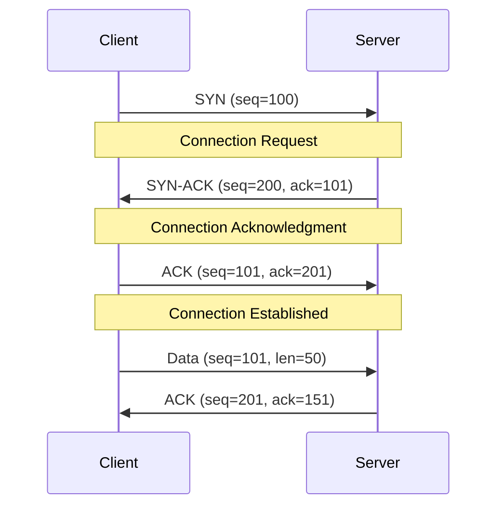

# Visual Learning & Video Content Guide

## Interactive Diagrams and Animations

### 1. OSI Model Interactive Visualization
**Concept**: Layer-by-layer packet flow visualization

```html
<!-- Interactive OSI Model Diagram -->
<div class="osi-model-interactive">
    <div class="layer" data-layer="7">
        <h3>Application Layer</h3>
        <div class="protocols">HTTP, HTTPS, FTP, SMTP</div>
        <div class="animation-trigger">Click to see packet flow</div>
    </div>
    <!-- Additional layers... -->
</div>
```

**Learning Objectives**:
- Visualize how data flows through network layers
- Understand protocol interactions at each layer
- See real packet examples

### 2. Load Balancing Algorithm Simulator
**Interactive Tool**: Visual representation of different algorithms

```javascript
// Load Balancing Simulator
class LoadBalancerSimulator {
    constructor(algorithm, servers) {
        this.algorithm = algorithm;
        this.servers = servers;
        this.requests = [];
    }
    
    simulateRequest(request) {
        const server = this.selectServer(request);
        this.visualizeRouting(request, server);
        return server;
    }
    
    visualizeRouting(request, server) {
        // Animation showing request routing
        document.getElementById('request-flow').animate([
            { transform: 'translateX(0px)' },
            { transform: `translateX(${server.position}px)` }
        ], 1000);
    }
}
```

### 3. TCP Connection Visualization
**Animation**: Three-way handshake and data transfer



## Video Content Library

### Module 02 Video Series

#### Video 1: "OSI Model Deep Dive" (15 minutes)
**Topics Covered**:
- Layer-by-layer explanation with real examples
- Packet capture analysis using Wireshark
- Common protocols at each layer

**Interactive Elements**:
- Pause points for knowledge checks
- Downloadable packet capture files
- Layer identification exercises

#### Video 2: "Load Balancing in Action" (12 minutes)
**Topics Covered**:
- Round-robin vs least connections demonstration
- Health check mechanisms
- Failover scenarios

**Hands-on Components**:
- AWS ALB configuration walkthrough
- Real-time traffic distribution visualization
- Performance comparison metrics

#### Video 3: "Service Discovery Patterns" (18 minutes)
**Topics Covered**:
- Client-side vs server-side discovery
- Service registry implementations
- AWS Cloud Map demonstration

**Interactive Labs**:
- Consul setup and configuration
- Service registration and discovery
- Failure handling scenarios

### Video Production Guidelines

#### Technical Specifications
- **Resolution**: 1080p minimum, 4K preferred
- **Frame Rate**: 30fps for presentations, 60fps for animations
- **Audio**: Clear narration with background music at -20dB
- **Captions**: Auto-generated with manual review

#### Content Structure
1. **Hook** (0-30 seconds): Problem statement or compelling question
2. **Overview** (30-60 seconds): What will be covered
3. **Main Content** (60-80% of video): Core concepts with examples
4. **Summary** (Last 10%): Key takeaways and next steps
5. **Call to Action**: Link to hands-on exercises

## Interactive Learning Tools

### 1. Network Topology Builder
**Tool**: Drag-and-drop network design interface

```html
<div id="network-builder">
    <div class="component-palette">
        <div class="component" data-type="server">Server</div>
        <div class="component" data-type="load-balancer">Load Balancer</div>
        <div class="component" data-type="database">Database</div>
        <div class="component" data-type="cache">Cache</div>
    </div>
    <div class="design-canvas">
        <!-- Drag components here -->
    </div>
    <div class="validation-panel">
        <!-- Real-time architecture validation -->
    </div>
</div>
```

### 2. Latency Calculator
**Interactive Tool**: Calculate network latency for different scenarios

```javascript
class LatencyCalculator {
    calculateLatency(distance, medium, protocol) {
        const speedOfLight = 299792458; // m/s
        const propagationDelay = (distance * 1000) / (speedOfLight * 0.7); // fiber optic
        const protocolOverhead = this.getProtocolOverhead(protocol);
        const processingDelay = this.getProcessingDelay(medium);
        
        return propagationDelay + protocolOverhead + processingDelay;
    }
    
    visualizeLatency(components) {
        // Create interactive latency visualization
        components.forEach(component => {
            this.animateLatency(component);
        });
    }
}
```

### 3. Security Group Simulator
**Tool**: Visual security group rule testing

```html
<div class="security-group-simulator">
    <div class="rule-builder">
        <select name="protocol">
            <option value="tcp">TCP</option>
            <option value="udp">UDP</option>
        </select>
        <input type="number" name="port" placeholder="Port">
        <input type="text" name="source" placeholder="Source CIDR">
        <button onclick="testRule()">Test Rule</button>
    </div>
    <div class="traffic-visualization">
        <!-- Visual representation of allowed/blocked traffic -->
    </div>
</div>
```

## Augmented Reality (AR) Components

### 1. 3D Network Topology Viewer
**Technology**: WebXR for browser-based AR
**Features**:
- 3D visualization of network architectures
- Interactive component exploration
- Real-time traffic flow animation

### 2. Protocol Stack Visualization
**Implementation**: AR overlay showing protocol layers
**Use Case**: Understanding packet encapsulation/decapsulation

## Assessment Integration

### Video-Based Quizzes
```javascript
// Video quiz integration
class VideoQuiz {
    constructor(videoElement, questions) {
        this.video = videoElement;
        this.questions = questions;
        this.setupQuizPoints();
    }
    
    setupQuizPoints() {
        this.questions.forEach(question => {
            this.video.addEventListener('timeupdate', () => {
                if (this.video.currentTime >= question.timestamp) {
                    this.showQuestion(question);
                }
            });
        });
    }
    
    showQuestion(question) {
        this.video.pause();
        this.displayQuestionOverlay(question);
    }
}
```

### Interactive Simulations
- **Network Failure Scenarios**: Simulate and recover from failures
- **Performance Optimization**: Tune network parameters and see results
- **Security Testing**: Test different attack scenarios and defenses

## Mobile Learning Support

### Responsive Design
- Touch-friendly interactive elements
- Optimized video streaming for mobile
- Offline content download capability

### Progressive Web App Features
- Push notifications for new content
- Background sync for progress tracking
- Installable app experience

## Analytics and Learning Insights

### Learning Analytics Dashboard
```javascript
// Track learning engagement
class LearningAnalytics {
    trackVideoEngagement(videoId, timestamp, action) {
        const data = {
            videoId,
            timestamp,
            action, // play, pause, seek, complete
            userId: this.getCurrentUser(),
            sessionId: this.getSessionId()
        };
        
        this.sendAnalytics(data);
    }
    
    generateInsights() {
        // Identify difficult concepts based on replay patterns
        // Suggest additional resources
        // Track completion rates
    }
}
```

### Personalized Learning Paths
- Adaptive content based on performance
- Difficulty adjustment based on quiz results
- Recommended additional resources
